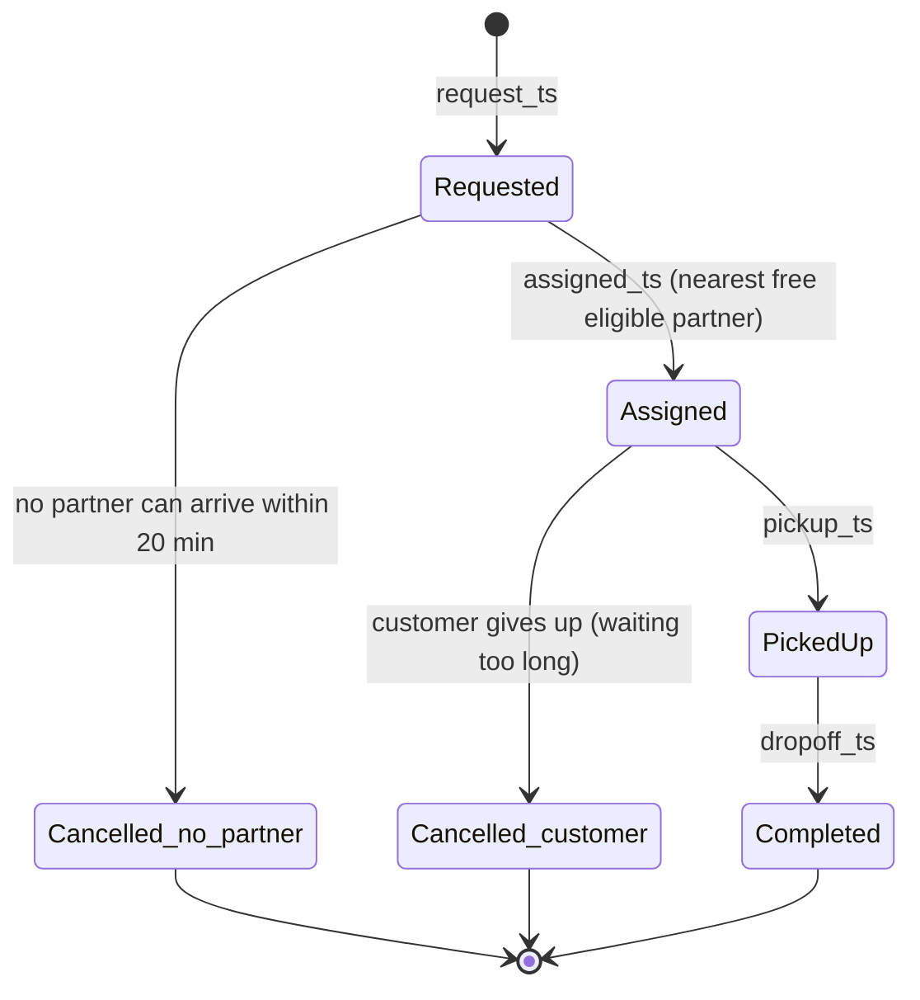
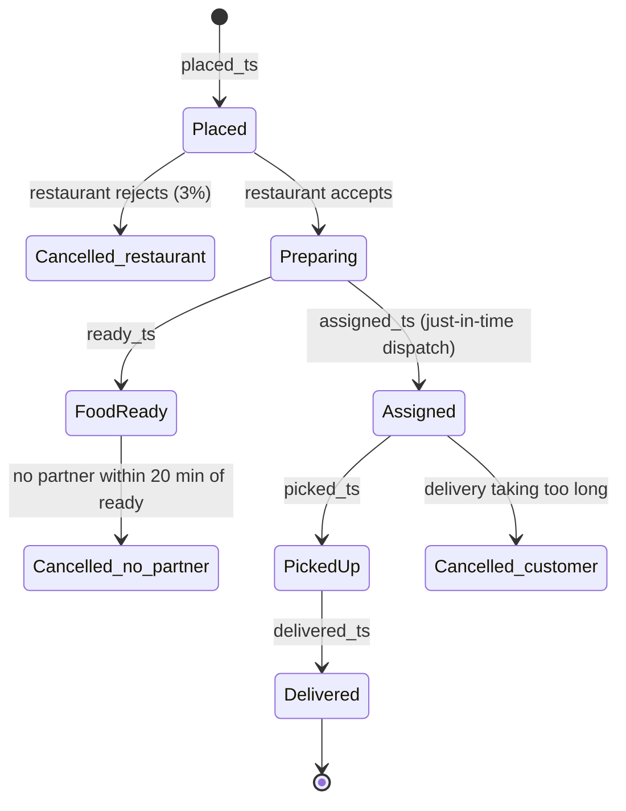
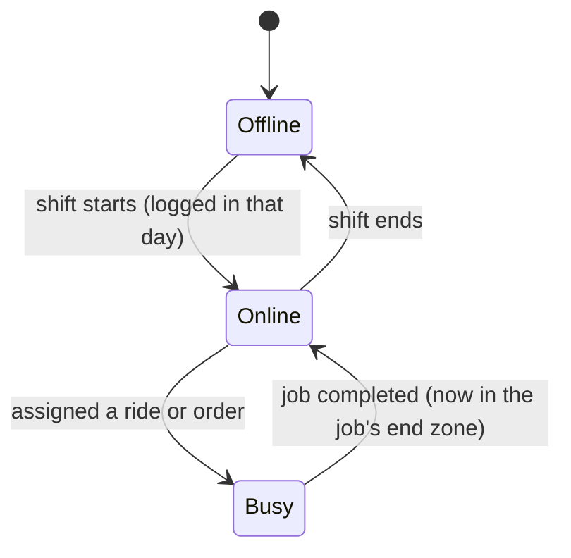
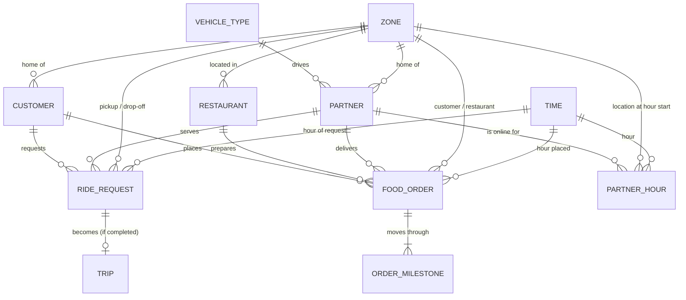
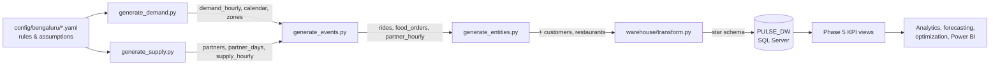

# Phase 2 — Marketplace Data Ecosystem

## 1. Purpose

PULSE is **one marketplace with two demand engines** — mobility and food
delivery — sharing **one pool of partners** across Bengaluru's zones. This
document maps the data that describes that marketplace:

- the **entities** (who and what exists),
- the **events** (what happens to them, and when),
- how they **relate**,
- where each one **comes from and ends up** (lineage), and
- how completely the data covers the locked Phase 2 plan.

The fundamental analytical object throughout is **Zone × Time × Service**.

---

## 2. The Three Data Domains

| Domain | Question it answers | Core records |
|--------|--------------------|--------------|
| **Mobility** | Who asked for a ride, was a partner found, and what did the trip earn? | Ride requests, completed trips |
| **Food delivery** | Who ordered, from which restaurant, how fast was it delivered, and what did it earn? | Food orders, order milestones |
| **Marketplace** | Where were partners, when, how busy, and what could they serve? | Partner availability, zones, time, eligibility |

The domains are linked by **shared dimensions**: the same customers order food
and request rides, the same two-wheeler partners serve both services, and every
record is placed in a zone and an hour.

---

## 3. Entity Catalogue

| Entity | What it represents | Key | Warehouse table | Default rows |
|--------|-------------------|-----|-----------------|-------------:|
| Zone | One of 24 Bengaluru operating zones, with type and centroid | `zone_key` | `Dim_Zone` | 24 |
| Time | One hour of the simulated period, with weekday, rain and event flags | `time_key` (yyyymmddhh) | `Dim_Time` | 2,712 |
| Service | Mobility or food delivery | `service_key` | `Dim_Service` | 2 |
| Vehicle type | Two-wheeler or four-wheeler cab, with service eligibility | `vehicle_key` | `Dim_Vehicle` | 2 |
| Partner (driver / delivery partner) | One person who can serve jobs; vehicle, home zone, shift | `driver_key` | `Dim_Driver` | 850 |
| Customer | One person who requests rides and/or orders food; home zone | `customer_key` | `Dim_Customer` | ~60,000 |
| Restaurant | One food outlet; zone and cuisine | `restaurant_key` | `Dim_Restaurant` | 1,035 |
| Ride request | One request for a ride, whatever its outcome | `ride_request_key` | `Fact_Ride_Requests` | 477,426 |
| Trip | One completed ride, with distance, fare and payout | `ride_key` | `Fact_Rides` | 343,291 |
| Food order | One food order, whatever its outcome | `order_key` | `Fact_Food_Orders` | 621,451 |
| Order milestone | One step in a food order's life | `delivery_event_key` | `Fact_Delivery_Events` | ~3.0M |
| Partner-hour | One partner online for one hour: location, busy and idle time | `availability_key` | `Fact_Driver_Availability` | 642,456 |
| Supply allocation | An optimizer decision to move partners between zones | `allocation_key` | `Fact_Supply_Allocation` | 0 (Phase 10) |
| Repositioning move | One partner's simulated move between zones | `repositioning_key` | `Fact_Repositioning` | 0 (Phase 10) |
| Incentive | A payment to bring supply online in a zone and hour | `incentive_key` | `Fact_Incentives` | 0 (Phase 11) |

Row counts are for the default dataset; current figures are generated in
`04_Data_Warehouse/Load_Results.md`.

---

## 4. Event Catalogue and Lifecycles

### 4.1 Ride request lifecycle

| Event | Recorded as | Table |
|-------|------------|-------|
| Requested | `request_ts`, pickup and drop-off zone | `Fact_Ride_Requests` |
| Assigned | `assigned_ts`, `driver_key`, `vehicle_key`, `pickup_km`, `pickup_eta_min` | `Fact_Ride_Requests` |
| Picked up / dropped off | `pickup_ts`, `dropoff_ts`, `trip_km`, `trip_minutes` | `Fact_Rides` |
| Outcome | `request_status` (completed / cancelled_customer / cancelled_no_partner) | `Fact_Ride_Requests` |
| Money | `fare`, `partner_payout`, `platform_revenue` | `Fact_Rides` |

### 4.2 Food order lifecycle

| Event | Recorded as | Table |
|-------|------------|-------|
| Placed | `placed_ts`, customer and restaurant zone, `order_value` | `Fact_Food_Orders` |
| Assigned | `assigned_ts`, `driver_key`, `pickup_km` | `Fact_Food_Orders` |
| Food ready | `ready_ts`, `prep_minutes` | `Fact_Food_Orders` |
| Picked up / delivered | `picked_ts`, `delivered_ts`, `delivery_km`, `delivery_minutes` | `Fact_Food_Orders` |
| Every milestone as its own row | `event_type`, `event_seq`, `event_ts`, `zone_key` | `Fact_Delivery_Events` |
| Money | `commission`, `delivery_fee`, `partner_payout`, `platform_revenue` | `Fact_Food_Orders` |

### 4.3 Partner lifecycle

| Event | Recorded as | Table |
|-------|------------|-------|
| Logged in for the day | partner-day | `partner_days.csv` (generation) |
| Online in an hour | one row per partner-hour, `zone_key` at hour start | `Fact_Driver_Availability` |
| Busy / idle time | `busy_minutes`, `idle_minutes`, `empty_km` per hour | `Fact_Driver_Availability` |
| Jobs served | `driver_key` on rides and orders | `Fact_Ride_Requests`, `Fact_Food_Orders` |

---

## 5. Relationships

**Key business rules carried by the data**

- A **two-wheeler** can serve rides and food; a **four-wheeler** serves rides only (`Dim_Vehicle`).
- A partner holds **one job at a time** and ends each job in that job's end zone.
- Every ride and order belongs to exactly one **zone** and one **hour** — the grain of all analysis.

---

## 6. Data Lineage

| Stage | Produced by | Output |
|-------|-------------|--------|
| Rules | `config/bengaluru/` | demand, supply, operations, entity, zone rules |
| Generation | `scripts/build_all.py` | CSV files in `data/processed/` |
| Warehouse | `scripts/load_warehouse.py` | 15 tables in `PULSE_DW` |
| KPIs | `05_Marketplace_Analytics/sql/00_create_kpi_views.sql` | 4 views |

---

## 7. Coverage Against the Locked Phase 2 Plan

| Plan item | Status | Where / note |
|-----------|--------|--------------|
| **Mobility** | | |
| Customers | ✅ Captured | `Dim_Customer` |
| Drivers | ✅ Captured | `Dim_Driver` |
| Ride requests | ✅ Captured | `Fact_Ride_Requests` |
| Trips | ✅ Captured | `Fact_Rides` |
| Locations | ⚠️ Zone level | `Dim_Zone`; no street-level points (see §8) |
| Fares | ✅ Captured | `Fact_Rides` |
| Cancellations | ✅ Captured | status and reason; exact cancel time not recorded |
| Driver status | ⚠️ Hourly aggregates | busy / idle minutes per hour, not individual state changes |
| **Food** | | |
| Customers | ✅ Captured | shared `Dim_Customer` |
| Restaurants | ✅ Captured | `Dim_Restaurant` |
| Orders | ✅ Captured | `Fact_Food_Orders` |
| Order items | ❌ Not modelled | order value only (see §8) |
| Delivery partners | ✅ Captured | shared `Dim_Driver` |
| Locations | ⚠️ Zone level | customer and restaurant zones |
| Preparation events | ✅ Captured | `ready_ts`, `food_ready` milestone |
| Delivery events | ✅ Captured | `Fact_Delivery_Events` |
| Cancellations | ✅ Captured | three reasons |
| **Marketplace** | | |
| Zones | ✅ Captured | `Dim_Zone` |
| Time | ✅ Captured | `Dim_Time` (hour grain) |
| Driver availability | ✅ Captured | `Fact_Driver_Availability` |
| Service eligibility | ✅ Captured | `Dim_Vehicle` |
| Assignments | ✅ Captured | `assigned_ts` and `driver_key` on every served job |
| Incentives | ⏳ Phase 11 | table exists, empty in status-quo history |
| Repositioning | ⏳ Phase 10 | table exists, empty in status-quo history |

---

## 8. Known Gaps and Deliberate Simplifications

| Gap | Why it is acceptable | Effect |
|-----|---------------------|--------|
| **Partner state changes are not individual events.** Time online, busy and idle is recorded per hour, not each switch between available, assigned, on trip and delivering. | PULSE plans supply per hour (the optimizer's period), so hourly busy and idle time is the level of detail decisions need. | Phase 7 can measure utilization and idle supply by zone and hour, but not minute-by-minute state sequences. |
| **Locations are zones, not points.** | All decisions in PULSE are zone-level (Zone × Time × Service). | Distances use zone centroids with a detour factor (Assumption C-04). |
| **Order items are not modelled.** | Basket contents do not affect supply allocation; order value is enough for economics. | No menu or item analysis — which is also outside the scope of an operations project. |
| **Cancellation time is not recorded.** | The outcome and reason matter for service levels; the exact second does not. | `Fact_Delivery_Events` stamps a cancellation at the last known milestone. |
| **Customers have only a home zone.** | PULSE is an operations project; customer analytics are outside its scope. | No customer segmentation in PULSE. |

---

## 9. Summary

The PULSE data ecosystem captures every entity and event needed to answer the
marketplace's operational question at **Zone × Time × Service** grain: who
asked for what, where and when; whether a partner served it and how fast; what
it earned; and where partners were and how busy. The three Phase 10–11 tables
are in place and empty by design. The remaining gaps are deliberate
simplifications that do not affect allocation decisions.
