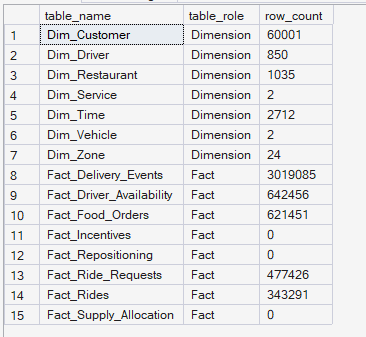
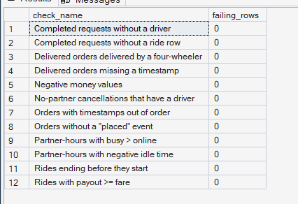
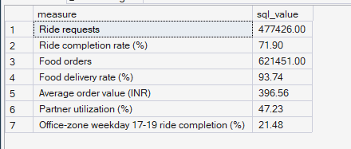

# Phase 4 — Enterprise Data Warehouse: Load Results
## Completeness, Data Quality and Reconciliation of `PULSE_DW`

**SQL scripts:** `04_Data_Warehouse/sql/` · **Report script:** `scripts/report_warehouse.py`

---

## 1. Business Question

Can the warehouse be trusted as the single source of truth for every analysis
that follows?

---

## 2. Objective

Show that `PULSE_DW` contains every record from the simulated marketplace,
that the data obeys the marketplace's business rules, and that headline
figures computed in SQL equal those computed in Python from the source files.

---

## 3. Data Sources

- SQL Server 2025 database `PULSE_DW`, schema `dw` (15 tables: 7 dimensions, 8 facts)
- Source files in `data/processed/` for the reconciliation

---

## 4. Analytical Grain

- Load summary: **table**
- Quality checks: **record** within each fact table
- Reconciliation: **whole marketplace** headline figures

---

## 5. Techniques Used

- System catalog views (`sys.tables`, `sys.partitions`) for row counts
- Rule-based quality checks with `LEFT JOIN`, `NOT EXISTS` and `UNION ALL`
- Enforced primary and foreign keys
- Independent recomputation in SQL and Python, compared value by value

---

# 6. Result Set A — Tables Loaded

**SQL script:** `sql/05_load_summary.sql`

<!-- AUTO:load_summary -->
| Table | Role | Rows |
|---|---|---|
| Dim_Customer | Dimension | 60,001 |
| Dim_Driver | Dimension | 850 |
| Dim_Restaurant | Dimension | 1,035 |
| Dim_Service | Dimension | 2 |
| Dim_Time | Dimension | 2,712 |
| Dim_Vehicle | Dimension | 2 |
| Dim_Zone | Dimension | 24 |
| Fact_Delivery_Events | Fact | 3,019,085 |
| Fact_Driver_Availability | Fact | 642,456 |
| Fact_Food_Orders | Fact | 621,451 |
| Fact_Incentives | Fact | 0 |
| Fact_Repositioning | Fact | 0 |
| Fact_Ride_Requests | Fact | 477,426 |
| Fact_Rides | Fact | 343,291 |
| Fact_Supply_Allocation | Fact | 0 |

**15 tables, 5,168,335 rows in total.**

_Generated 2026-10-03 by a report script — do not edit by hand._
<!-- /AUTO:load_summary -->

### Screenshot



---

# 7. Result Set B — Data-Quality Checks

**SQL script:** `sql/04_data_quality_checks.sql`

<!-- AUTO:quality -->
| Rule | Failing rows | Result |
|---|---|---|
| Completed requests without a driver | 0 | ✅ pass |
| Completed requests without a ride row | 0 | ✅ pass |
| Delivered orders delivered by a four-wheeler | 0 | ✅ pass |
| Delivered orders missing a timestamp | 0 | ✅ pass |
| Negative money values | 0 | ✅ pass |
| No-partner cancellations that have a driver | 0 | ✅ pass |
| Orders with timestamps out of order | 0 | ✅ pass |
| Orders without a "placed" event | 0 | ✅ pass |
| Partner-hours with busy > online | 0 | ✅ pass |
| Partner-hours with negative idle time | 0 | ✅ pass |
| Rides ending before they start | 0 | ✅ pass |
| Rides with payout >= fare | 0 | ✅ pass |

**12 of 12 checks pass.**

_Generated 2026-10-03 by a report script — do not edit by hand._
<!-- /AUTO:quality -->

### Screenshot



---

# 8. Result Set C — SQL ↔ Python Reconciliation

**SQL script:** `sql/06_reconciliation.sql`

<!-- AUTO:reconciliation -->
| Measure | SQL (warehouse) | Python (generated files) | Match |
|---|---|---|---|
| Ride requests | 477,426.00 | 477,426.00 | ✅ |
| Ride completion rate (%) | 71.90 | 71.90 | ✅ |
| Food orders | 621,451.00 | 621,451.00 | ✅ |
| Food delivery rate (%) | 93.74 | 93.74 | ✅ |
| Average order value (INR) | 396.56 | 396.56 | ✅ |
| Partner utilization (%) | 47.23 | 47.23 | ✅ |
| Office-zone weekday 17-19 ride completion (%) | 21.48 | 21.48 | ✅ |

_Generated 2026-10-03 by a report script — do not edit by hand._
<!-- /AUTO:reconciliation -->

### Screenshot



---

# 9. Key Observations

### 9.1 The warehouse is complete
Every table's row count equals its source file. The three Phase 10–11 facts
are empty by design — status-quo history has no repositioning or incentives.

### 9.2 The data obeys the marketplace's rules
Every quality rule passes: no completed ride without a driver, no food order
delivered by a four-wheeler, no timestamps out of order, no negative money and
no partner busy for longer than they were online.

### 9.3 SQL and Python agree
Every headline figure — volumes, completion and delivery rates, order value,
utilization and the office-zone evening completion rate — is identical whether
computed from the warehouse or from the generated files.

---

# 10. Business Interpretation

`PULSE_DW` is a faithful, validated copy of the simulated marketplace. Any
difference found later between a SQL KPI and an earlier Python result would
point to a KPI definition error, not a data problem.

---

# 11. Business Implication

Phase 5 marketplace analytics, and every Power BI page after it, can read
directly from `PULSE_DW` with confidence.

---

# 12. Scope Control

This analysis intentionally does **not** include KPI views, demand or supply
analysis, forecasting, optimization or Power BI. These begin in Phase 5.

---

# 13. Reproducibility

```bash
python scripts/load_warehouse.py     # rebuild PULSE_DW from scratch
python scripts/report_warehouse.py   # regenerate every table above
```

Each SQL script can also be opened and run in SSMS. Tables are never edited by
hand; screenshots show the same queries executed in SSMS.

---

## Conclusion

`PULSE_DW` is **complete** (all row counts match), **clean** (all quality
rules pass) and **reconciled** (SQL equals Python on every headline figure).
It is ready to serve as the single source of truth for Phases 5–12.
