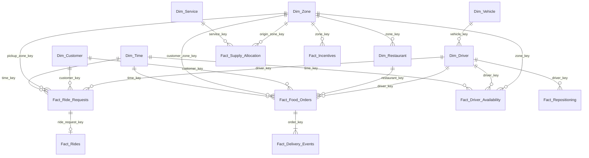

# Phase 4 — Enterprise Data Warehouse (`PULSE_DW`)

SQL Server 2025 (Developer), schema `dw`. Star schema at **Zone × Time × Service**
grain, loaded from the synthetic Bengaluru dataset.

## Build

```bash
python scripts/build_all.py        # generate data (if not already done)
python scripts/load_warehouse.py   # create PULSE_DW, load, index, run checks
```

The loader runs `sql/01` → `sql/02` → bulk insert → `sql/03` → row-count check →
`sql/04`. Re-running rebuilds the warehouse from scratch. Connection settings:
`config/warehouse.yaml`.

| Script | Purpose |
|--------|---------|
| `sql/01_create_database.sql` | Create `PULSE_DW` and schema `dw` |
| `sql/02_create_tables.sql` | Drop and create all dimensions and facts with keys |
| `sql/03_create_indexes.sql` | Analytics indexes (run after loading) |
| `sql/04_data_quality_checks.sql` | Business-rule checks; every count should be 0 |

## Star schema



## Tables

| Table | Grain | Rows (default data) |
|-------|-------|--------------------:|
| `Dim_Time` | Hour (`time_key` = yyyymmddhh), incl. one spill day | 2,712 |
| `Dim_Zone` | Zone | 24 |
| `Dim_Service` | Service | 2 |
| `Dim_Vehicle` | Vehicle type + eligibility | 2 |
| `Dim_Driver` | Partner | 850 |
| `Dim_Customer` | Customer | ~60,000 |
| `Dim_Restaurant` | Restaurant | 1,035 |
| `Fact_Ride_Requests` | Ride request (incl. cancelled) | 477,426 |
| `Fact_Rides` | Completed trip | 343,291 |
| `Fact_Food_Orders` | Food order (incl. cancelled) | 621,451 |
| `Fact_Delivery_Events` | Order milestone | ~3.0M |
| `Fact_Driver_Availability` | Partner × online hour | 642,456 |
| `Fact_Supply_Allocation` | Optimizer allocation — **filled in Phase 10** | 0 |
| `Fact_Repositioning` | Individual move — **filled in Phase 10** | 0 |
| `Fact_Incentives` | Incentive — **filled in Phase 11** | 0 |

Column-level definitions: `Data_Dictionary.md`.

## Design decisions

- **Surrogate keys** are assigned in Python (`src/pulse/warehouse/transform.py`),
  deterministically, so every load is reproducible.
- **`Dim_Location` merged into `Dim_Zone`** — a deliberate deviation from the
  locked plan: every PULSE event happens at zone level (no street addresses or
  GPS points), so a separate location dimension would duplicate `Dim_Zone`.
- **Three facts start empty.** Status-quo history has no repositioning or
  incentives; the tables exist so Phases 10–11 only need to insert rows.
- **Cancellation timestamps** in `Fact_Delivery_Events` use the last known
  milestone before cancelling (the simulation does not record the exact
  cancel moment).
- **Spill day** in `Dim_Time`: jobs finishing after midnight on the final day
  still get a valid `time_key` (`data_split = 'spill'`).
