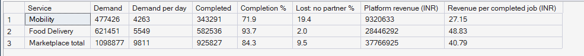
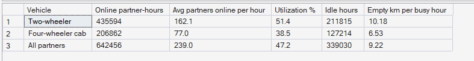

# Phase 5 — Marketplace Performance Analytics
## 01. Marketplace Overview

**SQL Script:** `sql/01_marketplace_overview.sql` · **Views:** `sql/00_create_kpi_views.sql`

---

## 1. Business Question

How large is the PULSE marketplace, how much of its demand does it actually
serve, and how fully are its partners used?

---

## 2. Objective

Establish the baseline: demand, fulfilment and platform revenue for each
service, and the volume and utilization of partner supply, for the full
16-week period under status-quo dispatch.

---

## 3. Data Sources

- `dw.vw_Marketplace_ZoneHour` (built on `Fact_Ride_Requests`, `Fact_Rides`, `Fact_Food_Orders`)
- `dw.vw_Supply_ZoneHour` (built on `Fact_Driver_Availability`)
- `dw.Dim_Service`, `dw.Dim_Vehicle`, `dw.Dim_Time`

---

## 4. Analytical Grain

Views are at **Zone × Hour × Service**; this analysis aggregates them to
**service** (Result Set A) and **vehicle type** (Result Set B) over the whole
period. The one-day "spill" buffer in `Dim_Time` is excluded from day counts.

---

## 5. Techniques Used

- Reusable KPI views holding sums, not rates
- Conditional aggregation and `UNION ALL` for a total row
- Ratio-of-sums rates (`SUM(completed) / SUM(demand)`)
- `NULLIF` to guard division by zero
- Variables for day and hour counts

---

# 6. Result Set A — Demand, Fulfilment and Revenue by Service

<!-- AUTO:A -->
| Service | Demand | Demand per day | Completed | Completion % | Lost: no partner % | Platform revenue (INR) | Revenue per completed job (INR) |
|---|---|---|---|---|---|---|---|
| Mobility | 477,426 | 4,263 | 343,291 | 71.9 | 19.4 | ₹9,320,633 | ₹27.15 |
| Food Delivery | 621,451 | 5,549 | 582,536 | 93.7 | 2.0 | ₹28,446,292 | ₹48.83 |
| Marketplace total | 1,098,877 | 9,811 | 925,827 | 84.3 | 9.5 | ₹37,766,925 | ₹40.79 |

_Generated 2026-10-03 by a report script — do not edit by hand._
<!-- /AUTO:A -->

### Screenshot

---

# 7. Result Set B — Supply and Utilization by Vehicle

<!-- AUTO:B -->
| Vehicle | Online partner-hours | Avg partners online per hour | Utilization % | Idle hours | Empty km per busy hour |
|---|---|---|---|---|---|
| Two-wheeler | 435,594 | 162.10 | 51.4 | 211,815 | 10.2 |
| Four-wheeler cab | 206,862 | 77.00 | 38.5 | 127,214 | 6.5 |
| All partners | 642,456 | 239.00 | 47.2 | 339,030 | 9.2 |

_Generated 2026-10-03 by a report script — do not edit by hand._
<!-- /AUTO:B -->

### Screenshot

---

# 8. Reconciliation — SQL vs Python

The service figures in Result Set A, recomputed directly from the generated
source files, must equal the SQL results.

<!-- AUTO:reconciliation -->
| Service | Measure | SQL | Python | Match |
|---|---|---|---|---|
| Mobility | Demand | 477,426 | 477,426 | ✅ |
| Mobility | Completed | 343,291 | 343,291 | ✅ |
| Mobility | Platform revenue (INR) | 9,320,633 | 9,320,633 | ✅ |
| Food Delivery | Demand | 621,451 | 621,451 | ✅ |
| Food Delivery | Completed | 582,536 | 582,536 | ✅ |
| Food Delivery | Platform revenue (INR) | 28,446,292 | 28,446,292 | ✅ |

_Generated 2026-10-03 by a report script — do not edit by hand._
<!-- /AUTO:reconciliation -->

---

# 9. Key Observations

### 9.1 Food delivery is reliable; mobility is not
Most food orders are delivered, but a substantial share of ride requests are
never completed (Result Set A).

### 9.2 Most failed rides are a supply-reach problem
The largest cause of ride failure is that no partner can reach the customer in
time — not customers cancelling.

### 9.3 Partners are under-used
Across both vehicle types, partners spend a large part of their online time
idle (Result Set B). Four-wheelers, which can serve rides only, are idle more
than two-wheelers.

---

# 10. Business Interpretation

The marketplace loses a meaningful share of its ride demand while a large
share of its paid-for partner time goes unused. Unserved demand and idle
supply existing together suggests a **matching and positioning** problem, not
simply a shortage of partners.

---

# 11. Business Implication

The next analyses must locate the failures in **space** (which zones) and
**time** (which hours) and test whether idle supply sits in different places
from unmet demand (analysis 04).

---

# 12. Scope Control

This analysis intentionally does **not** include demand maps (Phase 6),
supply maps (Phase 7), the pressure index (Phase 8), forecasting (Phase 9),
optimization (Phase 10) or incentives (Phase 11).

---

# 13. Reproducibility

`sql/01_marketplace_overview.sql` is the authoritative source; run it in SSMS
or regenerate this document with `python scripts/report_phase5.py`. Tables and
the headline summary below are generated, never typed.

---

## Conclusion

<!-- AUTO:headline -->
- **9,811 jobs per day**, of which **84.3%** are fulfilled.
- Rides are fulfilled **71.9%** of the time versus **93.7%** for food; **19.4%** of ride requests are lost because no partner can reach the customer.
- Platform revenue: **₹37,766,925** over the period — **₹27.15** per ride and **₹48.83** per food order.
- Partners are busy only **47.2%** of their online time.

_Generated 2026-10-03 by a report script — do not edit by hand._
<!-- /AUTO:headline -->
