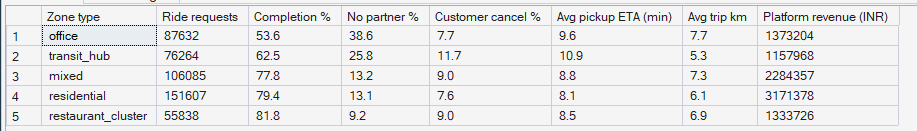
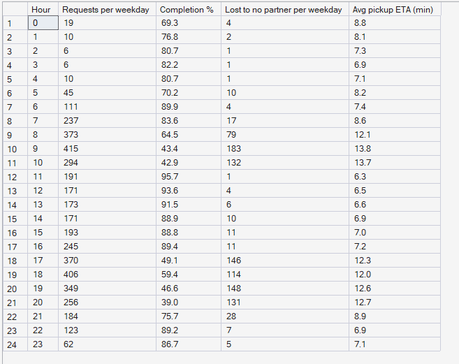

# Phase 5 — Marketplace Performance Analytics
## 02. Mobility Performance

**SQL Script:** `sql/02_mobility_performance.sql`

---

## 1. Business Question

Where and when do ride requests fail, and why?

---

## 2. Objective

Measure ride completion, cancellation reasons, pickup ETA and revenue by
pickup zone type, and profile weekday ride demand and failures hour by hour.

---

## 3. Data Sources

- `dw.vw_Mobility_ZoneHour` (built on `Fact_Ride_Requests` and `Fact_Rides`)
- `dw.Dim_Zone`, `dw.Dim_Time`

---

## 4. Analytical Grain

Aggregated from **pickup zone × hour** to **zone type** (Result Set A) and to
**weekday hour of day** (Result Set B). Per-day figures divide by the number
of weekdays in the period.

---

## 5. Techniques Used

- Ratio-of-sums rates for completion and each cancellation reason
- Weighted averages (`SUM(eta) / SUM(completed)`) instead of averaging averages
- Filtering on `Dim_Time.is_weekend`
- Ordering by the KPI to surface the worst segments first

---

# 6. Result Set A — Ride KPIs by Pickup Zone Type

<!-- AUTO:A -->
| Zone type | Ride requests | Completion % | No partner % | Customer cancel % | Avg pickup ETA (min) | Avg trip km | Platform revenue (INR) |
|---|---|---|---|---|---|---|---|
| office | 87,632 | 53.6 | 38.6 | 7.7 | 9.6 | 7.7 | ₹1,373,204 |
| transit_hub | 76,264 | 62.5 | 25.8 | 11.7 | 10.9 | 5.3 | ₹1,157,968 |
| mixed | 106,085 | 77.8 | 13.2 | 9.0 | 8.8 | 7.3 | ₹2,284,357 |
| residential | 151,607 | 79.4 | 13.1 | 7.6 | 8.1 | 6.1 | ₹3,171,378 |
| restaurant_cluster | 55,838 | 81.8 | 9.2 | 9.0 | 8.5 | 6.9 | ₹1,333,726 |

_Generated 2026-10-03 by a report script — do not edit by hand._
<!-- /AUTO:A -->

### Screenshot

---

# 7. Result Set B — Weekday Ride Profile by Hour

<!-- AUTO:B -->
| Hour | Requests per weekday | Completion % | Lost to no partner per weekday | Avg pickup ETA (min) |
|---|---|---|---|---|
| 0 | 19 | 69.3 | 4 | 8.8 |
| 1 | 10 | 76.8 | 2 | 8.1 |
| 2 | 6 | 80.7 | 1 | 7.3 |
| 3 | 6 | 82.2 | 1 | 6.9 |
| 4 | 10 | 80.7 | 1 | 7.1 |
| 5 | 45 | 70.2 | 10 | 8.2 |
| 6 | 111 | 89.9 | 4 | 7.4 |
| 7 | 237 | 83.6 | 17 | 8.6 |
| 8 | 373 | 64.5 | 79 | 12.1 |
| 9 | 415 | 43.4 | 183 | 13.8 |
| 10 | 294 | 42.9 | 132 | 13.7 |
| 11 | 191 | 95.7 | 1 | 6.3 |
| 12 | 171 | 93.6 | 4 | 6.5 |
| 13 | 173 | 91.5 | 6 | 6.6 |
| 14 | 171 | 88.9 | 10 | 6.9 |
| 15 | 193 | 88.8 | 11 | 7.0 |
| 16 | 245 | 89.4 | 11 | 7.2 |
| 17 | 370 | 49.1 | 146 | 12.3 |
| 18 | 406 | 59.4 | 114 | 12.0 |
| 19 | 349 | 46.6 | 148 | 12.6 |
| 20 | 256 | 39.0 | 131 | 12.7 |
| 21 | 184 | 75.7 | 28 | 8.9 |
| 22 | 123 | 89.2 | 7 | 6.9 |
| 23 | 62 | 86.7 | 5 | 7.1 |

_Generated 2026-10-03 by a report script — do not edit by hand._
<!-- /AUTO:B -->

### Screenshot

---

# 8. Key Observations

### 8.1 Office zones are the weakest pickup locations
Rides requested in office zones complete far less often than elsewhere, and
almost all of the gap is "no partner" rather than customer cancellation.

### 8.2 Residential and restaurant-cluster zones are served well
Where partners live and where they finish food deliveries, ride completion
is high.

### 8.3 Failures concentrate in the commute peaks
Weekday ride losses rise sharply in the morning and evening commute hours,
when ride demand peaks.

### 8.4 Customer cancellations are steady
Customer cancellations vary far less than "no partner" losses, so the
mobility problem is supply reach, not customer behaviour.

---

# 9. Business Interpretation

Ride failure is **structural**: it happens in specific zones (offices,
transit hubs) at specific hours (commute peaks), because partners are not
positioned where and when commuters need them.

---

# 10. Business Implication

The highest-value mobility interventions are targeted: positioning partners
near office zones before the evening peak and near residential zones before
the morning peak. Phase 8 will quantify the pressure; Phase 10 will decide the
moves.

---

# 11. Scope Control

This analysis does **not** attribute failures to individual partners or
customers, and does **not** include demand forecasting, optimization or
pricing.

---

# 12. Reproducibility

`sql/02_mobility_performance.sql` is the authoritative source; regenerate this
document with `python scripts/report_phase5.py`.

---

## Conclusion

<!-- AUTO:headline -->
- Ride completion ranges from **53.6%** in **office** zones to **81.8%** in **restaurant_cluster** zones.
- The most rides are lost at **09:00** on weekdays: **183** requests per day find no partner.
- Among busy hours, completion is lowest at **20:00** (**39.0%**).

_Generated 2026-10-03 by a report script — do not edit by hand._
<!-- /AUTO:headline -->
