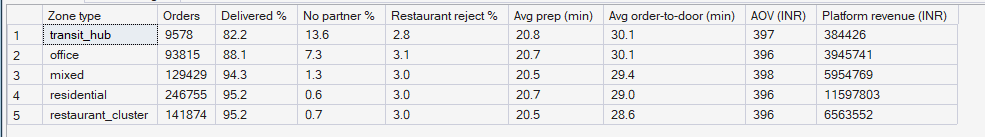
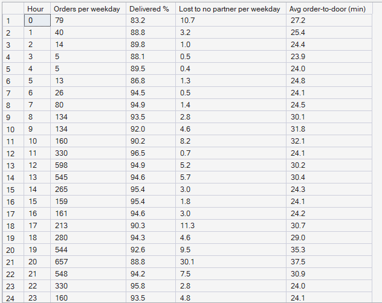

# Phase 5 — Marketplace Performance Analytics
## 03. Food Delivery Performance

**SQL Script:** `sql/03_food_performance.sql`

---

## 1. Business Question

How reliable and how fast is food delivery, and where does it fail?

---

## 2. Objective

Measure delivery success, cancellation reasons, preparation time,
order-to-door time, order value and revenue by customer zone type, and profile
weekday food demand hour by hour.

---

## 3. Data Sources

- `dw.vw_Food_ZoneHour` (built on `Fact_Food_Orders`)
- `dw.Dim_Zone`, `dw.Dim_Time`

---

## 4. Analytical Grain

Aggregated from **customer zone × hour** to **zone type** (Result Set A) and
to **weekday hour of day** (Result Set B).

---

## 5. Techniques Used

- Ratio-of-sums rates for delivery success and each cancellation reason
- Weighted average times (sum of minutes ÷ delivered orders)
- Average order value as GMV ÷ delivered orders
- Weekday filtering via `Dim_Time`

---

# 6. Result Set A — Food KPIs by Customer Zone Type

<!-- AUTO:A -->
| Zone type | Orders | Delivered % | No partner % | Restaurant reject % | Avg prep (min) | Avg order-to-door (min) | AOV (INR) | Platform revenue (INR) |
|---|---|---|---|---|---|---|---|---|
| transit_hub | 9,578 | 82.2 | 13.6 | 2.8 | 20.8 | 30.1 | ₹397 | ₹384,426 |
| office | 93,815 | 88.1 | 7.3 | 3.1 | 20.7 | 30.1 | ₹396 | ₹3,945,741 |
| mixed | 129,429 | 94.3 | 1.3 | 3.0 | 20.5 | 29.4 | ₹398 | ₹5,954,769 |
| residential | 246,755 | 95.2 | 0.6 | 3.0 | 20.7 | 29.0 | ₹396 | ₹11,597,803 |
| restaurant_cluster | 141,874 | 95.2 | 0.7 | 3.0 | 20.5 | 28.6 | ₹396 | ₹6,563,552 |

_Generated 2026-10-03 by a report script — do not edit by hand._
<!-- /AUTO:A -->

### Screenshot

---

# 7. Result Set B — Weekday Food Profile by Hour

<!-- AUTO:B -->
| Hour | Orders per weekday | Delivered % | Lost to no partner per weekday | Avg order-to-door (min) |
|---|---|---|---|---|
| 0 | 79 | 83.2 | 10.70 | 27.2 |
| 1 | 40 | 88.8 | 3.20 | 25.4 |
| 2 | 14 | 89.8 | 1.00 | 24.4 |
| 3 | 5 | 88.1 | 0.50 | 23.9 |
| 4 | 5 | 89.5 | 0.40 | 24.0 |
| 5 | 13 | 86.8 | 1.30 | 24.8 |
| 6 | 26 | 94.5 | 0.50 | 24.1 |
| 7 | 80 | 94.9 | 1.40 | 24.5 |
| 8 | 134 | 93.5 | 2.80 | 30.1 |
| 9 | 134 | 92.0 | 4.60 | 31.8 |
| 10 | 160 | 90.2 | 8.20 | 32.1 |
| 11 | 330 | 96.5 | 0.70 | 24.1 |
| 12 | 598 | 94.9 | 5.20 | 30.2 |
| 13 | 545 | 94.6 | 5.70 | 30.4 |
| 14 | 265 | 95.4 | 3.00 | 24.3 |
| 15 | 159 | 95.4 | 1.80 | 24.1 |
| 16 | 161 | 94.6 | 3.00 | 24.2 |
| 17 | 213 | 90.3 | 11.30 | 30.7 |
| 18 | 280 | 94.3 | 4.60 | 29.0 |
| 19 | 544 | 92.6 | 9.50 | 35.3 |
| 20 | 657 | 88.8 | 30.10 | 37.5 |
| 21 | 548 | 94.2 | 7.50 | 30.9 |
| 22 | 330 | 95.8 | 2.80 | 24.0 |
| 23 | 160 | 93.5 | 4.80 | 24.1 |

_Generated 2026-10-03 by a report script — do not edit by hand._
<!-- /AUTO:B -->

### Screenshot

---

# 8. Key Observations

### 8.1 Food delivery is reliable almost everywhere
Delivery success is high in residential, mixed and restaurant-cluster zones.

### 8.2 Transit hubs and office zones are the exceptions
Orders from transit hubs (notably the isolated airport) and office zones are
lost to "no partner" more often.

### 8.3 Speed is consistent
Preparation and order-to-door times vary little between zone types: when an
order is served, it is served at a similar speed.

### 8.4 Lunch and dinner dominate
Weekday orders peak sharply at lunch and dinner, the hours when food and ride
demand compete for the same two-wheelers.

---

# 9. Business Interpretation

Food performs well because two-wheelers are plentiful, restaurants cluster
near where partners already are, and just-in-time dispatch avoids waiting at
restaurants. Its weak spots are the same places mobility struggles: zones that
few partners live near or can reach.

---

# 10. Business Implication

Food service levels are not the main problem, but food's peaks determine how
many two-wheelers are left for rides at lunch and dinner. Allocation between
the two services (Phase 10) must account for this competition.

---

# 11. Scope Control

This analysis does **not** include restaurant-level performance ranking,
menu or cuisine analysis, customer analytics or pricing.

---

# 12. Reproducibility

`sql/03_food_performance.sql` is the authoritative source; regenerate this
document with `python scripts/report_phase5.py`.

---

## Conclusion

<!-- AUTO:headline -->
- Delivery success ranges from **82.2%** in **transit_hub** zones to **95.2%** in **restaurant_cluster** zones.
- Weekday order-to-door time averages about **30 minutes**, and varies little across zone types.
- The busiest weekday hour is **20:00** with **657** orders per day.

_Generated 2026-10-03 by a report script — do not edit by hand._
<!-- /AUTO:headline -->
