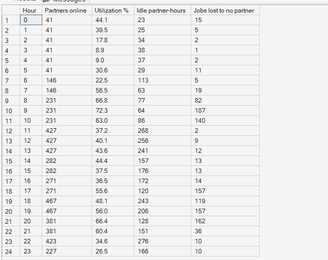
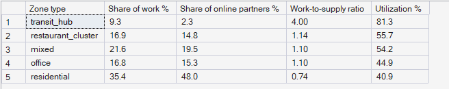

# Phase 5 — Marketplace Performance Analytics
## 04. Supply and Utilization

**SQL Script:** `sql/04_supply_utilization.sql`

---

## 1. Business Question

Is the marketplace short of partners, or are its partners in the wrong place
at the wrong time?

---

## 2. Objective

Compare, hour by hour, how many partners are online and idle with how many
jobs are lost for lack of a partner; and compare where partners are with where
the work is.

---

## 3. Data Sources

- `dw.vw_Supply_ZoneHour` (built on `Fact_Driver_Availability`; partner location at the start of each hour)
- `dw.vw_Marketplace_ZoneHour`
- `dw.Dim_Zone`, `dw.Dim_Time`

---

## 4. Analytical Grain

**Weekday hour of day** (Result Set A) and **zone type** (Result Set B).
"Work" is measured in partner-hours requested: rides ÷ 2 + orders ÷ 3
(Assumption O-01).

---

## 5. Techniques Used

- Common Table Expressions joining supply and demand at the same grain
- `LEFT JOIN` so hours without losses still appear
- Window functions (`SUM(...) OVER ()`) for shares of the city total
- A work-to-supply ratio: share of work ÷ share of online partners

---

# 6. Result Set A — Idle Partners vs Lost Jobs by Weekday Hour

<!-- AUTO:A -->
| Hour | Partners online | Utilization % | Idle partner-hours | Jobs lost to no partner |
|---|---|---|---|---|
| 0 | 41 | 44.1 | 23 | 15 |
| 1 | 41 | 39.5 | 25 | 5 |
| 2 | 41 | 17.8 | 34 | 2 |
| 3 | 41 | 8.9 | 38 | 1 |
| 4 | 41 | 9.0 | 37 | 2 |
| 5 | 41 | 30.6 | 29 | 11 |
| 6 | 146 | 22.5 | 113 | 5 |
| 7 | 146 | 56.5 | 63 | 19 |
| 8 | 231 | 66.8 | 77 | 82 |
| 9 | 231 | 72.3 | 64 | 187 |
| 10 | 231 | 63.0 | 86 | 140 |
| 11 | 427 | 37.2 | 268 | 2 |
| 12 | 427 | 40.1 | 256 | 9 |
| 13 | 427 | 43.6 | 241 | 12 |
| 14 | 282 | 44.4 | 157 | 13 |
| 15 | 282 | 37.5 | 176 | 13 |
| 16 | 271 | 36.5 | 172 | 14 |
| 17 | 271 | 55.6 | 120 | 157 |
| 18 | 467 | 48.1 | 243 | 119 |
| 19 | 467 | 56.0 | 206 | 157 |
| 20 | 381 | 66.4 | 128 | 162 |
| 21 | 381 | 60.4 | 151 | 36 |
| 22 | 423 | 34.6 | 276 | 10 |
| 23 | 227 | 26.5 | 166 | 10 |

_Generated 2026-10-03 by a report script — do not edit by hand._
<!-- /AUTO:A -->

### Screenshot

---

# 7. Result Set B — Where Partners Are vs Where Work Is

A work-to-supply ratio above 1 means a zone type generates more work than its
share of online partners; below 1 means it holds more partners than its work.

<!-- AUTO:B -->
| Zone type | Share of work % | Share of online partners % | Work-to-supply ratio | Utilization % |
|---|---|---|---|---|
| transit_hub | 9.3 | 2.3 | 4.00 | 81.3 |
| restaurant_cluster | 16.9 | 14.8 | 1.14 | 55.7 |
| office | 16.8 | 15.3 | 1.10 | 44.9 |
| mixed | 21.6 | 19.5 | 1.10 | 54.2 |
| residential | 35.4 | 48.0 | 0.74 | 40.9 |

_Generated 2026-10-03 by a report script — do not edit by hand._
<!-- /AUTO:B -->

### Screenshot

---

# 8. Key Observations

### 8.1 Idle partners and lost jobs occur in the same hours
In the commute peaks, jobs are lost for lack of a partner while many
partner-hours sit idle at the same time (Result Set A).

### 8.2 Residential zones hold surplus supply; the airport is starved
Over the whole period, residential zones are the only zone type holding a
larger share of online partners than of work. Every other type holds less,
and transit hubs — dominated by the isolated airport — far less (Result Set B).

### 8.3 Whole-period shares understate the peak problem
Partners drift into office and mixed zones by completing trips there, so
across all hours those zones look only mildly short. The real mismatch is at
specific hours — such as the weekday lunch and evening peaks — which Phase 8
measures hour by hour.

### 8.4 Utilization is lowest where supply waits
Utilization is lowest in residential zones, where most partners start and
wait, and highest at transit hubs, where the few partners present are kept
busy.

---

# 9. Business Interpretation

The marketplace's problem is **location and timing**, not fleet size: there
are enough partners online in total, but too many are in the wrong zones when
demand peaks. This is the central finding Phase 5 hands to the rest of PULSE.

---

# 10. Business Implication

Moving existing partners ahead of demand (repositioning) can recover lost jobs
without adding fleet cost. Incentivising extra supply (Phase 11) is mainly
justified where no existing partner can reach in time — for example the
airport.

---

# 11. Scope Control

This analysis measures the mismatch; it does **not** compute the Marketplace
Pressure Index per zone and hour (Phase 8) or recommend moves (Phase 10).

---

# 12. Reproducibility

`sql/04_supply_utilization.sql` is the authoritative source; regenerate this
document with `python scripts/report_phase5.py`.

---

## Conclusion

<!-- AUTO:headline -->
- At **09:00** on weekdays, **187** jobs per day are lost to no partner while **64** partner-hours sit idle.
- **transit_hub** zones generate **9.3%** of the work but hold only **2.3%** of online partners (ratio **4.00**).
- **residential** zones hold **48.0%** of online partners for **35.4%** of the work (ratio **0.74**).

_Generated 2026-10-03 by a report script — do not edit by hand._
<!-- /AUTO:headline -->
