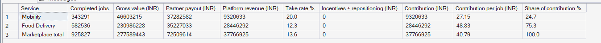
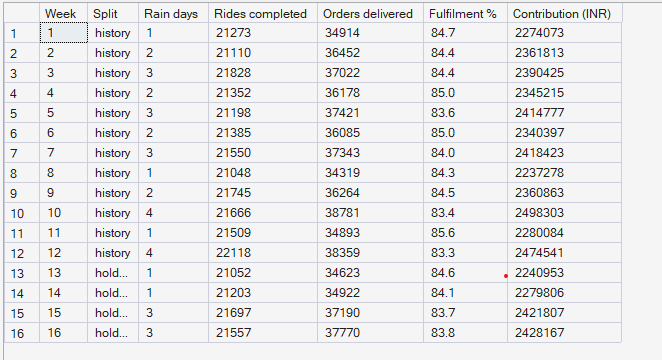

# Phase 5 — Marketplace Performance Analytics
## 05. Marketplace Economics

**SQL Script:** `sql/05_marketplace_economics.sql`

---

## 1. Business Question

Where does the marketplace's contribution come from, and how stable is it
week to week?

---

## 2. Objective

Trace the money from gross value through partner payouts to platform revenue
and contribution for each service, and show the weekly trend across the
history and holdout periods.

---

## 3. Data Sources

- `dw.vw_Marketplace_ZoneHour` (built on `Fact_Rides` and `Fact_Food_Orders`)
- `dw.Dim_Service`, `dw.Dim_Time`

---

## 4. Analytical Grain

**Service** for the full period (Result Set A) and **week** (Result Set B).

---

## 5. Techniques Used

- Money waterfall: gross value → payout → platform revenue → contribution
- Take rate as platform revenue ÷ gross value
- Share of total via a scalar subquery
- Weekly aggregation with rain-day counts from `Dim_Time`

**Definition note.** Contribution = platform revenue − incentives −
repositioning cost (KPI_Dictionary.md §5). Status-quo history contains no
incentives or repositioning, so contribution equals platform revenue here. The
column is kept so Phases 10–11 can show the change.

---

# 6. Result Set A — Money Waterfall by Service

<!-- AUTO:A -->
| Service | Completed jobs | Gross value (INR) | Partner payout (INR) | Platform revenue (INR) | Take rate % | Incentives + repositioning (INR) | Contribution (INR) | Contribution per job (INR) | Share of contribution % |
|---|---|---|---|---|---|---|---|---|---|
| Mobility | 343,291 | ₹46,603,215 | ₹37,282,582 | ₹9,320,633 | 20.0 | ₹0 | ₹9,320,633 | ₹27.15 | 24.7 |
| Food Delivery | 582,536 | ₹230,986,228 | ₹35,227,033 | ₹28,446,292 | 12.3 | ₹0 | ₹28,446,292 | ₹48.83 | 75.3 |
| Marketplace total | 925,827 | ₹277,589,443 | ₹72,509,614 | ₹37,766,925 | 13.6 | ₹0 | ₹37,766,925 | ₹40.79 | 100.0 |

_Generated 2026-10-03 by a report script — do not edit by hand._
<!-- /AUTO:A -->

### Screenshot

---

# 7. Result Set B — Weekly Trend

<!-- AUTO:B -->
| Week | Split | Rain days | Rides completed | Orders delivered | Fulfilment % | Contribution (INR) |
|---|---|---|---|---|---|---|
| 1 | history | 1 | 21,273 | 34,914 | 84.7 | ₹2,274,073 |
| 2 | history | 2 | 21,110 | 36,452 | 84.4 | ₹2,361,813 |
| 3 | history | 3 | 21,828 | 37,022 | 84.4 | ₹2,390,425 |
| 4 | history | 2 | 21,352 | 36,178 | 85.0 | ₹2,345,215 |
| 5 | history | 3 | 21,198 | 37,421 | 83.6 | ₹2,414,777 |
| 6 | history | 2 | 21,385 | 36,085 | 85.0 | ₹2,340,397 |
| 7 | history | 3 | 21,550 | 37,343 | 84.0 | ₹2,418,423 |
| 8 | history | 1 | 21,048 | 34,319 | 84.3 | ₹2,237,278 |
| 9 | history | 2 | 21,745 | 36,264 | 84.5 | ₹2,360,863 |
| 10 | history | 4 | 21,666 | 38,781 | 83.4 | ₹2,498,303 |
| 11 | history | 1 | 21,509 | 34,893 | 85.6 | ₹2,280,084 |
| 12 | history | 4 | 22,118 | 38,359 | 83.3 | ₹2,474,541 |
| 13 | holdout | 1 | 21,052 | 34,623 | 84.6 | ₹2,240,953 |
| 14 | holdout | 1 | 21,203 | 34,922 | 84.1 | ₹2,279,806 |
| 15 | holdout | 3 | 21,697 | 37,190 | 83.7 | ₹2,421,807 |
| 16 | holdout | 3 | 21,557 | 37,770 | 83.8 | ₹2,428,167 |

_Generated 2026-10-03 by a report script — do not edit by hand._
<!-- /AUTO:B -->

### Screenshot

---

# 8. Key Observations

### 8.1 Food delivery earns most of the contribution
Food orders contribute the majority of platform revenue, because each
delivered order earns more than a ride (Result Set A).

### 8.2 The two services earn differently
Rides earn a higher share of each fare; food earns a smaller share of a larger
basket plus the delivery fee.

### 8.3 Weekly contribution is stable, and rain helps
Week-to-week contribution moves within a narrow band. Weeks with more rain
days tend to earn more, because rain raises food orders (Assumption D-08).

---

# 9. Business Interpretation

Food is the economic engine; mobility is the weaker service in both
reliability and earnings per job. But every ride lost to "no partner" is lost
revenue on top of an unhappy customer, and those losses are concentrated in a
few zones and hours.

---

# 10. Business Implication

When two-wheelers are scarce, sending them to food usually earns more — but
the right choice depends on local demand at that hour. That trade-off is
exactly what the Phase 10 optimizer prices, using these Bengaluru economics
(resolving open item X-02).

---

# 11. Scope Control

This analysis does **not** include fixed costs, customer acquisition cost,
pricing changes, incentives or repositioning costs (zero in status-quo
history; Phases 10–11).

---

# 12. Reproducibility

`sql/05_marketplace_economics.sql` is the authoritative source; regenerate
this document with `python scripts/report_phase5.py`.

---

## Conclusion

<!-- AUTO:headline -->
- Food delivery provides **75.3%** of contribution; rides **24.7%**.
- Take rate: **20.0%** of ride fares and **12.3%** of food GMV.
- Contribution per job: **₹27.15** per ride and **₹48.83** per food order.
- Weekly contribution ranges from **₹2,237,278** to **₹2,498,303** across the 16 weeks.

_Generated 2026-10-03 by a report script — do not edit by hand._
<!-- /AUTO:headline -->
