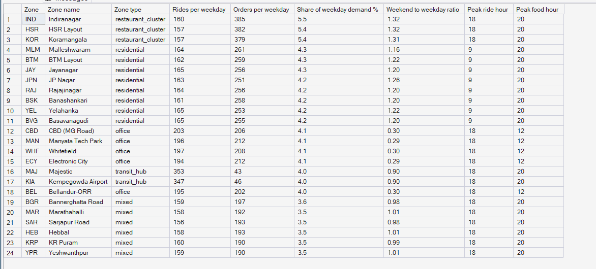
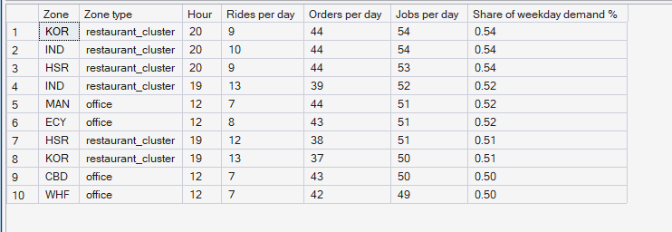
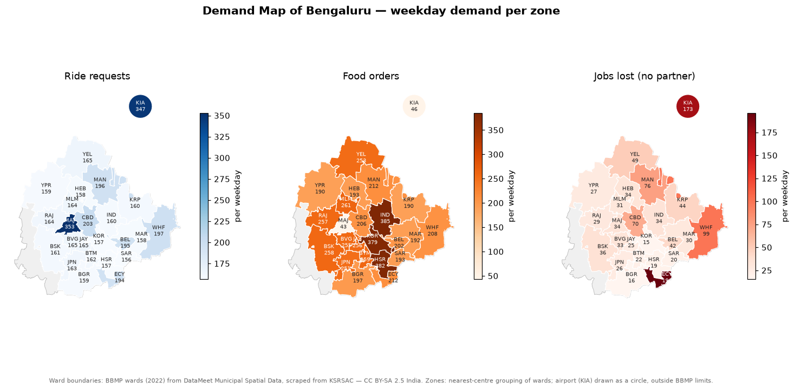

# Phase 6 — Hyperlocal Demand Intelligence
## 01. Zone Demand Profile

**SQL Script:** `sql/01_zone_demand_profile.sql`

---

## 1. Business Question

Which zones generate PULSE's demand, for which service, how do weekends
change it, and when does each zone peak?

---

## 2. Objective

Profile all 24 zones on weekday ride and food demand, their share of the
city, their weekend-to-weekday ratio and their peak hours; then identify the
busiest individual zone-hours.

---

## 3. Data Sources

- `dw.vw_Marketplace_ZoneHour` (Phase 5 KPI view)
- `dw.Dim_Zone`, `dw.Dim_Time`
- `config/bengaluru/zone_boundaries.geojson` for the map

---

## 4. Analytical Grain

**Zone** (Result Set A) and **zone × weekday hour** (Result Set B), expressed
per day so weekdays and weekends compare fairly.

---

## 5. Techniques Used

- Conditional aggregation by service and day type
- `ROW_NUMBER() OVER (PARTITION BY …)` to find each zone's peak hour
- Window shares (`SUM(...) OVER ()`) and `TOP (10)`
- Choropleth map of real ward-based zone boundaries (GeoPandas)

---

# 6. Result Set A — Zone Demand Profile

<!-- AUTO:A -->
| Zone | Zone name | Zone type | Rides per weekday | Orders per weekday | Share of weekday demand % | Weekend to weekday ratio | Peak ride hour | Peak food hour |
|---|---|---|---|---|---|---|---|---|
| IND | Indiranagar | restaurant_cluster | 160 | 385 | 5.5 | 1.32 | 18 | 20 |
| HSR | HSR Layout | restaurant_cluster | 157 | 382 | 5.4 | 1.32 | 18 | 20 |
| KOR | Koramangala | restaurant_cluster | 157 | 379 | 5.4 | 1.31 | 18 | 20 |
| JAY | Jayanagar | residential | 165 | 256 | 4.3 | 1.20 | 9 | 20 |
| MLM | Malleshwaram | residential | 164 | 261 | 4.3 | 1.16 | 9 | 20 |
| BTM | BTM Layout | residential | 162 | 259 | 4.3 | 1.22 | 9 | 20 |
| YEL | Yelahanka | residential | 165 | 253 | 4.2 | 1.22 | 9 | 20 |
| BVG | Basavanagudi | residential | 165 | 255 | 4.2 | 1.20 | 9 | 20 |
| BSK | Banashankari | residential | 161 | 258 | 4.2 | 1.20 | 9 | 20 |
| JPN | JP Nagar | residential | 163 | 251 | 4.2 | 1.26 | 9 | 20 |
| RAJ | Rajajinagar | residential | 164 | 256 | 4.2 | 1.20 | 9 | 20 |
| WHF | Whitefield | office | 197 | 208 | 4.1 | 0.30 | 18 | 12 |
| ECY | Electronic City | office | 194 | 212 | 4.1 | 0.29 | 18 | 12 |
| MAN | Manyata Tech Park | office | 196 | 212 | 4.1 | 0.29 | 18 | 12 |
| CBD | CBD (MG Road) | office | 203 | 206 | 4.1 | 0.30 | 18 | 12 |
| MAJ | Majestic | transit_hub | 353 | 43 | 4.0 | 0.90 | 18 | 20 |
| KIA | Kempegowda Airport | transit_hub | 347 | 46 | 4.0 | 0.90 | 18 | 20 |
| BEL | Bellandur-ORR | office | 195 | 202 | 4.0 | 0.30 | 18 | 12 |
| BGR | Bannerghatta Road | mixed | 159 | 197 | 3.6 | 0.98 | 18 | 20 |
| HEB | Hebbal | mixed | 158 | 193 | 3.5 | 1.01 | 18 | 20 |
| MAR | Marathahalli | mixed | 158 | 192 | 3.5 | 1.01 | 18 | 20 |
| SAR | Sarjapur Road | mixed | 156 | 193 | 3.5 | 0.98 | 18 | 20 |
| KRP | KR Puram | mixed | 160 | 190 | 3.5 | 0.99 | 18 | 20 |
| YPR | Yeshwanthpur | mixed | 159 | 190 | 3.5 | 1.01 | 18 | 20 |

_Generated 2026-10-03 by a report script — do not edit by hand._
<!-- /AUTO:A -->

### Screenshot

---

# 7. Result Set B — The Ten Busiest Weekday Zone-Hours

<!-- AUTO:B -->
| Zone | Zone type | Hour | Rides per day | Orders per day | Jobs per day | Share of weekday demand % |
|---|---|---|---|---|---|---|
| KOR | restaurant_cluster | 20 | 9 | 44 | 54 | 0.5 |
| IND | restaurant_cluster | 20 | 10 | 44 | 54 | 0.5 |
| HSR | restaurant_cluster | 20 | 9 | 44 | 53 | 0.5 |
| IND | restaurant_cluster | 19 | 13 | 39 | 52 | 0.5 |
| MAN | office | 12 | 7 | 44 | 51 | 0.5 |
| ECY | office | 12 | 8 | 43 | 51 | 0.5 |
| HSR | restaurant_cluster | 19 | 12 | 38 | 51 | 0.5 |
| KOR | restaurant_cluster | 19 | 13 | 37 | 50 | 0.5 |
| CBD | office | 12 | 7 | 43 | 50 | 0.5 |
| WHF | office | 12 | 7 | 42 | 49 | 0.5 |

_Generated 2026-10-03 by a report script — do not edit by hand._
<!-- /AUTO:B -->

### Screenshot

---

# 8. The Demand Map of Bengaluru

---

# 9. Key Observations

### 9.1 Ride demand concentrates at transit hubs
Majestic and the airport generate the most ride requests of any zone, all day
long (Result Set A, map).

### 9.2 Food demand concentrates in restaurant clusters
Koramangala, Indiranagar and HSR Layout lead food orders, followed by the
dense residential zones.

### 9.3 Weekends reshape the city
Office zones lose most of their demand at weekends, while restaurant clusters
and residential zones gain — so the weekend demand map is a different city
from the weekday one.

### 9.4 Each zone type has its own peak
Office zones peak in the evening for rides and residential zones in the
morning; food peaks at dinner in most zones but at lunch in office zones.

---

# 10. Business Interpretation

Demand in PULSE is **hyperlocal**: a handful of zones and hours carry a large
share of the city's work, and which zones matter changes with the service, the
hour and the day type. Planning supply at city level would hide this.

---

# 11. Business Implication

Supply plans must be built per zone and per day type. Transit hubs need ride
supply all day; restaurant clusters need two-wheelers at meal times; office
zones need almost nothing at weekends.

---

# 12. Scope Control

This analysis describes **demand** only. It does not analyse supply
positions (Phase 7), compute the pressure index (Phase 8), forecast (Phase 9)
or recommend actions (Phases 10–11).

---

# 13. Reproducibility

`sql/01_zone_demand_profile.sql` is the authoritative source; run it in SSMS or regenerate this
document with `python scripts/report_phase6.py`. Tables, charts and the
headline summary are generated, never typed.

---

## Conclusion

<!-- AUTO:headline -->
- The busiest zone is **IND (Indiranagar)** with **5.5%** of weekday demand.
- Most ride requests: **MAJ** (**353** per weekday); most food orders: **IND** (**385** per weekday).
- Weekends change demand most in **office** zones (weekend ÷ weekday **0.30**) and **restaurant_cluster** zones (**1.32**).
- The single busiest weekday zone-hour is **KOR at 20:00** with **54** jobs per day.

_Generated 2026-10-03 by a report script — do not edit by hand._
<!-- /AUTO:headline -->
