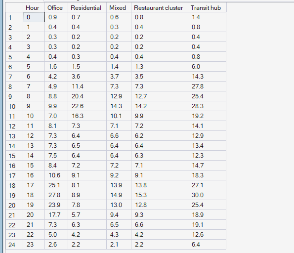
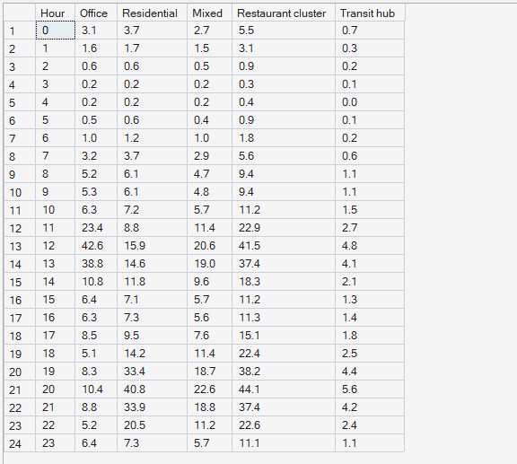
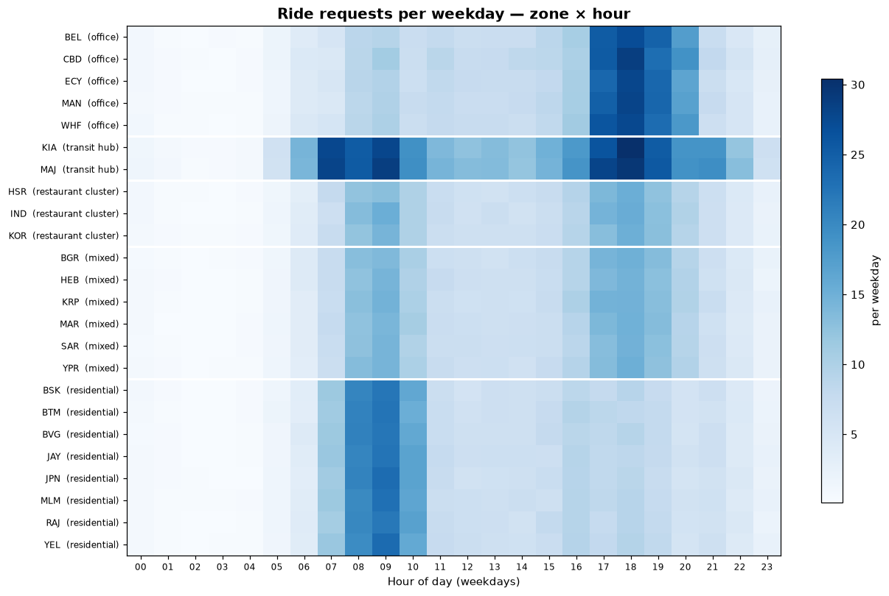
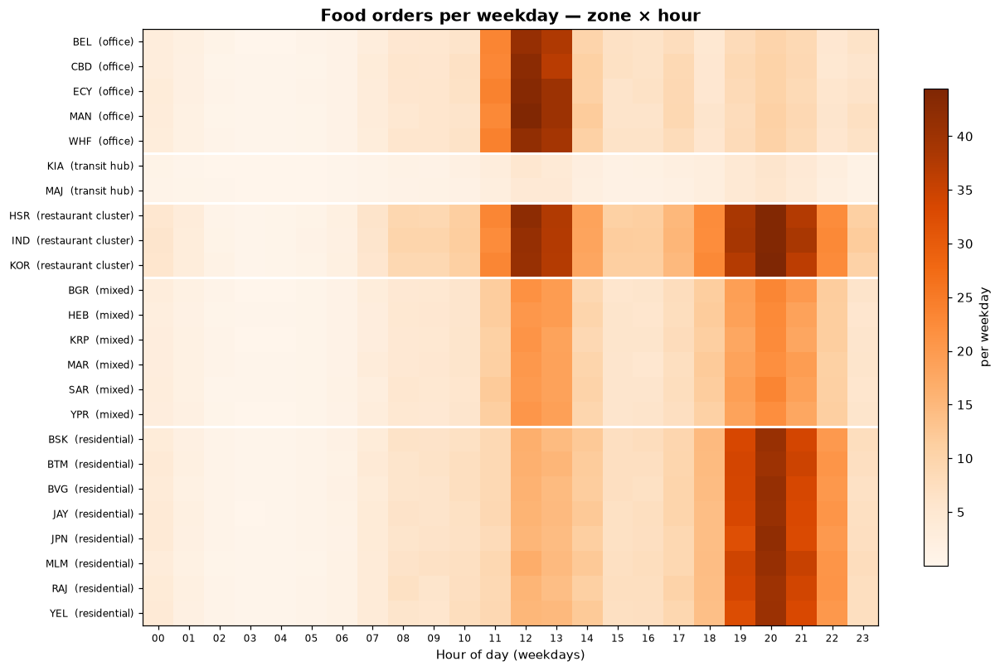

# Phase 6 — Hyperlocal Demand Intelligence
## 02. Time-of-Day Demand Patterns

**SQL Script:** `sql/02_time_of_day_patterns.sql` · **Chart data:** `sql/06_zone_hour_matrix.sql`

---

## 1. Business Question

How does demand for each service move through the weekday in each type of
zone — and in each individual zone?

---

## 2. Objective

Build the weekday hourly demand shape for every zone type and service, and
show the full zone × hour picture as heatmaps.

---

## 3. Data Sources

- `dw.vw_Marketplace_ZoneHour`, `dw.Dim_Zone`, `dw.Dim_Time`

---

## 4. Analytical Grain

**Weekday hour × zone type**, expressed **per zone** (demand divided by the
number of zones of that type) so zone types of different sizes can be compared
on shape. Heatmaps show **zone × weekday hour**.

---

## 5. Techniques Used

- Conditional aggregation to pivot zone types into columns
- Per-zone normalisation with a correlated count
- Zone × hour heatmaps grouped by zone type (matplotlib)

---

# 6. Result Set A — Weekday Rides per Zone, by Hour and Zone Type

<!-- AUTO:A -->
| Hour | Office | Residential | Mixed | Restaurant cluster | Transit hub |
|---|---|---|---|---|---|
| 0 | 0.90 | 0.70 | 0.60 | 0.80 | 1.40 |
| 1 | 0.40 | 0.40 | 0.30 | 0.40 | 0.80 |
| 2 | 0.30 | 0.20 | 0.20 | 0.20 | 0.40 |
| 3 | 0.30 | 0.20 | 0.20 | 0.20 | 0.40 |
| 4 | 0.40 | 0.30 | 0.40 | 0.40 | 0.80 |
| 5 | 1.60 | 1.50 | 1.40 | 1.30 | 6.00 |
| 6 | 4.20 | 3.60 | 3.70 | 3.50 | 14.30 |
| 7 | 4.90 | 11.40 | 7.30 | 7.30 | 27.80 |
| 8 | 8.80 | 20.40 | 12.90 | 12.70 | 25.40 |
| 9 | 9.90 | 22.60 | 14.30 | 14.20 | 28.30 |
| 10 | 7.00 | 16.30 | 10.10 | 9.90 | 19.20 |
| 11 | 8.10 | 7.30 | 7.10 | 7.20 | 14.10 |
| 12 | 7.30 | 6.40 | 6.60 | 6.20 | 12.90 |
| 13 | 7.30 | 6.50 | 6.40 | 6.40 | 13.40 |
| 14 | 7.50 | 6.40 | 6.40 | 6.30 | 12.30 |
| 15 | 8.40 | 7.20 | 7.20 | 7.10 | 14.70 |
| 16 | 10.60 | 9.10 | 9.20 | 9.10 | 18.30 |
| 17 | 25.10 | 8.10 | 13.90 | 13.80 | 27.10 |
| 18 | 27.80 | 8.90 | 14.90 | 15.30 | 30.00 |
| 19 | 23.90 | 7.80 | 13.00 | 12.80 | 25.40 |
| 20 | 17.70 | 5.70 | 9.40 | 9.30 | 18.90 |
| 21 | 7.30 | 6.30 | 6.50 | 6.60 | 19.10 |
| 22 | 5.00 | 4.20 | 4.30 | 4.20 | 12.60 |
| 23 | 2.60 | 2.20 | 2.10 | 2.20 | 6.40 |

_Generated 2026-10-03 by a report script — do not edit by hand._
<!-- /AUTO:A -->

### Screenshot

---

# 7. Result Set B — Weekday Food Orders per Zone, by Hour and Zone Type

<!-- AUTO:B -->
| Hour | Office | Residential | Mixed | Restaurant cluster | Transit hub |
|---|---|---|---|---|---|
| 0 | 3.10 | 3.70 | 2.70 | 5.50 | 0.70 |
| 1 | 1.60 | 1.70 | 1.50 | 3.10 | 0.30 |
| 2 | 0.60 | 0.60 | 0.50 | 0.90 | 0.20 |
| 3 | 0.20 | 0.20 | 0.20 | 0.30 | 0.10 |
| 4 | 0.20 | 0.20 | 0.20 | 0.40 | 0.00 |
| 5 | 0.50 | 0.60 | 0.40 | 0.90 | 0.10 |
| 6 | 1.00 | 1.20 | 1.00 | 1.80 | 0.20 |
| 7 | 3.20 | 3.70 | 2.90 | 5.60 | 0.60 |
| 8 | 5.20 | 6.10 | 4.70 | 9.40 | 1.10 |
| 9 | 5.30 | 6.10 | 4.80 | 9.40 | 1.10 |
| 10 | 6.30 | 7.20 | 5.70 | 11.20 | 1.50 |
| 11 | 23.40 | 8.80 | 11.40 | 22.90 | 2.70 |
| 12 | 42.60 | 15.90 | 20.60 | 41.50 | 4.80 |
| 13 | 38.80 | 14.60 | 19.00 | 37.40 | 4.10 |
| 14 | 10.80 | 11.80 | 9.60 | 18.30 | 2.10 |
| 15 | 6.40 | 7.10 | 5.70 | 11.20 | 1.30 |
| 16 | 6.30 | 7.30 | 5.60 | 11.30 | 1.40 |
| 17 | 8.50 | 9.50 | 7.60 | 15.10 | 1.80 |
| 18 | 5.10 | 14.20 | 11.40 | 22.40 | 2.50 |
| 19 | 8.30 | 33.40 | 18.70 | 38.20 | 4.40 |
| 20 | 10.40 | 40.80 | 22.60 | 44.10 | 5.60 |
| 21 | 8.80 | 33.90 | 18.80 | 37.40 | 4.20 |
| 22 | 5.20 | 20.50 | 11.20 | 22.60 | 2.40 |
| 23 | 6.40 | 7.30 | 5.70 | 11.10 | 1.10 |

_Generated 2026-10-03 by a report script — do not edit by hand._
<!-- /AUTO:B -->

### Screenshot

---

# 8. Heatmaps — Every Zone, Every Hour

---

# 9. Key Observations

### 9.1 Rides follow commuting
Residential zones send riders out in the morning; office zones send them home
in the evening. Transit hubs are busy from early morning to late evening.

### 9.2 Food follows meals
Food demand has two peaks everywhere — lunch and dinner — but offices are
lunch-heavy and residential zones dinner-heavy.

### 9.3 Zones of the same type behave alike
Within each zone type the heatmap rows look very similar, so zone type is a
strong first predictor of a zone's daily shape (useful for Phase 9).

---

# 10. Business Interpretation

The two services peak at **different times in different places**. Morning
ride demand comes from where partners already live, while the evening ride
peak and the lunch food peak sit in office zones — exactly where few partners
start their day.

---

# 11. Business Implication

Zone type plus hour of day explains most of the demand shape, which gives the
Phase 9 forecast a strong, simple structure to build on. Supply has to move
between zone types over the day to follow these shapes.

---

# 12. Scope Control

This analysis describes **demand** only. It does not analyse supply
positions (Phase 7), compute the pressure index (Phase 8), forecast (Phase 9)
or recommend actions (Phases 10–11).

---

# 13. Reproducibility

`sql/02_time_of_day_patterns.sql` is the authoritative source; run it in SSMS or regenerate this
document with `python scripts/report_phase6.py`. Tables, charts and the
headline summary are generated, never typed.

---

## Conclusion

<!-- AUTO:headline -->
- Weekday ride peak by zone type: Office 18:00, Residential 09:00, Mixed 18:00, Restaurant cluster 18:00, Transit hub 18:00.
- Weekday food peak by zone type: Office 12:00, Residential 20:00, Mixed 20:00, Restaurant cluster 20:00, Transit hub 20:00.

_Generated 2026-10-03 by a report script — do not edit by hand._
<!-- /AUTO:headline -->
