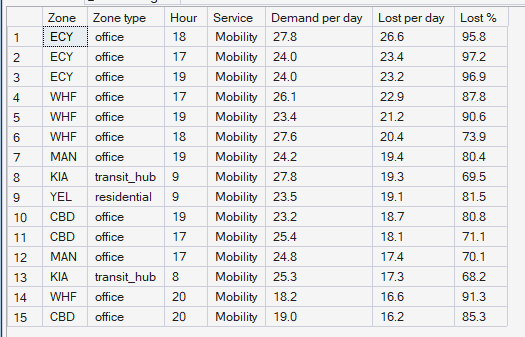
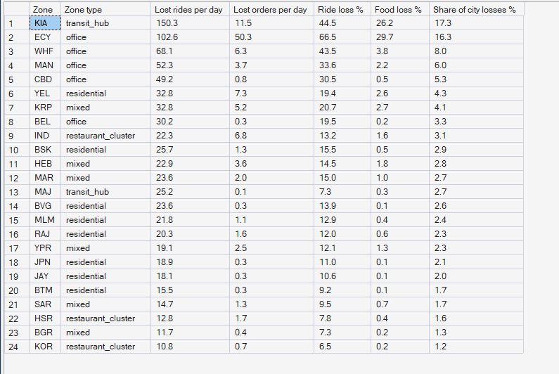
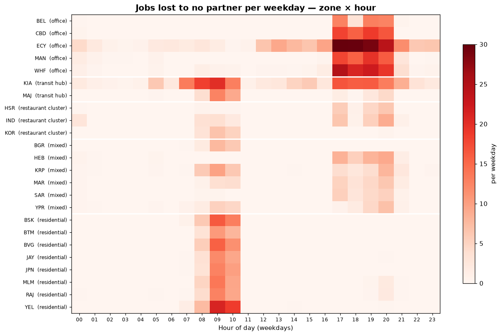

# Phase 6 — Hyperlocal Demand Intelligence
## 03. Demand Pressure — Where Demand Goes Unserved

**SQL Script:** `sql/03_demand_pressure.sql`

---

## 1. Business Question

At which zones and hours does demand go unserved because no partner can reach
it in time?

---

## 2. Objective

Rank the weekday zone-hour-services that lose the most jobs to "no partner",
and summarise lost demand per zone for each service.

---

## 3. Data Sources

- `dw.vw_Marketplace_ZoneHour` (`lost_no_partner`, `demand`)
- `dw.Dim_Zone`, `dw.Dim_Time`, `dw.Dim_Service`

---

## 4. Analytical Grain

**Zone × weekday hour × service** (Result Set A) and **zone** across all days
(Result Set B).

---

## 5. Techniques Used

- `TOP (15)` ordered by an aggregate
- Loss rates as ratio of sums
- Window share of the city's total losses
- Zone × hour heatmap and map of lost jobs

---

# 6. Result Set A — The 15 Worst Weekday Pressure Points

<!-- AUTO:A -->
| Zone | Zone type | Hour | Service | Demand per day | Lost per day | Lost % |
|---|---|---|---|---|---|---|
| ECY | office | 18 | Mobility | 27.8 | 26.6 | 95.8 |
| ECY | office | 17 | Mobility | 24.0 | 23.4 | 97.2 |
| ECY | office | 19 | Mobility | 24.0 | 23.2 | 96.9 |
| WHF | office | 17 | Mobility | 26.1 | 22.9 | 87.8 |
| WHF | office | 19 | Mobility | 23.4 | 21.2 | 90.6 |
| WHF | office | 18 | Mobility | 27.6 | 20.4 | 73.9 |
| MAN | office | 19 | Mobility | 24.2 | 19.4 | 80.4 |
| KIA | transit_hub | 9 | Mobility | 27.8 | 19.3 | 69.5 |
| YEL | residential | 9 | Mobility | 23.5 | 19.1 | 81.5 |
| CBD | office | 19 | Mobility | 23.2 | 18.7 | 80.8 |
| CBD | office | 17 | Mobility | 25.4 | 18.1 | 71.1 |
| MAN | office | 17 | Mobility | 24.8 | 17.4 | 70.1 |
| KIA | transit_hub | 8 | Mobility | 25.3 | 17.3 | 68.2 |
| WHF | office | 20 | Mobility | 18.2 | 16.6 | 91.3 |
| CBD | office | 20 | Mobility | 19.0 | 16.2 | 85.3 |

_Generated 2026-10-03 by a report script — do not edit by hand._
<!-- /AUTO:A -->

### Screenshot

---

# 7. Result Set B — Lost Demand by Zone

<!-- AUTO:B -->
| Zone | Zone type | Lost rides per day | Lost orders per day | Ride loss % | Food loss % | Share of city losses % |
|---|---|---|---|---|---|---|
| KIA | transit_hub | 150.3 | 11.5 | 44.5 | 26.2 | 17.3 |
| ECY | office | 102.6 | 50.3 | 66.5 | 29.7 | 16.3 |
| WHF | office | 68.1 | 6.3 | 43.5 | 3.8 | 8.0 |
| MAN | office | 52.3 | 3.7 | 33.6 | 2.2 | 6.0 |
| CBD | office | 49.2 | 0.8 | 30.5 | 0.5 | 5.3 |
| YEL | residential | 32.8 | 7.3 | 19.4 | 2.6 | 4.3 |
| KRP | mixed | 32.8 | 5.2 | 20.7 | 2.7 | 4.1 |
| BEL | office | 30.2 | 0.3 | 19.5 | 0.2 | 3.3 |
| IND | restaurant_cluster | 22.3 | 6.8 | 13.2 | 1.6 | 3.1 |
| BSK | residential | 25.7 | 1.3 | 15.5 | 0.5 | 2.9 |
| HEB | mixed | 22.9 | 3.6 | 14.5 | 1.8 | 2.8 |
| MAR | mixed | 23.6 | 2.0 | 15.0 | 1.0 | 2.7 |
| MAJ | transit_hub | 25.2 | 0.1 | 7.3 | 0.3 | 2.7 |
| BVG | residential | 23.6 | 0.3 | 13.9 | 0.1 | 2.6 |
| MLM | residential | 21.8 | 1.1 | 12.9 | 0.4 | 2.4 |
| RAJ | residential | 20.3 | 1.6 | 12.0 | 0.6 | 2.3 |
| YPR | mixed | 19.1 | 2.5 | 12.1 | 1.3 | 2.3 |
| JPN | residential | 18.9 | 0.3 | 11.0 | 0.1 | 2.1 |
| JAY | residential | 18.1 | 0.3 | 10.6 | 0.1 | 2.0 |
| SAR | mixed | 14.7 | 1.3 | 9.5 | 0.7 | 1.7 |
| BTM | residential | 15.5 | 0.3 | 9.2 | 0.1 | 1.7 |
| HSR | restaurant_cluster | 12.8 | 1.7 | 7.8 | 0.4 | 1.6 |
| BGR | mixed | 11.7 | 0.4 | 7.3 | 0.2 | 1.3 |
| KOR | restaurant_cluster | 10.8 | 0.7 | 6.5 | 0.2 | 1.2 |

_Generated 2026-10-03 by a report script — do not edit by hand._
<!-- /AUTO:B -->

### Screenshot

---

# 8. Where and When Jobs Are Lost

The right-hand panel of the Demand Map (analysis 01) shows the same losses by zone.

---

# 9. Key Observations

### 9.1 The airport is the single largest pressure point
Kempegowda Airport loses more jobs than any other zone — it is beyond
repositioning reach of every other zone (Assumption C-07).

### 9.2 Office zones lose rides in the evening
The evening exodus from office zones produces most of the remaining top
pressure points.

### 9.3 Pressure is concentrated
A small number of zones and hours account for a large share of all lost jobs;
most zone-hours lose almost nothing.

### 9.4 Losses are mostly rides
Food losses are small almost everywhere because two-wheelers are plentiful and
restaurants sit close to partners.

---

# 10. Business Interpretation

Unserved demand is not spread across the city — it sits in a few predictable
**zone-hour pockets**. That makes it targetable: the optimizer (Phase 10) and
incentives (Phase 11) can focus on these pockets instead of the whole city.

---

# 11. Business Implication

Phase 8 turns these losses into a Marketplace Pressure Index per zone and hour;
Phase 10 decides moves that relieve the evening office pockets; Phase 11 tests
whether incentives are worth it for the airport, which repositioning cannot
reach.

---

# 12. Scope Control

This analysis describes **demand** only. It does not analyse supply
positions (Phase 7), compute the pressure index (Phase 8), forecast (Phase 9)
or recommend actions (Phases 10–11).

---

# 13. Reproducibility

`sql/03_demand_pressure.sql` is the authoritative source; run it in SSMS or regenerate this
document with `python scripts/report_phase6.py`. Tables, charts and the
headline summary are generated, never typed.

---

## Conclusion

<!-- AUTO:headline -->
- The worst weekday pressure point is **ECY mobility at 18:00**: **26.6** jobs lost per day (**95.8%** of its demand).
- Three zones — **KIA, ECY, WHF** — account for **41.6%** of all jobs lost to no partner.
- **15 of the top 15** pressure points are ride requests.

_Generated 2026-10-03 by a report script — do not edit by hand._
<!-- /AUTO:headline -->
