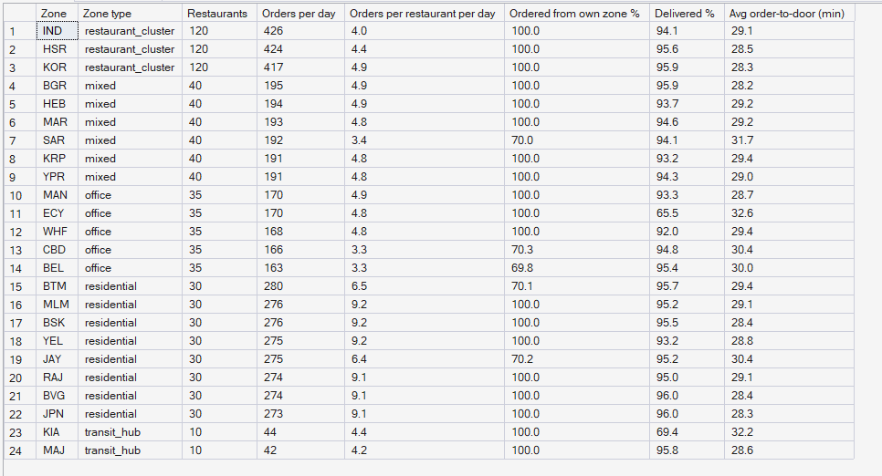
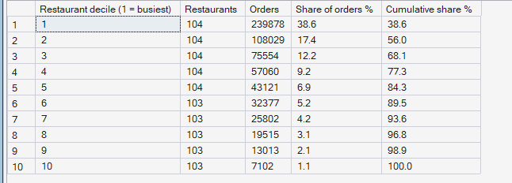

# Phase 6 — Hyperlocal Demand Intelligence
## 04. Restaurant Density and Food Demand

**SQL Script:** `sql/04_restaurant_density.sql`

---

## 1. Business Question

Where are restaurants, how far do customers order across zones, and how
concentrated is food demand across restaurants?

---

## 2. Objective

Profile each zone's restaurant count, food demand, restaurant workload,
own-zone ordering and delivery performance, and measure how orders are
distributed across restaurants.

---

## 3. Data Sources

- `dw.Fact_Food_Orders`, `dw.Dim_Restaurant`, `dw.Dim_Zone`, `dw.Dim_Time`

---

## 4. Analytical Grain

**Customer zone** (Result Set A) and **restaurant decile** (Result Set B).

---

## 5. Techniques Used

- Multiple CTEs joined at zone level (customer side and restaurant side)
- `NTILE(10)` to rank restaurants into deciles
- Running totals with `SUM(...) OVER (ORDER BY ... ROWS UNBOUNDED PRECEDING)`

---

# 6. Result Set A — Restaurants and Food Demand by Zone

<!-- AUTO:A -->
| Zone | Zone type | Restaurants | Orders per day | Orders per restaurant per day | Ordered from own zone % | Delivered % | Avg order-to-door (min) |
|---|---|---|---|---|---|---|---|
| IND | restaurant_cluster | 120 | 426 | 4.0 | 100.0 | 94.1 | 29.1 |
| HSR | restaurant_cluster | 120 | 424 | 4.4 | 100.0 | 95.6 | 28.5 |
| KOR | restaurant_cluster | 120 | 417 | 4.9 | 100.0 | 95.9 | 28.3 |
| BGR | mixed | 40 | 195 | 4.9 | 100.0 | 95.9 | 28.2 |
| HEB | mixed | 40 | 194 | 4.9 | 100.0 | 93.7 | 29.2 |
| MAR | mixed | 40 | 193 | 4.8 | 100.0 | 94.6 | 29.2 |
| SAR | mixed | 40 | 192 | 3.4 | 70.0 | 94.1 | 31.7 |
| KRP | mixed | 40 | 191 | 4.8 | 100.0 | 93.2 | 29.4 |
| YPR | mixed | 40 | 191 | 4.8 | 100.0 | 94.3 | 29.0 |
| MAN | office | 35 | 170 | 4.9 | 100.0 | 93.3 | 28.7 |
| ECY | office | 35 | 170 | 4.8 | 100.0 | 65.5 | 32.6 |
| WHF | office | 35 | 168 | 4.8 | 100.0 | 92.0 | 29.4 |
| CBD | office | 35 | 166 | 3.3 | 70.3 | 94.8 | 30.4 |
| BEL | office | 35 | 163 | 3.3 | 69.8 | 95.4 | 30.0 |
| BTM | residential | 30 | 280 | 6.5 | 70.1 | 95.7 | 29.4 |
| MLM | residential | 30 | 276 | 9.2 | 100.0 | 95.2 | 29.1 |
| BSK | residential | 30 | 276 | 9.2 | 100.0 | 95.5 | 28.4 |
| YEL | residential | 30 | 275 | 9.2 | 100.0 | 93.2 | 28.8 |
| JAY | residential | 30 | 275 | 6.4 | 70.2 | 95.2 | 30.4 |
| BVG | residential | 30 | 274 | 9.1 | 100.0 | 96.0 | 28.4 |
| RAJ | residential | 30 | 274 | 9.1 | 100.0 | 95.0 | 29.1 |
| JPN | residential | 30 | 273 | 9.1 | 100.0 | 96.0 | 28.3 |
| KIA | transit_hub | 10 | 44 | 4.4 | 100.0 | 69.4 | 32.2 |
| MAJ | transit_hub | 10 | 42 | 4.2 | 100.0 | 95.8 | 28.6 |

_Generated 2026-10-03 by a report script — do not edit by hand._
<!-- /AUTO:A -->

### Screenshot

---

# 7. Result Set B — Order Concentration across Restaurants

<!-- AUTO:B -->
| Restaurant decile (1 = busiest) | Restaurants | Orders | Share of orders % | Cumulative share % |
|---|---|---|---|---|
| 1 | 104 | 239,878 | 38.6 | 38.6 |
| 2 | 104 | 108,029 | 17.4 | 56.0 |
| 3 | 104 | 75,554 | 12.2 | 68.1 |
| 4 | 104 | 57,060 | 9.2 | 77.3 |
| 5 | 104 | 43,121 | 6.9 | 84.3 |
| 6 | 103 | 32,377 | 5.2 | 89.5 |
| 7 | 103 | 25,802 | 4.2 | 93.6 |
| 8 | 103 | 19,515 | 3.1 | 96.8 |
| 9 | 103 | 13,013 | 2.1 | 98.9 |
| 10 | 103 | 7,102 | 1.1 | 100.0 |

_Generated 2026-10-03 by a report script — do not edit by hand._
<!-- /AUTO:B -->

### Screenshot

---

# 8. Key Observations

### 8.1 Restaurants cluster
Koramangala, Indiranagar and HSR Layout hold far more restaurants than any
other zones and serve their customers entirely from inside the zone.

### 8.2 Most customers order locally
In every zone type, most orders come from a restaurant in the customer's own
zone; the rest come from a nearby restaurant cluster.

### 8.3 A minority of restaurants take most orders
The busiest decile of restaurants takes a large share of orders, while the
quietest half takes only a small share (Result Set B).

### 8.4 Delivery speed does not depend on restaurant density
Order-to-door time is similar everywhere: density changes where food comes
from, not how long it takes.

---

# 9. Business Interpretation

Food demand is generated where people are, but **prepared where restaurants
cluster**. Two-wheelers therefore gravitate towards restaurant clusters, which
shapes where they are available for rides as well.

---

# 10. Business Implication

Restaurant clusters are natural staging areas for two-wheelers at meal times.
The supply analysis (Phase 7) should check whether partners actually wait
there, and the optimizer (Phase 10) can treat clusters as hubs.

---

# 11. Scope Control

This analysis describes **demand** only. It does not analyse supply
positions (Phase 7), compute the pressure index (Phase 8), forecast (Phase 9)
or recommend actions (Phases 10–11).

---

# 12. Reproducibility

`sql/04_restaurant_density.sql` is the authoritative source; run it in SSMS or regenerate this
document with `python scripts/report_phase6.py`. Tables, charts and the
headline summary are generated, never typed.

---

## Conclusion

<!-- AUTO:headline -->
- **IND** has the most restaurants (**120**).
- The busiest 10% of restaurants take **38.6%** of all orders; the busiest half take **84.3%**.
- Order-to-door time ranges from **28.2** to **32.6** minutes across zones.

_Generated 2026-10-03 by a report script — do not edit by hand._
<!-- /AUTO:headline -->
