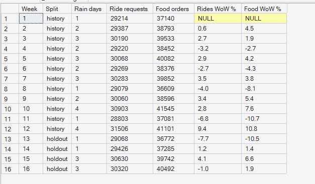
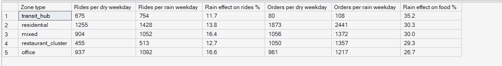

# Phase 6 — Hyperlocal Demand Intelligence
## 05. Demand Growth and Variability

**SQL Script:** `sql/05_demand_variability.sql`

---

## 1. Business Question

Is demand growing, and how much does it move with rain?

---

## 2. Objective

Track weekly demand for each service with week-over-week change, and measure
how rain changes weekday demand in each zone type.

---

## 3. Data Sources

- `dw.vw_Marketplace_ZoneHour`, `dw.Dim_Time` (rain flags), `dw.Dim_Zone`

---

## 4. Analytical Grain

**Week** (Result Set A) and **zone type × day type (rain / dry)**, weekdays
only (Result Set B).

---

## 5. Techniques Used

- `LAG()` for week-over-week change
- Averages over rain and dry weekdays
- Comparison of history and holdout weeks

---

# 6. Result Set A — Weekly Demand and Week-over-Week Change

<!-- AUTO:A -->
| Week | Split | Rain days | Ride requests | Food orders | Rides WoW % | Food WoW % |
|---|---|---|---|---|---|---|
| 1 | history | 1 | 29,214 | 37,140 |  |  |
| 2 | history | 2 | 29,387 | 38,793 | 0.6 | 4.5 |
| 3 | history | 3 | 30,190 | 39,533 | 2.7 | 1.9 |
| 4 | history | 2 | 29,220 | 38,452 | -3.2 | -2.7 |
| 5 | history | 3 | 30,068 | 40,082 | 2.9 | 4.2 |
| 6 | history | 2 | 29,269 | 38,376 | -2.7 | -4.3 |
| 7 | history | 3 | 30,283 | 39,852 | 3.5 | 3.8 |
| 8 | history | 1 | 29,079 | 36,609 | -4.0 | -8.1 |
| 9 | history | 2 | 30,060 | 38,596 | 3.4 | 5.4 |
| 10 | history | 4 | 30,903 | 41,545 | 2.8 | 7.6 |
| 11 | history | 1 | 28,803 | 37,081 | -6.8 | -10.7 |
| 12 | history | 4 | 31,506 | 41,101 | 9.4 | 10.8 |
| 13 | holdout | 1 | 29,068 | 36,772 | -7.7 | -10.5 |
| 14 | holdout | 1 | 29,426 | 37,285 | 1.2 | 1.4 |
| 15 | holdout | 3 | 30,630 | 39,742 | 4.1 | 6.6 |
| 16 | holdout | 3 | 30,320 | 40,492 | -1.0 | 1.9 |

_Generated 2026-10-03 by a report script — do not edit by hand._
<!-- /AUTO:A -->

### Screenshot

---

# 7. Result Set B — Rain Sensitivity by Zone Type

<!-- AUTO:B -->
| Zone type | Rides per dry weekday | Rides per rain weekday | Rain effect on rides % | Orders per dry weekday | Orders per rain weekday | Rain effect on food % |
|---|---|---|---|---|---|---|
| transit_hub | 675 | 754 | 11.7 | 80 | 108 | 35.2 |
| residential | 1,255 | 1,428 | 13.8 | 1,873 | 2,441 | 30.3 |
| mixed | 904 | 1,052 | 16.4 | 1,056 | 1,372 | 30.0 |
| restaurant_cluster | 455 | 513 | 12.7 | 1,050 | 1,357 | 29.3 |
| office | 937 | 1,092 | 16.6 | 961 | 1,217 | 26.7 |

_Generated 2026-10-03 by a report script — do not edit by hand._
<!-- /AUTO:B -->

### Screenshot

---

# 8. Key Observations

### 8.1 There is no growth trend
Weekly demand moves up and down but does not trend over the 16 weeks — the
synthetic marketplace is stationary by design. Week-to-week swings follow the
number of rain days.

### 8.2 Rain raises food demand much more than rides
Rain lifts food orders strongly and rides moderately, in every zone type.

### 8.3 Rain affects all zone types alike
The rain effect is similar across zone types, because the generator applies
one citywide rain multiplier (Assumption D-08). Real cities would likely show
more variation.

---

# 9. Business Interpretation

The demand forecast (Phase 9) needs **weather**, not a growth trend. Holdout
weeks look like history weeks, so a model trained on history should transfer
well — provided it knows which days rain.

---

# 10. Business Implication

Rain days are predictable pressure days: food demand jumps while two-wheeler
supply drops (Assumption S-04). They are prime candidates for incentive
scenarios in Phase 11.

---

# 11. Scope Control

This analysis describes **demand** only. It does not analyse supply
positions (Phase 7), compute the pressure index (Phase 8), forecast (Phase 9)
or recommend actions (Phases 10–11).

---

# 12. Reproducibility

`sql/05_demand_variability.sql` is the authoritative source; run it in SSMS or regenerate this
document with `python scripts/report_phase6.py`. Tables, charts and the
headline summary are generated, never typed.

---

## Conclusion

<!-- AUTO:headline -->
- Week-over-week change stays within **±9.4%** for rides and **±10.8%** for food: no structural growth trend in the period.
- Rain lifts weekday food orders by **26.7–35.2%** and rides by **11.7–16.6%** across zone types.

_Generated 2026-10-03 by a report script — do not edit by hand._
<!-- /AUTO:headline -->
