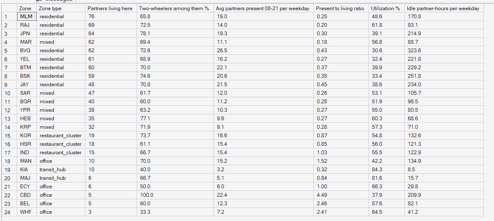
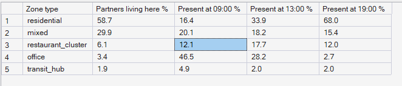
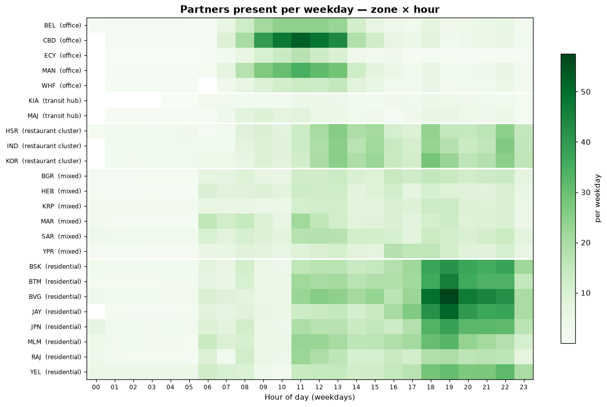

# Phase 7 — Supply Intelligence
## 01. Supply Profile — Where Partners Live vs Where They Are

**SQL Script:** `sql/01_supply_profile.sql`

---

## 1. Business Question

Where do PULSE's partners live, and where are they actually located through the weekday?

---

## 2. Objective

Compare each zone's resident partners with the partners present there during the day, and show how the city's supply drifts between zone types from morning to evening.

---

## 3. Data Sources

- `dw.Dim_Driver` (home zone, vehicle)
- `dw.vw_Supply_ZoneHour` (partner location at the start of each online hour)
- `dw.Dim_Zone`, `dw.Dim_Time`

---

## 4. Analytical Grain

**Zone** (Result Set A) and **zone type at 09:00, 13:00 and 19:00 on weekdays** (Result Set B).

---

## 5. Techniques Used

- Home-zone counts from the driver dimension
- Average presence over 08:00–21:00 (partner-hours ÷ weekdays ÷ 14 hours)
- Window shares for the daily drift
- Choropleth Supply Map

---

# 6. Result Set A — Supply by Zone

<!-- AUTO:A -->
| Zone | Zone type | Partners living here | Two-wheelers among them % | Avg partners present 08-21 per weekday | Present to living ratio | Utilization % | Idle partner-hours per weekday |
|---|---|---|---|---|---|---|---|
| MLM | residential | 76 | 65.8 | 19.0 | 0.25 | 48.6 | 170.8 |
| RAJ | residential | 69 | 72.5 | 14.0 | 0.20 | 61.8 | 93.1 |
| JPN | residential | 64 | 78.1 | 19.3 | 0.30 | 39.1 | 214.9 |
| MAR | mixed | 62 | 69.4 | 11.1 | 0.18 | 56.8 | 88.7 |
| BVG | residential | 62 | 72.6 | 26.5 | 0.43 | 30.6 | 323.6 |
| YEL | residential | 61 | 68.9 | 16.2 | 0.27 | 32.4 | 221.8 |
| BTM | residential | 60 | 70.0 | 22.1 | 0.37 | 39.9 | 229.2 |
| BSK | residential | 59 | 74.6 | 20.6 | 0.35 | 33.4 | 251.8 |
| JAY | residential | 48 | 70.8 | 21.5 | 0.45 | 38.6 | 234.0 |
| SAR | mixed | 47 | 61.7 | 12.0 | 0.26 | 53.1 | 105.7 |
| BGR | mixed | 40 | 60.0 | 11.2 | 0.28 | 51.9 | 96.5 |
| YPR | mixed | 38 | 63.2 | 10.3 | 0.27 | 55.0 | 80.5 |
| HEB | mixed | 35 | 77.1 | 9.6 | 0.27 | 60.3 | 68.6 |
| KRP | mixed | 32 | 71.9 | 9.1 | 0.28 | 57.3 | 71.0 |
| KOR | restaurant_cluster | 19 | 73.7 | 16.6 | 0.87 | 54.8 | 132.6 |
| HSR | restaurant_cluster | 18 | 61.1 | 15.4 | 0.85 | 56.0 | 121.3 |
| IND | restaurant_cluster | 15 | 66.7 | 15.4 | 1.03 | 55.5 | 122.9 |
| KIA | transit_hub | 10 | 40.0 | 3.2 | 0.32 | 84.3 | 8.5 |
| MAN | office | 10 | 70.0 | 15.2 | 1.52 | 42.2 | 134.9 |
| MAJ | transit_hub | 6 | 66.7 | 5.1 | 0.84 | 81.6 | 15.7 |
| ECY | office | 6 | 50.0 | 6.0 | 1.00 | 66.3 | 29.8 |
| CBD | office | 5 | 100.0 | 22.4 | 4.49 | 37.9 | 209.9 |
| BEL | office | 5 | 60.0 | 12.3 | 2.46 | 57.6 | 82.1 |
| WHF | office | 3 | 33.3 | 7.2 | 2.41 | 64.5 | 41.2 |

_Generated 2026-10-03 by a report script — do not edit by hand._
<!-- /AUTO:A -->

### Screenshot

---

# 7. Result Set B — Daily Drift of Supply by Zone Type

<!-- AUTO:B -->
| Zone type | Partners living here % | Present at 09:00 % | Present at 13:00 % | Present at 19:00 % |
|---|---|---|---|---|
| residential | 58.7 | 16.4 | 33.9 | 68.0 |
| mixed | 29.9 | 20.1 | 18.2 | 15.4 |
| restaurant_cluster | 6.1 | 12.1 | 17.7 | 12.0 |
| office | 3.4 | 46.5 | 28.2 | 2.7 |
| transit_hub | 1.9 | 4.9 | 2.0 | 2.0 |

_Generated 2026-10-03 by a report script — do not edit by hand._
<!-- /AUTO:B -->

### Screenshot

---

# 8. The Supply Map of Bengaluru

---

# 9. Key Observations

### 9.1 Partners live in residential and mixed zones
Almost nine in ten partners live in residential or mixed zones; office zones
and transit hubs are home to very few (Result Set A, map).

### 9.2 Supply drifts with the riders it carries
Morning rides carry partners from residential zones into office zones, so at
09:00 office zones hold many times their share of homes. Evening rides carry
them back, so by 19:00 office zones hold *less* than their share — exactly
when their evening ride demand peaks (Result Set B).

### 9.3 Presence follows shifts, not just homes
Even in residential zones, the partners present at any hour are a fraction of
those living there, because only part of the fleet is on shift at once.

---

# 10. Business Interpretation

Status-quo dispatch lets supply **flow with demand** — and the flow runs the
wrong way for the next peak. Supply arrives in office zones in the morning,
when they need little, and leaves them in the evening, when they need most.

---

# 11. Business Implication

The evening office shortage cannot be fixed by dispatching harder in the
evening; partners must be **positioned towards office zones before** the
evening peak — the core task of the Phase 10 repositioning optimizer.

---

# 12. Scope Control

This analysis describes **supply** only. It does not compute the pressure
index (Phase 8), forecast (Phase 9) or recommend moves or incentives
(Phases 10–11).

---

# 13. Reproducibility

`sql/01_supply_profile.sql` is the authoritative source; run it in SSMS or regenerate this
document with `python scripts/report_phase7.py`. Tables, charts and the
headline summary are generated, never typed.

---

## Conclusion

<!-- AUTO:headline -->
- Most partners live in **MLM** (**76**).
- Office zones are home to **3.4%** of partners but hold **46.5%** of them at 09:00 and **2.7%** at 19:00.
- Residential zones are home to **58.7%** of partners but hold only **16.4%** at 09:00, rising to **68.0%** at 19:00.

_Generated 2026-10-03 by a report script — do not edit by hand._
<!-- /AUTO:headline -->
