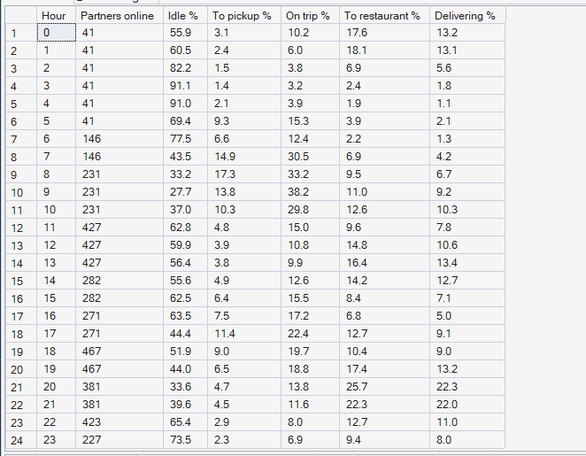
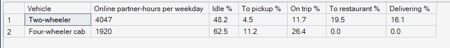
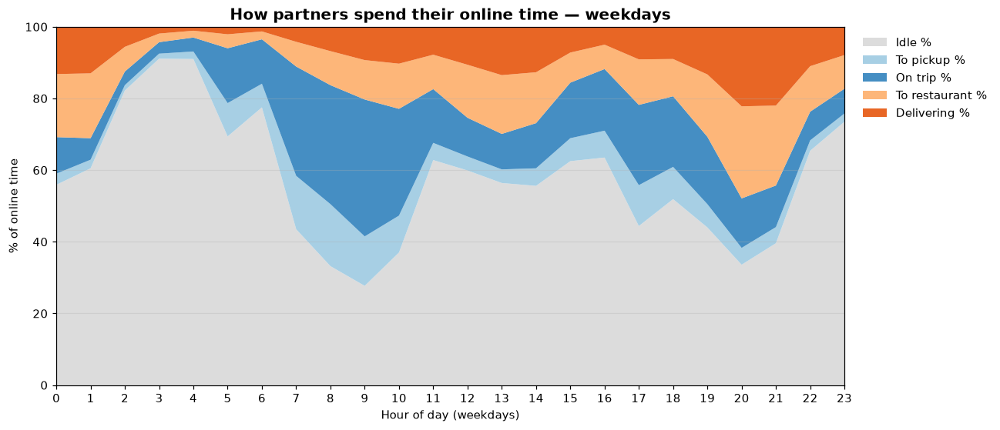

# Phase 7 — Supply Intelligence
## 02. How Partners Spend Their Online Time

**SQL Script:** `sql/02_partner_time_states.sql`

---

## 1. Business Question

How do partners spend their online time — and how much of it earns nothing?

---

## 2. Objective

Split weekday online time, hour by hour and by vehicle type, into idle, travelling to a pickup, on a ride, travelling to a restaurant, and delivering.

---

## 3. Data Sources

- `dw.Fact_Rides`, `dw.Fact_Ride_Requests`, `dw.Fact_Food_Orders` (job timestamps)
- `dw.vw_Supply_ZoneHour` (online and busy hours)
- `dw.Dim_Driver`, `dw.Dim_Vehicle`, `dw.Dim_Time`

---

## 4. Analytical Grain

**Weekday hour** (Result Set A) and **vehicle type** (Result Set B).

---

## 5. Techniques Used

- Job segments split exactly across clock hours with `CROSS APPLY`, `GREATEST` and `LEAST`
- Temporary tables to stage the state mix
- Busy time from availability shared out by the segment mix, so states add to 100%
- Stacked-area chart of partner time by hour

---

# 6. Result Set A — Partner Time by Weekday Hour

<!-- AUTO:A -->
| Hour | Partners online | Idle % | To pickup % | On trip % | To restaurant % | Delivering % |
|---|---|---|---|---|---|---|
| 0 | 41 | 55.9 | 3.1 | 10.2 | 17.6 | 13.2 |
| 1 | 41 | 60.5 | 2.4 | 6.0 | 18.1 | 13.1 |
| 2 | 41 | 82.2 | 1.5 | 3.8 | 6.9 | 5.6 |
| 3 | 41 | 91.1 | 1.4 | 3.2 | 2.4 | 1.8 |
| 4 | 41 | 91.0 | 2.1 | 3.9 | 1.9 | 1.1 |
| 5 | 41 | 69.4 | 9.3 | 15.3 | 3.9 | 2.1 |
| 6 | 146 | 77.5 | 6.6 | 12.4 | 2.2 | 1.3 |
| 7 | 146 | 43.5 | 14.9 | 30.5 | 6.9 | 4.2 |
| 8 | 231 | 33.2 | 17.3 | 33.2 | 9.5 | 6.7 |
| 9 | 231 | 27.7 | 13.8 | 38.2 | 11.0 | 9.2 |
| 10 | 231 | 37.0 | 10.3 | 29.8 | 12.6 | 10.3 |
| 11 | 427 | 62.8 | 4.8 | 15.0 | 9.6 | 7.8 |
| 12 | 427 | 59.9 | 3.9 | 10.8 | 14.8 | 10.6 |
| 13 | 427 | 56.4 | 3.8 | 9.9 | 16.4 | 13.4 |
| 14 | 282 | 55.6 | 4.9 | 12.6 | 14.2 | 12.7 |
| 15 | 282 | 62.5 | 6.4 | 15.5 | 8.4 | 7.1 |
| 16 | 271 | 63.5 | 7.5 | 17.2 | 6.8 | 5.0 |
| 17 | 271 | 44.4 | 11.4 | 22.4 | 12.7 | 9.1 |
| 18 | 467 | 51.9 | 9.0 | 19.7 | 10.4 | 9.0 |
| 19 | 467 | 44.0 | 6.5 | 18.8 | 17.4 | 13.2 |
| 20 | 381 | 33.6 | 4.7 | 13.8 | 25.7 | 22.3 |
| 21 | 381 | 39.6 | 4.5 | 11.6 | 22.3 | 22.0 |
| 22 | 423 | 65.4 | 2.9 | 8.0 | 12.7 | 11.0 |
| 23 | 227 | 73.5 | 2.3 | 6.9 | 9.4 | 8.0 |

_Generated 2026-10-03 by a report script — do not edit by hand._
<!-- /AUTO:A -->

### Screenshot

---

# 7. Result Set B — Partner Time by Vehicle Type

<!-- AUTO:B -->
| Vehicle | Online partner-hours per weekday | Idle % | To pickup % | On trip % | To restaurant % | Delivering % |
|---|---|---|---|---|---|---|
| Two-wheeler | 4,047 | 48.2 | 4.5 | 11.7 | 19.5 | 16.1 |
| Four-wheeler cab | 1,920 | 62.5 | 11.2 | 26.4 | 0.0 | 0.0 |

_Generated 2026-10-03 by a report script — do not edit by hand._
<!-- /AUTO:B -->

### Screenshot

---

# 8. Partner Time Through the Day

---

# 9. Key Observations

### 9.1 About half of online time is idle
Across a weekday, partners spend roughly half their online time without a job
(Result Set A, chart).

### 9.2 Idle time is lowest at the edges of the peaks, not in the middle
Idle share is lowest at the morning commute, when few partners are on shift,
and falls again at the end of the evening peak. In the early evening, when the
most partners are online, around half of their time is still idle — they are
online, but in the wrong zones (Phase 5, analysis 04).

### 9.3 Food work is spread across fetching and delivering
For food, a large share of busy time is spent reaching the restaurant;
just-in-time dispatch keeps waiting short but cannot remove the trip.

### 9.4 Cabs are idle far more than two-wheelers
Four-wheelers can serve rides only, so outside the commute peaks they have
little to do (Result Set B).

---

# 10. Business Interpretation

The marketplace pays for a lot of partner time that produces nothing. That
idle time is the raw material for improvement: repositioning turns idle time
in the wrong place into useful time in the right place.

---

# 11. Business Implication

Utilization gains will come mainly from the evening peak and from four-wheelers
— the two places where idle time is largest while demand still goes unserved.

---

# 12. Scope Control

This analysis describes **supply** only. It does not compute the pressure
index (Phase 8), forecast (Phase 9) or recommend moves or incentives
(Phases 10–11).

---

# 13. Reproducibility

`sql/02_partner_time_states.sql` is the authoritative source; run it in SSMS or regenerate this
document with `python scripts/report_phase7.py`. Tables, charts and the
headline summary are generated, never typed.

---

## Conclusion

<!-- AUTO:headline -->
- Over a weekday, partners spend about **53%** of their online time idle.
- Among the busier hours, idle time is lowest at **20:00** (**33.6%**).
- **Two-wheelers** are idle **48.2%** of the time; **four-wheeler cabs** **62.5%**.

_Generated 2026-10-03 by a report script — do not edit by hand._
<!-- /AUTO:headline -->
