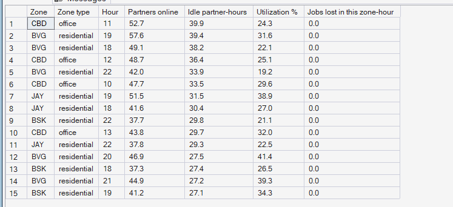
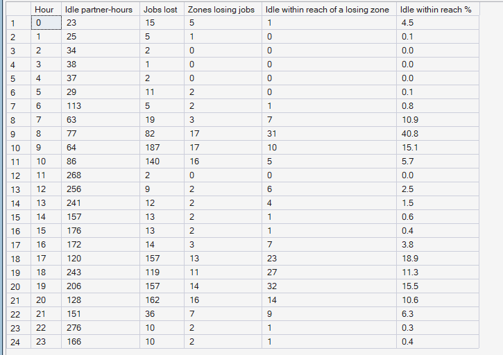
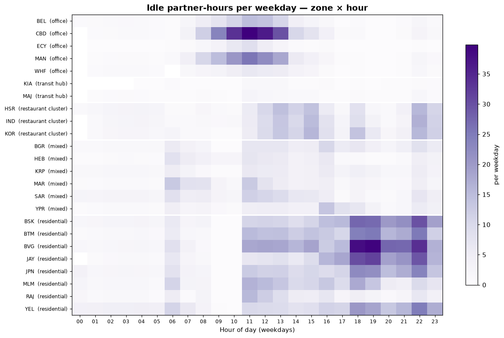

# Phase 7 — Supply Intelligence
## 03. Idle Supply and Its Distance to Unserved Demand

**SQL Script:** `sql/03_idle_supply.sql`

---

## 1. Business Question

Where does supply sit idle — and could that idle supply have reached the demand that went unserved?

---

## 2. Objective

Find the zone-hours with the most idle partner-hours, and for every weekday hour measure how much idle supply was within 20 minutes' travel of a zone that was losing jobs at the same time.

---

## 3. Data Sources

- `dw.vw_Supply_ZoneHour` (idle hours by zone and hour)
- `dw.vw_Marketplace_ZoneHour` (jobs lost to no partner)
- `dw.Dim_Zone` (centroids), `dw.Dim_Time` (peak flags)

---

## 4. Analytical Grain

**Zone × weekday hour** (Result Set A) and **weekday hour** (Result Set B).

---

## 5. Techniques Used

- SQL Server `geography` type for zone-to-zone distances (× 1.4 road factor, Assumption C-04)
- Hour-specific reach: 5 km at peak, 8.3 km otherwise (Assumption C-06)
- Correlated `EXISTS` to flag idle supply near a losing zone
- Idle-time heatmap

---

# 6. Result Set A — The 15 Largest Idle Pools

<!-- AUTO:A -->
| Zone | Zone type | Hour | Partners online | Idle partner-hours | Utilization % | Jobs lost in this zone-hour |
|---|---|---|---|---|---|---|
| CBD | office | 11 | 52.70 | 39.90 | 24.3 | 0 |
| BVG | residential | 19 | 57.60 | 39.40 | 31.6 | 0 |
| BVG | residential | 18 | 49.10 | 38.20 | 22.1 | 0 |
| CBD | office | 12 | 48.70 | 36.40 | 25.1 | 0 |
| BVG | residential | 22 | 42.00 | 33.90 | 19.2 | 0 |
| CBD | office | 10 | 47.70 | 33.50 | 29.6 | 0 |
| JAY | residential | 19 | 51.50 | 31.50 | 38.9 | 0 |
| JAY | residential | 18 | 41.60 | 30.40 | 27.0 | 0 |
| BSK | residential | 22 | 37.70 | 29.80 | 21.1 | 0 |
| CBD | office | 13 | 43.80 | 29.70 | 32.0 | 0 |
| JAY | residential | 22 | 37.80 | 29.30 | 22.5 | 0 |
| BVG | residential | 20 | 46.90 | 27.50 | 41.4 | 0 |
| BSK | residential | 18 | 37.30 | 27.40 | 26.5 | 0 |
| BVG | residential | 21 | 44.90 | 27.20 | 39.3 | 0 |
| BSK | residential | 19 | 41.20 | 27.10 | 34.3 | 0 |

_Generated 2026-10-03 by a report script — do not edit by hand._
<!-- /AUTO:A -->

### Screenshot

---

# 7. Result Set B — Idle Supply within Reach of Unserved Demand

<!-- AUTO:B -->
| Hour | Idle partner-hours | Jobs lost | Zones losing jobs | Idle within reach of a losing zone | Idle within reach % |
|---|---|---|---|---|---|
| 0 | 23 | 15 | 5 | 1 | 4.5 |
| 1 | 25 | 5 | 1 | 0 | 0.1 |
| 2 | 34 | 2 | 0 | 0 | 0.0 |
| 3 | 38 | 1 | 0 | 0 | 0.0 |
| 4 | 37 | 2 | 0 | 0 | 0.0 |
| 5 | 29 | 11 | 2 | 0 | 0.1 |
| 6 | 113 | 5 | 2 | 1 | 0.8 |
| 7 | 63 | 19 | 3 | 7 | 10.9 |
| 8 | 77 | 82 | 17 | 31 | 40.8 |
| 9 | 64 | 187 | 17 | 10 | 15.1 |
| 10 | 86 | 140 | 16 | 5 | 5.7 |
| 11 | 268 | 2 | 0 | 0 | 0.0 |
| 12 | 256 | 9 | 2 | 6 | 2.5 |
| 13 | 241 | 12 | 2 | 4 | 1.5 |
| 14 | 157 | 13 | 2 | 1 | 0.6 |
| 15 | 176 | 13 | 2 | 1 | 0.4 |
| 16 | 172 | 14 | 3 | 7 | 3.8 |
| 17 | 120 | 157 | 13 | 23 | 18.9 |
| 18 | 243 | 119 | 11 | 27 | 11.3 |
| 19 | 206 | 157 | 14 | 32 | 15.5 |
| 20 | 128 | 162 | 16 | 14 | 10.6 |
| 21 | 151 | 36 | 7 | 9 | 6.3 |
| 22 | 276 | 10 | 2 | 1 | 0.3 |
| 23 | 166 | 10 | 2 | 1 | 0.4 |

_Generated 2026-10-03 by a report script — do not edit by hand._
<!-- /AUTO:B -->

### Screenshot

---

# 8. Where Supply Waits

---

# 9. Key Observations

### 9.1 The largest idle pools are in residential zones
Partners wait where they live and where food jobs end — residential zones —
and these zones lose almost no jobs themselves (Result Set A).

### 9.2 Idle supply is mostly out of reach of unserved demand
In the hours with the most lost jobs, only a small share of idle partners were
within 20 minutes of a zone that was losing jobs (Result Set B). The rest
could not have arrived in time even if dispatched immediately.

### 9.3 Peak traffic makes it worse
At peak hours reach shrinks to about 5 km, so the idle supply that is "close"
off-peak becomes "too far" exactly when demand needs it.

---

# 10. Business Interpretation

The status quo does not fail because dispatch is slow to react — it fails
because **supply is in the wrong place before demand arrives**. Reacting in
the same hour cannot fix that; only **anticipating** demand and moving supply
early can.

---

# 11. Business Implication

This is the central justification for PULSE's design: forecast demand by zone
and hour (Phase 9), then reposition idle supply **ahead** of it (Phase 10).

---

# 12. Scope Control

This analysis describes **supply** only. It does not compute the pressure
index (Phase 8), forecast (Phase 9) or recommend moves or incentives
(Phases 10–11).

---

# 13. Reproducibility

`sql/03_idle_supply.sql` is the authoritative source; run it in SSMS or regenerate this
document with `python scripts/report_phase7.py`. Tables, charts and the
headline summary are generated, never typed.

---

## Conclusion

<!-- AUTO:headline -->
- The largest idle pool is **CBD at 11:00**: **40** idle partner-hours per weekday.
- At **09:00**, the hour with the most lost jobs (**187**), only **15.1%** of idle supply was within 20 minutes of a zone losing jobs.
- Across all weekday hours, **5.7%** of idle partner-hours were within reach of unserved demand.

_Generated 2026-10-03 by a report script — do not edit by hand._
<!-- /AUTO:headline -->
