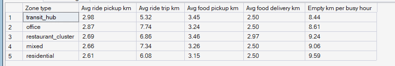
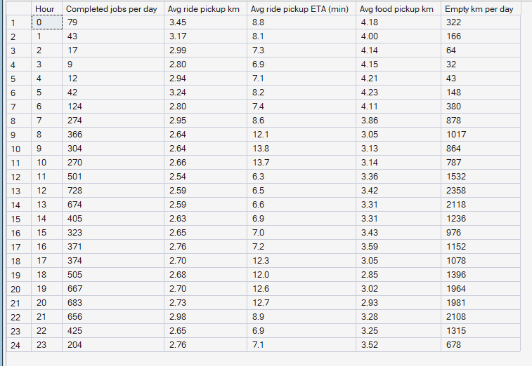

# Phase 7 — Supply Intelligence
## 04. Empty Kilometres — Driving That Earns Nothing

**SQL Script:** `sql/04_empty_km.sql`

---

## 1. Business Question

How far do partners drive empty to reach pickups, and where and when is it worst?

---

## 2. Objective

Measure pickup distance, trip distance and empty kilometres by zone type, and pickup distance, ETA and total empty kilometres by weekday hour.

---

## 3. Data Sources

- `dw.Fact_Rides`, `dw.Fact_Ride_Requests`, `dw.Fact_Food_Orders` (pickup and trip km, ETA)
- `dw.vw_Supply_ZoneHour` (empty km and busy hours)
- `dw.Dim_Zone`, `dw.Dim_Time`

---

## 4. Analytical Grain

**Zone type** (Result Set A) and **weekday hour** (Result Set B).

---

## 5. Techniques Used

- Averages of pickup and trip distance by zone type
- Empty km per busy hour as an efficiency ratio
- Hourly ETA and empty-km profile

---

# 6. Result Set A — Empty Kilometres by Zone Type

<!-- AUTO:A -->
| Zone type | Avg ride pickup km | Avg ride trip km | Avg food pickup km | Avg food delivery km | Empty km per busy hour |
|---|---|---|---|---|---|
| transit_hub | 3.0 | 5.3 | 3.5 | 2.5 | 8.4 |
| office | 2.9 | 7.7 | 3.2 | 2.5 | 8.6 |
| restaurant_cluster | 2.7 | 6.9 | 3.5 | 3.0 | 9.2 |
| mixed | 2.7 | 7.3 | 3.3 | 2.5 | 9.1 |
| residential | 2.6 | 6.1 | 3.1 | 2.5 | 9.6 |

_Generated 2026-10-03 by a report script — do not edit by hand._
<!-- /AUTO:A -->

### Screenshot

---

# 7. Result Set B — Empty Kilometres by Weekday Hour

<!-- AUTO:B -->
| Hour | Completed jobs per day | Avg ride pickup km | Avg ride pickup ETA (min) | Avg food pickup km | Empty km per day |
|---|---|---|---|---|---|
| 0 | 79 | 3.5 | 8.8 | 4.2 | 322.0 |
| 1 | 43 | 3.2 | 8.1 | 4.0 | 166.0 |
| 2 | 17 | 3.0 | 7.3 | 4.1 | 64.0 |
| 3 | 9 | 2.8 | 6.9 | 4.2 | 32.0 |
| 4 | 12 | 2.9 | 7.1 | 4.2 | 43.0 |
| 5 | 42 | 3.2 | 8.2 | 4.2 | 148.0 |
| 6 | 124 | 2.8 | 7.4 | 4.1 | 380.0 |
| 7 | 274 | 3.0 | 8.6 | 3.9 | 878.0 |
| 8 | 366 | 2.6 | 12.1 | 3.0 | 1017.0 |
| 9 | 304 | 2.6 | 13.8 | 3.1 | 864.0 |
| 10 | 270 | 2.7 | 13.7 | 3.1 | 787.0 |
| 11 | 501 | 2.5 | 6.3 | 3.4 | 1532.0 |
| 12 | 728 | 2.6 | 6.5 | 3.4 | 2358.0 |
| 13 | 674 | 2.6 | 6.6 | 3.3 | 2118.0 |
| 14 | 405 | 2.6 | 6.9 | 3.3 | 1236.0 |
| 15 | 323 | 2.6 | 7.0 | 3.4 | 976.0 |
| 16 | 371 | 2.8 | 7.2 | 3.6 | 1152.0 |
| 17 | 374 | 2.7 | 12.3 | 3.0 | 1078.0 |
| 18 | 505 | 2.7 | 12.0 | 2.9 | 1396.0 |
| 19 | 667 | 2.7 | 12.6 | 3.0 | 1964.0 |
| 20 | 683 | 2.7 | 12.7 | 2.9 | 1981.0 |
| 21 | 656 | 3.0 | 8.9 | 3.3 | 2108.0 |
| 22 | 425 | 2.6 | 6.9 | 3.2 | 1315.0 |
| 23 | 204 | 2.8 | 7.1 | 3.5 | 678.0 |

_Generated 2026-10-03 by a report script — do not edit by hand._
<!-- /AUTO:B -->

### Screenshot

---

# 8. Key Observations

### 8.1 Food pickups are longer than ride pickups
A food partner can be dispatched while the food is still being prepared, so
the dispatcher accepts partners from further away. A ride customer is waiting,
so a ride only succeeds when a partner is close — ride pickups are shorter
because distant rides simply fail (Result Set A).

### 8.2 Ride pickups are slightly longer where supply is thin
Transit hubs and office zones, where few partners live or stay, have slightly
longer ride pickups than residential zones.

### 8.3 Pickup ETA rises in the peaks
Slower peak traffic and longer distances push pickup ETAs up during the
commute hours (Result Set B).

---

# 9. Business Interpretation

Empty driving is the cost of supply being in the wrong place: every kilometre
driven to a pickup is fuel and partner time with no revenue.

---

# 10. Business Implication

Repositioning has a cost too — the optimizer must only move partners when the
expected gain beats the empty kilometres of the move (Phase 10's repositioning
cost term).

---

# 11. Note on Measurement

Empty km counts the distance to each pickup; it does not include partners
driving home or wandering between jobs, which the simulation does not model.

---

# 12. Scope Control

This analysis describes **supply** only. It does not compute the pressure
index (Phase 8), forecast (Phase 9) or recommend moves or incentives
(Phases 10–11).

---

# 13. Reproducibility

`sql/04_empty_km.sql` is the authoritative source; run it in SSMS or regenerate this
document with `python scripts/report_phase7.py`. Tables, charts and the
headline summary are generated, never typed.

---

## Conclusion

<!-- AUTO:headline -->
- Ride pickups are longest in **transit_hub** zones (**2.98 km** on average).
- Ride pickup ETA peaks at **09:00** (**13.8 min**).
- Partners drive about **24,593 empty km per weekday** to reach pickups.

_Generated 2026-10-03 by a report script — do not edit by hand._
<!-- /AUTO:headline -->
