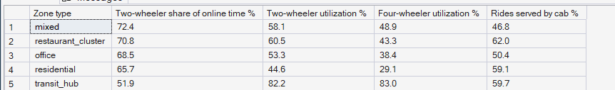
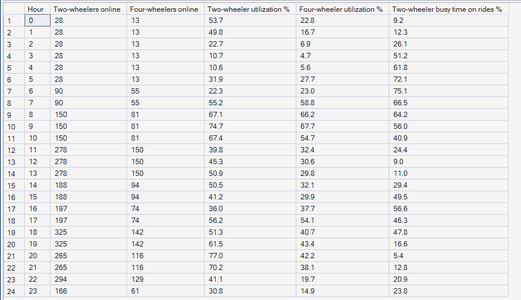
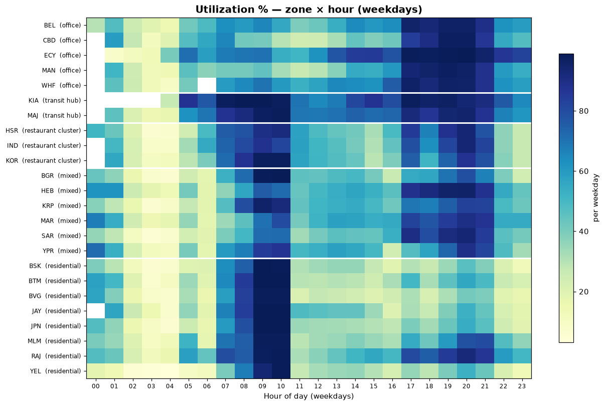

# Phase 7 — Supply Intelligence
## 05. Service Eligibility — Two-Wheelers vs Cabs

**SQL Script:** `sql/05_service_eligibility.sql`

---

## 1. Business Question

Where are two-wheelers and cabs, how busy is each, and how do two-wheelers split their time between rides and food?

---

## 2. Objective

Compare the two vehicle types by zone type and by weekday hour, and measure the share of two-wheeler busy time spent on rides.

---

## 3. Data Sources

- `dw.vw_Supply_ZoneHour`, `dw.Dim_Vehicle` (eligibility)
- `dw.Fact_Rides`, `dw.Fact_Ride_Requests`, `dw.Fact_Food_Orders`
- `dw.Dim_Zone`, `dw.Dim_Time`

---

## 4. Analytical Grain

**Zone type** (Result Set A) and **weekday hour** (Result Set B).

---

## 5. Techniques Used

- Self-join of a CTE to put two-wheelers and cabs side by side
- Utilization by vehicle type
- Two-wheeler busy minutes split by service

---

# 6. Result Set A — Vehicle Mix and Utilization by Zone Type

<!-- AUTO:A -->
| Zone type | Two-wheeler share of online time % | Two-wheeler utilization % | Four-wheeler utilization % | Rides served by cab % |
|---|---|---|---|---|
| mixed | 72.4 | 58.1 | 48.9 | 46.8 |
| restaurant_cluster | 70.8 | 60.5 | 43.3 | 62.0 |
| office | 68.5 | 53.3 | 38.4 | 50.4 |
| residential | 65.7 | 44.6 | 29.1 | 59.1 |
| transit_hub | 51.9 | 82.2 | 83.0 | 59.7 |

_Generated 2026-10-03 by a report script — do not edit by hand._
<!-- /AUTO:A -->

### Screenshot

---

# 7. Result Set B — Vehicles and Two-Wheeler Time by Weekday Hour

<!-- AUTO:B -->
| Hour | Two-wheelers online | Four-wheelers online | Two-wheeler utilization % | Four-wheeler utilization % | Two-wheeler busy time on rides % |
|---|---|---|---|---|---|
| 0 | 28 | 13 | 53.7 | 22.8 | 9.2 |
| 1 | 28 | 13 | 49.8 | 16.7 | 12.3 |
| 2 | 28 | 13 | 22.7 | 6.9 | 26.1 |
| 3 | 28 | 13 | 10.7 | 4.7 | 51.2 |
| 4 | 28 | 13 | 10.6 | 5.6 | 61.8 |
| 5 | 28 | 13 | 31.9 | 27.7 | 72.1 |
| 6 | 90 | 55 | 22.3 | 23.0 | 75.1 |
| 7 | 90 | 55 | 55.2 | 58.8 | 66.5 |
| 8 | 150 | 81 | 67.1 | 66.2 | 64.2 |
| 9 | 150 | 81 | 74.7 | 67.7 | 56.0 |
| 10 | 150 | 81 | 67.4 | 54.7 | 40.9 |
| 11 | 278 | 150 | 39.8 | 32.4 | 24.4 |
| 12 | 278 | 150 | 45.3 | 30.6 | 9.0 |
| 13 | 278 | 150 | 50.9 | 29.8 | 11.0 |
| 14 | 188 | 94 | 50.5 | 32.1 | 29.4 |
| 15 | 188 | 94 | 41.2 | 29.9 | 49.5 |
| 16 | 197 | 74 | 36.0 | 37.7 | 56.6 |
| 17 | 197 | 74 | 56.2 | 54.1 | 46.3 |
| 18 | 325 | 142 | 51.3 | 40.7 | 47.8 |
| 19 | 325 | 142 | 61.5 | 43.4 | 16.6 |
| 20 | 265 | 116 | 77.0 | 42.2 | 5.4 |
| 21 | 265 | 116 | 70.2 | 38.1 | 12.8 |
| 22 | 294 | 129 | 41.1 | 19.7 | 20.9 |
| 23 | 166 | 61 | 30.8 | 14.9 | 23.8 |

_Generated 2026-10-03 by a report script — do not edit by hand._
<!-- /AUTO:B -->

### Screenshot

---

# 8. Utilization Through the Day

---

# 9. Key Observations

### 9.1 Two-wheelers carry the marketplace
Two-wheelers provide most online time and are busier than cabs in every zone
type except transit hubs, where both vehicle types are almost fully used
(Result Set A).

### 9.2 Cabs only matter in the commute peaks
Four-wheeler utilization rises in the commute peaks and falls sharply between
them, because cabs cannot take food work (Result Set B).

### 9.3 Two-wheelers switch services through the day
Two-wheeler busy time tilts towards rides in the commute hours and towards food
at lunch and dinner — the shared pool in action.

---

# 10. Business Interpretation

The shared two-wheeler pool is PULSE's main flexibility: the same partners
serve whichever service needs them. Cabs are a rides-only reserve that is
valuable at the peaks and idle otherwise.

---

# 11. Business Implication

The optimizer must respect eligibility (cabs never to food) and use
two-wheelers as the swing capacity between services — exactly the constraint
structure validated on the toy model (Stages 1–4).

---

# 12. Scope Control

This analysis describes **supply** only. It does not compute the pressure
index (Phase 8), forecast (Phase 9) or recommend moves or incentives
(Phases 10–11).

---

# 13. Reproducibility

`sql/05_service_eligibility.sql` is the authoritative source; run it in SSMS or regenerate this
document with `python scripts/report_phase7.py`. Tables, charts and the
headline summary are generated, never typed.

---

## Conclusion

<!-- AUTO:headline -->
- Four-wheeler utilization ranges from **4.7%** to **67.7%** across weekday hours; two-wheelers from **10.6%** to **77.0%**.
- Two-wheelers spend the most busy time on rides at **06:00** (**75.1%**) and the least at **20:00** (**5.4%**).

_Generated 2026-10-03 by a report script — do not edit by hand._
<!-- /AUTO:headline -->
