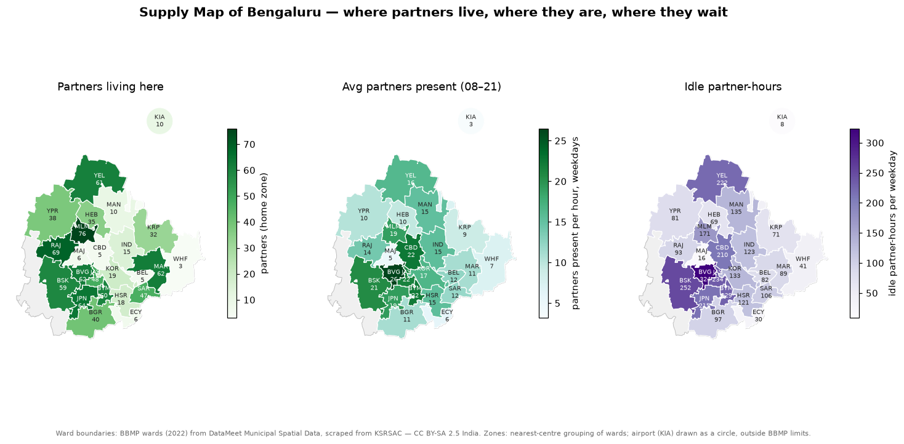

# Phase 7 — Supply Intelligence

**Question answered:** *Where is supply really — and is it where the demand
is?* The supply-side mirror of Phase 6, at **Zone × Hour** grain.



Compare with the Demand Map: `06_Demand_Intelligence/images/charts/demand_map.png`.

## How it is built

| Layer | File | Purpose |
|-------|------|---------|
| Analyses | `sql/01_…` to `sql/05_…` | One file per analysis; Result Sets A and B |
| Chart data | `sql/06_zone_hour_supply.sql` | Zone × hour supply matrix and partners living per zone |
| Findings | `01_…md` to `05_…md` | ORGEE format; tables, headlines and charts generated |
| Evidence | `images/` (SSMS screenshots), `images/charts/` (generated) | |

```bash
python scripts/report_phase7.py     # all five documents + supply map + heatmaps + partner-time chart
```

## Analyses

| # | Document | Business question |
|---|----------|-------------------|
| 01 | `01_Supply_Profile.md` | Where do partners live, and where are they through the day? |
| 02 | `02_Partner_Time_States.md` | How do partners spend their online time? |
| 03 | `03_Idle_Supply.md` | Where does supply sit idle — and could it have reached unserved demand? |
| 04 | `04_Empty_Kilometres.md` | How far do partners drive empty to reach pickups? |
| 05 | `05_Service_Eligibility.md` | Where are two-wheelers vs cabs, and what do two-wheelers spend time on? |

## Partner states

The locked plan lists partner states (available, assigned, on trip,
delivering, idle, offline, repositioning). PULSE records them as **time per
hour**, not as individual state changes (see `02_Data_Ecosystem/Data_Ecosystem.md` §8):

| Plan state | Measured as |
|------------|-------------|
| Available / idle | idle minutes (online, no job) |
| Assigned | *to pickup* (ride) and *to restaurant* (food) minutes |
| On trip | *on trip* minutes |
| Delivering | *delivering* minutes |
| Offline | hours outside a partner's shift (not online) |
| Repositioning | none in status-quo history (Phase 10) |
