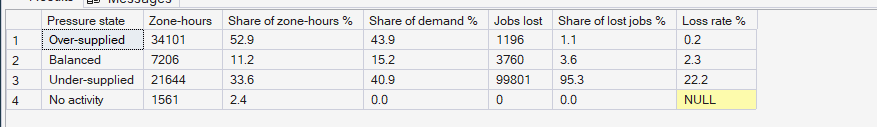
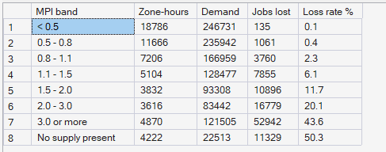
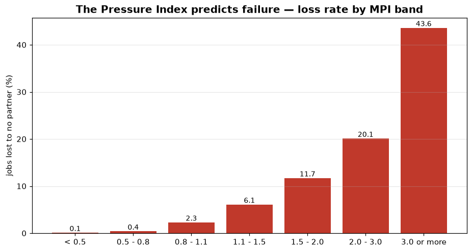

# Phase 8 — Supply–Demand Imbalance
## 01. Does the Pressure Index Predict Lost Demand?

**SQL Script:** `sql/01_pressure_index_validation.sql` · **Pressure table:** `sql/00_build_pressure_table.sql`

---

## 1. Business Question

Is the Marketplace Pressure Index a trustworthy signal — does higher pressure really mean more lost demand?

---

## 2. Objective

Compare zone-hours, demand and lost jobs across pressure states, and measure the loss rate in each band of the index.

---

## 3. Data Sources

- `dw.Agg_Pressure_ZoneHour` (Marketplace Pressure Index per zone and hour)
- `dw.Dim_Time`, `dw.Dim_Zone`

---

## 4. Analytical Grain

**Zone-hour** across all 112 days, grouped by **pressure state** (Result Set A) and **MPI band** (Result Set B).

---

## 5. Techniques Used

- Materialised index table built with CTEs, a geography distance matrix and a neighbourhood self-join
- Banding with `CASE`
- Window shares (`SUM(...) OVER ()`)
- Calibration chart

---

# 6. Result Set A — Demand and Losses by Pressure State

<!-- AUTO:A -->
| Pressure state | Zone-hours | Share of zone-hours % | Share of demand % | Jobs lost | Share of lost jobs % | Loss rate % |
|---|---|---|---|---|---|---|
| Over-supplied | 34,101 | 52.9 | 43.9 | 1,196 | 1.1 | 0.2 |
| Balanced | 7,206 | 11.2 | 15.2 | 3,760 | 3.6 | 2.3 |
| Under-supplied | 21,644 | 33.6 | 40.9 | 99,801 | 95.3 | 22.2 |
| No activity | 1,561 | 2.4 | 0.0 | 0 | 0.0 |  |

_Generated 2026-10-03 by a report script — do not edit by hand._
<!-- /AUTO:A -->

### Screenshot

---

# 7. Result Set B — Loss Rate by MPI Band

<!-- AUTO:B -->
| MPI band | Zone-hours | Demand | Jobs lost | Loss rate % |
|---|---|---|---|---|
| < 0.5 | 18,786 | 246,731 | 135 | 0.1 |
| 0.5 - 0.8 | 11,666 | 235,942 | 1,061 | 0.4 |
| 0.8 - 1.1 | 7,206 | 166,959 | 3,760 | 2.3 |
| 1.1 - 1.5 | 5,104 | 128,477 | 7,855 | 6.1 |
| 1.5 - 2.0 | 3,832 | 93,308 | 10,896 | 11.7 |
| 2.0 - 3.0 | 3,616 | 83,442 | 16,779 | 20.1 |
| 3.0 or more | 4,870 | 121,505 | 52,942 | 43.6 |
| No supply present | 4,222 | 22,513 | 11,329 | 50.3 |

_Generated 2026-10-03 by a report script — do not edit by hand._
<!-- /AUTO:B -->

### Screenshot

---

# 8. Calibration Chart

---

# 9. Key Observations

### 9.1 Lost demand lives in under-supplied zone-hours
Under-supplied zone-hours are a minority of all zone-hours but hold the large
majority of all lost jobs (Result Set A).

### 9.2 The loss rate rises steadily with the index
Below an MPI of 0.8 almost nothing is lost; above 3 a large share of demand is
lost. Each band loses more than the one before (Result Set B, chart).

### 9.3 Over-supply is common
Around half of all zone-hours are over-supplied — partners present with far
more capacity than local demand — which is the idle supply seen in Phase 7.

---

# 10. Business Interpretation

The Pressure Index is a **reliable, simple signal**: computed from demand and
supply alone, it sorts zone-hours by how much demand will be lost. That makes
it suitable as an input to optimization and as a dashboard alert.

---

# 11. Business Implication

The thresholds 0.80 and 1.10 (KPI_Dictionary.md) sit where losses begin to
climb, so they are sensible operating limits. Phase 10 can use the index to
decide where supply is needed; Phase 12 can use it to colour the city.

---

# 12. Scope Control

This analysis measures imbalance from **observed** supply and demand. It does
not forecast (Phase 9), optimize moves (Phase 10) or price incentives
(Phase 11).

---

# 13. Reproducibility

`sql/01_pressure_index_validation.sql` is the authoritative source; regenerate this document (and the
pressure table) with `python scripts/report_phase8.py`. Tables, charts and the
headline summary are generated, never typed.

---

## Conclusion

<!-- AUTO:headline -->
- Under-supplied zone-hours are **33.6%** of all zone-hours but hold **95.3%** of all lost jobs.
- The loss rate rises from **0.1%** at MPI < 0.5 to **43.6%** at MPI 3.0 or more: the index predicts failure.

_Generated 2026-10-03 by a report script — do not edit by hand._
<!-- /AUTO:headline -->
