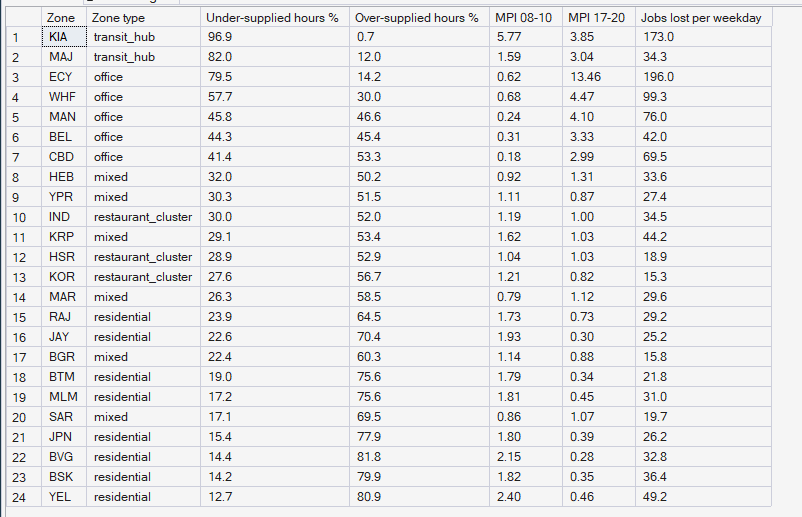
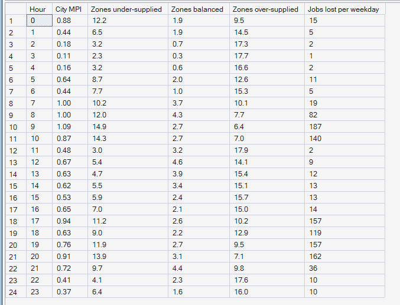
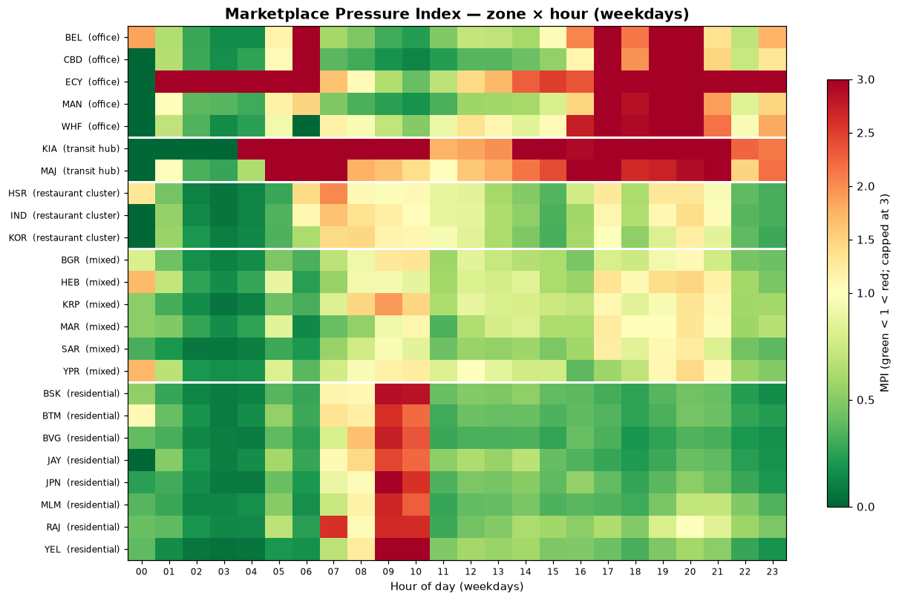

# Phase 8 — Supply–Demand Imbalance
## 02. Where and When Is the Marketplace Under Pressure?

**SQL Script:** `sql/02_pressure_by_zone_hour.sql` · **Pressure table:** `sql/00_build_pressure_table.sql`

---

## 1. Business Question

Which zones and which hours of the weekday are under-supplied, balanced or over-supplied?

---

## 2. Objective

Rank zones by how often they are under-supplied and by their pressure in the morning and evening peaks, and show the city's pressure hour by hour.

---

## 3. Data Sources

- `dw.Agg_Pressure_ZoneHour` (Marketplace Pressure Index per zone and hour)
- `dw.Dim_Time`, `dw.Dim_Zone`

---

## 4. Analytical Grain

**Zone** over weekdays (Result Set A) and **weekday hour** (Result Set B).

---

## 5. Techniques Used

- Conditional counts of pressure states
- Ratio-of-sums MPI for peak windows
- Diverging zone × hour heatmap centred on MPI = 1
- Choropleth Pressure Map

---

# 6. Result Set A — Pressure by Zone

<!-- AUTO:A -->
| Zone | Zone type | Under-supplied hours % | Over-supplied hours % | MPI 08-10 | MPI 17-20 | Jobs lost per weekday |
|---|---|---|---|---|---|---|
| KIA | transit_hub | 96.9 | 0.7 | 5.77 | 3.85 | 173.0 |
| MAJ | transit_hub | 82.0 | 12.0 | 1.59 | 3.04 | 34.3 |
| ECY | office | 79.5 | 14.2 | 0.62 | 13.46 | 196.0 |
| WHF | office | 57.7 | 30.0 | 0.68 | 4.47 | 99.3 |
| MAN | office | 45.8 | 46.6 | 0.24 | 4.10 | 76.0 |
| BEL | office | 44.3 | 45.4 | 0.31 | 3.33 | 42.0 |
| CBD | office | 41.4 | 53.3 | 0.18 | 2.99 | 69.5 |
| HEB | mixed | 32.0 | 50.2 | 0.92 | 1.31 | 33.6 |
| YPR | mixed | 30.3 | 51.5 | 1.11 | 0.87 | 27.4 |
| IND | restaurant_cluster | 30.0 | 52.0 | 1.19 | 1.00 | 34.5 |
| KRP | mixed | 29.1 | 53.4 | 1.62 | 1.03 | 44.2 |
| HSR | restaurant_cluster | 28.9 | 52.9 | 1.04 | 1.03 | 18.9 |
| KOR | restaurant_cluster | 27.6 | 56.7 | 1.21 | 0.82 | 15.3 |
| MAR | mixed | 26.3 | 58.5 | 0.79 | 1.12 | 29.6 |
| RAJ | residential | 23.9 | 64.5 | 1.73 | 0.73 | 29.2 |
| JAY | residential | 22.6 | 70.4 | 1.93 | 0.30 | 25.2 |
| BGR | mixed | 22.4 | 60.3 | 1.14 | 0.88 | 15.8 |
| BTM | residential | 19.0 | 75.6 | 1.79 | 0.34 | 21.8 |
| MLM | residential | 17.2 | 75.6 | 1.81 | 0.45 | 31.0 |
| SAR | mixed | 17.1 | 69.5 | 0.86 | 1.07 | 19.7 |
| JPN | residential | 15.4 | 77.9 | 1.80 | 0.39 | 26.2 |
| BVG | residential | 14.4 | 81.8 | 2.15 | 0.28 | 32.8 |
| BSK | residential | 14.2 | 79.9 | 1.82 | 0.35 | 36.4 |
| YEL | residential | 12.7 | 80.9 | 2.40 | 0.46 | 49.2 |

_Generated 2026-10-03 by a report script — do not edit by hand._
<!-- /AUTO:A -->

### Screenshot

---

# 7. Result Set B — Pressure by Weekday Hour

<!-- AUTO:B -->
| Hour | City MPI | Zones under-supplied | Zones balanced | Zones over-supplied | Jobs lost per weekday |
|---|---|---|---|---|---|
| 0 | 0.88 | 12.20 | 1.90 | 9.50 | 15 |
| 1 | 0.44 | 6.50 | 1.90 | 14.50 | 5 |
| 2 | 0.18 | 3.20 | 0.70 | 17.30 | 2 |
| 3 | 0.11 | 2.30 | 0.30 | 17.70 | 1 |
| 4 | 0.16 | 3.20 | 0.60 | 16.60 | 2 |
| 5 | 0.64 | 8.70 | 2.00 | 12.60 | 11 |
| 6 | 0.44 | 7.70 | 1.00 | 15.30 | 5 |
| 7 | 1.00 | 10.20 | 3.70 | 10.10 | 19 |
| 8 | 1.00 | 12.00 | 4.30 | 7.70 | 82 |
| 9 | 1.09 | 14.90 | 2.70 | 6.40 | 187 |
| 10 | 0.87 | 14.30 | 2.70 | 7.00 | 140 |
| 11 | 0.48 | 3.00 | 3.20 | 17.90 | 2 |
| 12 | 0.67 | 5.40 | 4.60 | 14.10 | 9 |
| 13 | 0.63 | 4.70 | 3.90 | 15.40 | 12 |
| 14 | 0.62 | 5.50 | 3.40 | 15.10 | 13 |
| 15 | 0.53 | 5.90 | 2.40 | 15.70 | 13 |
| 16 | 0.65 | 7.00 | 2.10 | 15.00 | 14 |
| 17 | 0.94 | 11.20 | 2.60 | 10.20 | 157 |
| 18 | 0.63 | 9.00 | 2.20 | 12.90 | 119 |
| 19 | 0.76 | 11.90 | 2.70 | 9.50 | 157 |
| 20 | 0.91 | 13.90 | 3.10 | 7.10 | 162 |
| 21 | 0.72 | 9.70 | 4.40 | 9.80 | 36 |
| 22 | 0.41 | 4.10 | 2.30 | 17.60 | 10 |
| 23 | 0.37 | 6.40 | 1.60 | 16.00 | 10 |

_Generated 2026-10-03 by a report script — do not edit by hand._
<!-- /AUTO:B -->

### Screenshot

---

# 8. The Pressure Map and Heatmap

---

# 9. Key Observations

### 9.1 A few zones are chronically short
The airport, Electronic City and the office zones are under-supplied in a
large share of their active weekday hours (Result Set A, map).

### 9.2 The city as a whole is rarely short
City-level MPI stays at or below balance in most hours, even while many
individual zones are under-supplied (Result Set B).

### 9.3 Pressure moves across the city through the day
The heatmap shows residential zones under pressure in the morning and office
zones in the evening, with residential zones over-supplied for most of the day.

---

# 10. Business Interpretation

Imbalance in PULSE is **local and time-specific**: at any hour some zones are
starved while others have surplus. The total fleet is broadly sufficient; its
distribution is not.

---

# 11. Business Implication

The optimizer's job is redistribution, not expansion: move surplus from
over-supplied zones to under-supplied ones before each peak.

---

# 12. Scope Control

This analysis measures imbalance from **observed** supply and demand. It does
not forecast (Phase 9), optimize moves (Phase 10) or price incentives
(Phase 11).

---

# 13. Reproducibility

`sql/02_pressure_by_zone_hour.sql` is the authoritative source; regenerate this document (and the
pressure table) with `python scripts/report_phase8.py`. Tables, charts and the
headline summary are generated, never typed.

---

## Conclusion

<!-- AUTO:headline -->
- **KIA** is under-supplied in **96.9%** of its active weekday hours, the most of any zone.
- At **09:00** on weekdays, **14.9** of 24 zones are under-supplied on an average day (city MPI **1.09**).

_Generated 2026-10-03 by a report script — do not edit by hand._
<!-- /AUTO:headline -->
