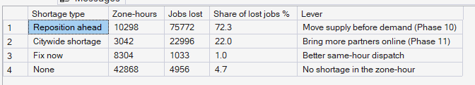
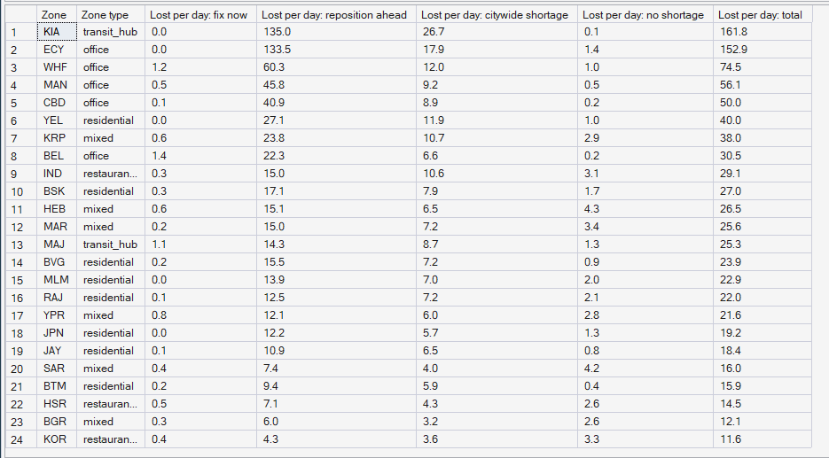
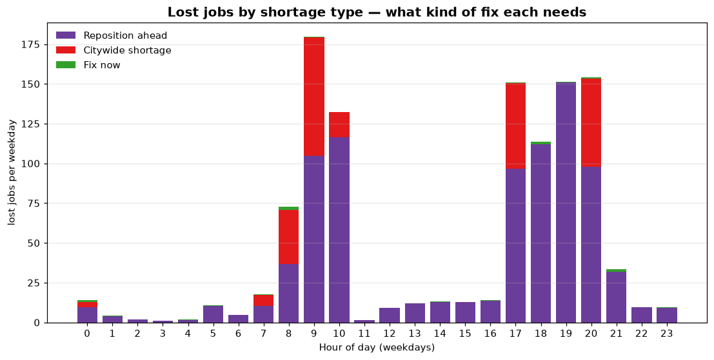

# Phase 8 — Supply–Demand Imbalance
## 03. Shortage Types — Which Lever Fixes Which Shortage?

**SQL Script:** `sql/03_shortage_types.sql` · **Pressure table:** `sql/00_build_pressure_table.sql`

---

## 1. Business Question

When a zone is under-supplied, what kind of shortage is it — and which lever can fix it?

---

## 2. Objective

Classify every under-supplied zone-hour as fixable now, fixable only by repositioning ahead of demand, or a citywide shortage, and measure the lost jobs in each.

---

## 3. Data Sources

- `dw.Agg_Pressure_ZoneHour` (Marketplace Pressure Index per zone and hour)
- `dw.Dim_Zone`

---

## 4. Analytical Grain

**Shortage type** across all 112 days (Result Set A) and **zone** (Result Set B).

---

## 5. Techniques Used

- Three-level test: local, neighbourhood (20-minute reach) and city MPI
- Conditional sums of lost jobs by type
- Stacked chart of lost jobs by type and hour

---

# 6. Result Set A — Lost Jobs by Shortage Type

<!-- AUTO:A -->
| Shortage type | Zone-hours | Jobs lost | Share of lost jobs % | Lever |
|---|---|---|---|---|
| Reposition ahead | 10,298 | 75,772 | 72.3 | Move supply before demand (Phase 10) |
| Citywide shortage | 3,042 | 22,996 | 22.0 | Bring more partners online (Phase 11) |
| Fix now | 8,304 | 1,033 | 1.0 | Better same-hour dispatch |
| None | 42,868 | 4,956 | 4.7 | No shortage in the zone-hour |

_Generated 2026-10-03 by a report script — do not edit by hand._
<!-- /AUTO:A -->

### Screenshot

---

# 7. Result Set B — Lost Jobs by Zone and Shortage Type

<!-- AUTO:B -->
| Zone | Zone type | Lost per day: fix now | Lost per day: reposition ahead | Lost per day: citywide shortage | Lost per day: no shortage | Lost per day: total |
|---|---|---|---|---|---|---|
| KIA | transit_hub | 0.0 | 135.0 | 26.7 | 0.1 | 161.8 |
| ECY | office | 0.0 | 133.5 | 17.9 | 1.4 | 152.9 |
| WHF | office | 1.2 | 60.3 | 12.0 | 1.0 | 74.5 |
| MAN | office | 0.5 | 45.8 | 9.2 | 0.5 | 56.1 |
| CBD | office | 0.1 | 40.9 | 8.9 | 0.2 | 50.0 |
| YEL | residential | 0.0 | 27.1 | 11.9 | 1.0 | 40.0 |
| KRP | mixed | 0.6 | 23.8 | 10.7 | 2.9 | 38.0 |
| BEL | office | 1.4 | 22.3 | 6.6 | 0.2 | 30.5 |
| IND | restaurant_cluster | 0.3 | 15.0 | 10.6 | 3.1 | 29.1 |
| BSK | residential | 0.3 | 17.1 | 7.9 | 1.7 | 27.0 |
| HEB | mixed | 0.6 | 15.1 | 6.5 | 4.3 | 26.5 |
| MAR | mixed | 0.2 | 15.0 | 7.2 | 3.4 | 25.6 |
| MAJ | transit_hub | 1.1 | 14.3 | 8.7 | 1.3 | 25.3 |
| BVG | residential | 0.2 | 15.5 | 7.2 | 0.9 | 23.9 |
| MLM | residential | 0.0 | 13.9 | 7.0 | 2.0 | 22.9 |
| RAJ | residential | 0.1 | 12.5 | 7.2 | 2.1 | 22.0 |
| YPR | mixed | 0.8 | 12.1 | 6.0 | 2.8 | 21.6 |
| JPN | residential | 0.0 | 12.2 | 5.7 | 1.3 | 19.2 |
| JAY | residential | 0.1 | 10.9 | 6.5 | 0.8 | 18.4 |
| SAR | mixed | 0.4 | 7.4 | 4.0 | 4.2 | 16.0 |
| BTM | residential | 0.2 | 9.4 | 5.9 | 0.4 | 15.9 |
| HSR | restaurant_cluster | 0.5 | 7.1 | 4.3 | 2.6 | 14.5 |
| BGR | mixed | 0.3 | 6.0 | 3.2 | 2.6 | 12.1 |
| KOR | restaurant_cluster | 0.4 | 4.3 | 3.6 | 3.3 | 11.6 |

_Generated 2026-10-03 by a report script — do not edit by hand._
<!-- /AUTO:B -->

### Screenshot

---

# 8. Lost Jobs by Shortage Type and Hour

---

# 9. Key Observations

### 9.1 Most lost demand needs repositioning ahead of time
The large majority of lost jobs happen when the zone's whole neighbourhood is
short while the city still has spare partners elsewhere (Result Set A). Those
partners exist — they are simply too far away to arrive in time.

### 9.2 A smaller share is a genuine citywide shortage
Some losses occur when the city as a whole lacks partners — in the commute
peaks and around midnight, when demand briefly outruns the partners on shift.

### 9.3 Same-hour dispatch would barely help
Very few lost jobs occur where a nearby neighbour has slack at the same
moment, so faster or smarter dispatch alone cannot recover them.

### 9.4 Isolated zones dominate repositioning needs
The airport, Electronic City, Whitefield and Manyata carry most of the
reposition-ahead losses (Result Set B).

---

# 10. Business Interpretation

This splits PULSE's problem cleanly between its two decision phases: most
losses are a **positioning** problem for the optimizer, and the rest are a
**capacity** problem for incentives.

---

# 11. Business Implication

- **Phase 10** targets the reposition-ahead losses: forecast the pressure and
  move surplus partners towards those zones *before* the peak.
- **Phase 11** targets citywide shortages: incentives that bring partners
  online earlier or later than their shifts.

---

# 12. Scope Control

This analysis measures imbalance from **observed** supply and demand. It does
not forecast (Phase 9), optimize moves (Phase 10) or price incentives
(Phase 11).

---

# 13. Reproducibility

`sql/03_shortage_types.sql` is the authoritative source; regenerate this document (and the
pressure table) with `python scripts/report_phase8.py`. Tables, charts and the
headline summary are generated, never typed.

---

## Conclusion

<!-- AUTO:headline -->
- **72.3%** of lost jobs happen where supply exists elsewhere in the city but not within reach — fixable only by **repositioning ahead** of demand (Phase 10).
- **22.0%** happen when the whole city is short — a **citywide shortage** that needs more partners online (Phase 11).
- Only **1.0%** could be fixed by better same-hour dispatch.
- **KIA** loses the most jobs (**161.8** per day).

_Generated 2026-10-03 by a report script — do not edit by hand._
<!-- /AUTO:headline -->
