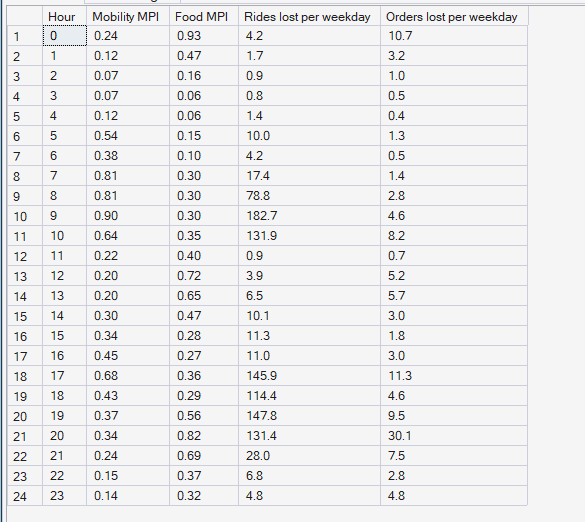
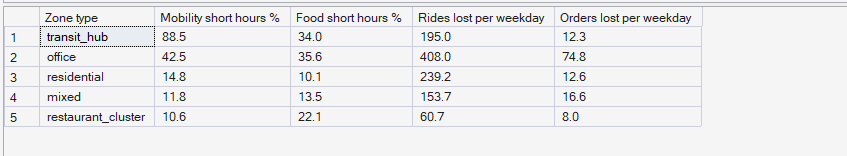

# Phase 8 — Supply–Demand Imbalance
## 04. Service Pressure — Rides vs Food

**SQL Script:** `sql/04_service_pressure.sql` · **Pressure table:** `sql/00_build_pressure_table.sql`

---

## 1. Business Question

Is the marketplace short of capacity for rides, for food, or for both — and when?

---

## 2. Objective

Measure city-level mobility and food pressure through the weekday, and how often each zone type is short of capacity for each service.

---

## 3. Data Sources

- `dw.Agg_Pressure_ZoneHour` (Marketplace Pressure Index per zone and hour)
- `dw.Dim_Time`, `dw.Dim_Zone`

---

## 4. Analytical Grain

**Weekday hour** (Result Set A) and **zone type** (Result Set B).

---

## 5. Techniques Used

- Service-specific capacity: all partners for rides (2 jobs/hour), two-wheelers only for food (3 jobs/hour)
- Ratio-of-sums MPI per service
- Share of active hours short of capacity

---

# 6. Result Set A — Service Pressure by Weekday Hour

<!-- AUTO:A -->
| Hour | Mobility MPI | Food MPI | Rides lost per weekday | Orders lost per weekday |
|---|---|---|---|---|
| 0 | 0.24 | 0.93 | 4.2 | 10.7 |
| 1 | 0.12 | 0.47 | 1.7 | 3.2 |
| 2 | 0.07 | 0.16 | 0.9 | 1.0 |
| 3 | 0.07 | 0.06 | 0.8 | 0.5 |
| 4 | 0.12 | 0.06 | 1.4 | 0.4 |
| 5 | 0.54 | 0.15 | 10.0 | 1.3 |
| 6 | 0.38 | 0.10 | 4.2 | 0.5 |
| 7 | 0.81 | 0.30 | 17.4 | 1.4 |
| 8 | 0.81 | 0.30 | 78.8 | 2.8 |
| 9 | 0.90 | 0.30 | 182.7 | 4.6 |
| 10 | 0.64 | 0.35 | 131.9 | 8.2 |
| 11 | 0.22 | 0.40 | 0.9 | 0.7 |
| 12 | 0.20 | 0.72 | 3.9 | 5.2 |
| 13 | 0.20 | 0.65 | 6.5 | 5.7 |
| 14 | 0.30 | 0.47 | 10.1 | 3.0 |
| 15 | 0.34 | 0.28 | 11.3 | 1.8 |
| 16 | 0.45 | 0.27 | 11.0 | 3.0 |
| 17 | 0.68 | 0.36 | 145.9 | 11.3 |
| 18 | 0.43 | 0.29 | 114.4 | 4.6 |
| 19 | 0.37 | 0.56 | 147.8 | 9.5 |
| 20 | 0.34 | 0.82 | 131.4 | 30.1 |
| 21 | 0.24 | 0.69 | 28.0 | 7.5 |
| 22 | 0.15 | 0.37 | 6.8 | 2.8 |
| 23 | 0.14 | 0.32 | 4.8 | 4.8 |

_Generated 2026-10-03 by a report script — do not edit by hand._
<!-- /AUTO:A -->

### Screenshot

---

# 7. Result Set B — Service Pressure by Zone Type

<!-- AUTO:B -->
| Zone type | Mobility short hours % | Food short hours % | Rides lost per weekday | Orders lost per weekday |
|---|---|---|---|---|
| transit_hub | 88.5 | 34.0 | 195.0 | 12.3 |
| office | 42.5 | 35.6 | 408.0 | 74.8 |
| residential | 14.8 | 10.1 | 239.2 | 12.6 |
| mixed | 11.8 | 13.5 | 153.7 | 16.6 |
| restaurant_cluster | 10.6 | 22.1 | 60.7 | 8.0 |

_Generated 2026-10-03 by a report script — do not edit by hand._
<!-- /AUTO:B -->

### Screenshot

---

# 8. Key Observations

### 8.1 Mobility pressure peaks in the morning commute
City-level ride pressure is highest in the morning peak, when ride demand is
high and few partners are on shift (Result Set A).

### 8.2 Food pressure peaks at dinner and late night
Food pressure rises at lunch and is highest at dinner and around midnight, when
two-wheeler numbers fall faster than food demand.

### 8.3 Losses are mostly rides
Rides are lost far more often than food orders in every zone type, even where
food pressure is high — food partners can be dispatched during preparation,
rides cannot wait (Phase 7, analysis 04).

### 8.4 The services peak at different times
Ride and food pressure rarely peak in the same hour, which is what makes a
shared two-wheeler pool valuable.

---

# 9. Business Interpretation

The two services compete for two-wheelers at different times of day. That is
an **opportunity**: the same partners can follow ride pressure in the commute
and food pressure at meals.

---

# 10. Business Implication

The optimizer should allocate two-wheelers between services hour by hour
(service is part of its decision), while cabs follow ride pressure only.

---

# 11. Note on the Two Indices

Each service index treats the shared two-wheelers as fully available to that
service, so the two indices cannot simply be added. The combined local MPI
(analyses 01–03) is the one that accounts for sharing.

---

# 12. Scope Control

This analysis measures imbalance from **observed** supply and demand. It does
not forecast (Phase 9), optimize moves (Phase 10) or price incentives
(Phase 11).

---

# 13. Reproducibility

`sql/04_service_pressure.sql` is the authoritative source; regenerate this document (and the
pressure table) with `python scripts/report_phase8.py`. Tables, charts and the
headline summary are generated, never typed.

---

## Conclusion

<!-- AUTO:headline -->
- City-level mobility pressure peaks at **09:00** (MPI **0.90**); food pressure peaks at **00:00** (MPI **0.93**).
- **transit_hub** zones are short of mobility supply in **88.5%** of their weekday ride hours.

_Generated 2026-10-03 by a report script — do not edit by hand._
<!-- /AUTO:headline -->
