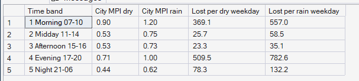
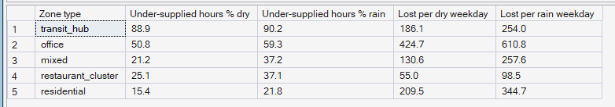

# Phase 8 — Supply–Demand Imbalance
## 05. Rain and Pressure

**SQL Script:** `sql/05_rain_pressure.sql` · **Pressure table:** `sql/00_build_pressure_table.sql`

---

## 1. Business Question

How much does rain add to marketplace pressure, and where?

---

## 2. Objective

Compare city pressure and lost jobs on rain and dry weekdays by time of day, and the share of under-supplied hours by zone type.

---

## 3. Data Sources

- `dw.Agg_Pressure_ZoneHour` (Marketplace Pressure Index per zone and hour)
- `dw.Dim_Time` (rain flags), `dw.Dim_Zone`

---

## 4. Analytical Grain

**Weekday time band × day type** (Result Set A) and **zone type × day type** (Result Set B).

---

## 5. Techniques Used

- Day-type comparison with per-day normalisation
- Conditional MPI for rain and dry days

---

# 6. Result Set A — Pressure by Time Band — Dry vs Rain

<!-- AUTO:A -->
| Time band | City MPI dry | City MPI rain | Lost per dry weekday | Lost per rain weekday |
|---|---|---|---|---|
| 1 Morning 07-10 | 0.90 | 1.20 | 369.10 | 557.00 |
| 2 Midday 11-14 | 0.53 | 0.75 | 25.70 | 58.50 |
| 3 Afternoon 15-16 | 0.53 | 0.73 | 23.30 | 35.10 |
| 4 Evening 17-20 | 0.71 | 1.00 | 509.50 | 782.60 |
| 5 Night 21-06 | 0.44 | 0.62 | 78.30 | 132.20 |

_Generated 2026-10-03 by a report script — do not edit by hand._
<!-- /AUTO:A -->

### Screenshot

---

# 7. Result Set B — Under-supplied Hours by Zone Type — Dry vs Rain

<!-- AUTO:B -->
| Zone type | Under-supplied hours % dry | Under-supplied hours % rain | Lost per dry weekday | Lost per rain weekday |
|---|---|---|---|---|
| transit_hub | 88.9 | 90.2 | 186.10 | 254.00 |
| office | 50.8 | 59.3 | 424.70 | 610.80 |
| mixed | 21.2 | 37.2 | 130.60 | 257.60 |
| restaurant_cluster | 25.1 | 37.1 | 55.00 | 98.50 |
| residential | 15.4 | 21.8 | 209.50 | 344.70 |

_Generated 2026-10-03 by a report script — do not edit by hand._
<!-- /AUTO:B -->

### Screenshot

---

# 8. Key Observations

### 8.1 Rain raises pressure in every part of the day
City MPI is higher on rain days in every time band, because rain lifts demand
while cutting two-wheeler supply (Result Set A).

### 8.2 Rain adds lost demand
Weekday losses are higher on rain days, concentrated in the periods that were
already under pressure.

### 8.3 Already-pressured zone types suffer most
Zone types that were short on dry days become short more often on rain days
(Result Set B).

---

# 9. Business Interpretation

Rain is a predictable stress event: both sides of the marketplace move against
it at once — more orders and rides, fewer two-wheelers.

---

# 10. Business Implication

Rain days are natural triggers for Phase 11 incentive scenarios and for
pre-emptive repositioning in Phase 10, and the forecast (Phase 9) must carry a
rain signal.

---

# 11. Data Note

The synthetic generator applies one citywide rain effect (Assumptions D-08,
S-04), so differences between zone types come from their baseline pressure,
not from local weather.

---

# 12. Scope Control

This analysis measures imbalance from **observed** supply and demand. It does
not forecast (Phase 9), optimize moves (Phase 10) or price incentives
(Phase 11).

---

# 13. Reproducibility

`sql/05_rain_pressure.sql` is the authoritative source; regenerate this document (and the
pressure table) with `python scripts/report_phase8.py`. Tables, charts and the
headline summary are generated, never typed.

---

## Conclusion

<!-- AUTO:headline -->
- Rain raises pressure most in the **Evening 17-20** band: lost jobs go from **509.5** to **782.6** per weekday.
- Total weekday losses rise from **1,006** on dry days to **1,565** on rain days.

_Generated 2026-10-03 by a report script — do not edit by hand._
<!-- /AUTO:headline -->
