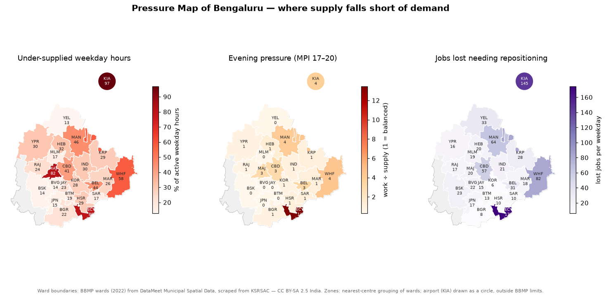

# Phase 8 — Supply–Demand Imbalance

**Question answered:** *Where and when does demand exceed the supply that can
serve it — and what kind of fix does each shortage need?*



## The Marketplace Pressure Index (MPI)

For every **Zone × Hour** (and each service), stored in
**`dw.Agg_Pressure_ZoneHour`** — an analytical input to the Phase 10 optimizer.

| Measure | Definition |
|---------|-----------|
| Work hours | rides ÷ 2 + food orders ÷ 3 — partner-hours requested (Assumption O-01) |
| Supply hours | partners present at the start of the hour |
| **Local MPI** | work hours ÷ supply hours in the zone |
| Neighbourhood MPI | the same over all zones reachable in 20 minutes (5 km at weekday peak, 8.3 km otherwise) |
| City MPI | the same over the whole city in that hour |
| Mobility / Food MPI | rides ÷ (2 × all partners present); orders ÷ (3 × two-wheelers present) |

**Pressure state** (KPI_Dictionary.md): **Under-supplied** MPI > 1.10 (or demand
with no supply) · **Balanced** 0.80–1.10 · **Over-supplied** < 0.80 · No activity.

**Shortage type** — for under-supplied zone-hours, *which lever can fix it*:

| Type | Condition | Lever |
|------|-----------|-------|
| **Fix now** | neighbourhood MPI ≤ 1.10 | better same-hour dispatch |
| **Reposition ahead** | neighbourhood short, city MPI ≤ 1.10 | move supply before demand — **Phase 10** |
| **Citywide shortage** | city MPI > 1.10 | bring more partners online — **Phase 11** |

## How it is built

```bash
python scripts/report_phase8.py   # rebuild the pressure table, all five documents and charts
```

| Layer | File |
|-------|------|
| Pressure table | `sql/00_build_pressure_table.sql` → `dw.Agg_Pressure_ZoneHour` |
| Analyses | `sql/01_…` to `sql/05_…` (Result Sets A and B) |
| Chart data | `sql/06_pressure_matrix.sql` |
| Findings | `01_…md` to `05_…md` (structured write-up, generated tables and headlines) |

## Analyses

| # | Document | Business question |
|---|----------|-------------------|
| 01 | `01_Pressure_Index_Validation.md` | Does the index actually predict lost demand? |
| 02 | `02_Pressure_by_Zone_and_Hour.md` | Where and when is the marketplace under pressure? |
| 03 | `03_Shortage_Types.md` | What kind of shortage is it, and which lever fixes it? |
| 04 | `04_Service_Pressure.md` | Is the pressure on rides, food, or both? |
| 05 | `05_Rain_and_Pressure.md` | How much does rain add to pressure? |
