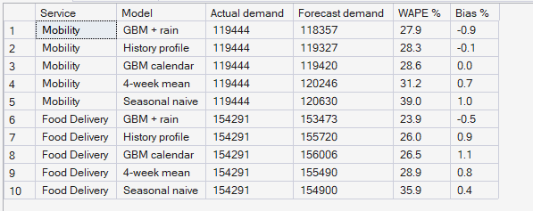
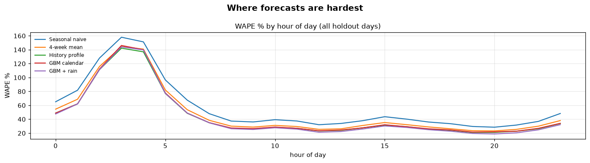

# Phase 9 — Demand & Supply Forecasting
## 02. Demand Forecast Accuracy

**Code:** `src/pulse/forecasting/demand.py` · **SQL Script:** `sql/04_forecast_accuracy.sql` (Result Set A)

---

## 1. Business Question

How accurately can PULSE forecast demand for every zone, hour and service a
week ahead — and does machine learning beat simple methods?

---

## 2. Objective

Compare five forecasting models on the four holdout weeks against the
seasonal naive benchmark and the noise floor, overall, at weekday peaks and
by service, and confirm the results in the warehouse.

---

## 3. Data Sources

- `sql/01_demand_history.sql` (built on `dw.vw_Marketplace_ZoneHour`, `dw.Dim_Time`, `dw.Dim_Zone`)
- `dw.Fact_Demand_Forecast` (written by the pipeline)

---

## 4. Analytical Grain

**Zone × hour × service** over the 4 holdout weeks (32,256 forecasts per model).

---

## 5. Techniques Used

- Seasonal naive, moving-average and profile benchmarks
- Gradient-boosted regression trees with a Poisson loss (scikit-learn `HistGradientBoostingRegressor`)
- WAPE, bias and skill metrics; noise-floor comparison
- Independent recomputation of accuracy in SQL

---

# 6. Result — Model Comparison (Python)

<!-- AUTO:models -->
| Model | WAPE % | Bias % | Weekday peak WAPE % | Skill vs seasonal naive % |
|---|---|---|---|---|
| Seasonal naive | 37.2 | 0.7 | 32.7 | 0.0 |
| 4-week mean | 29.9 | 0.7 | 25.9 | 19.7 |
| History profile | 27.0 | 0.5 | 23.6 | 27.4 |
| GBM calendar | 27.4 | 0.6 | 24.2 | 26.4 |
| GBM + rain | 25.6 | -0.7 | 22.4 | 31.1 |
| Noise floor (true expected demand) | 23.7 |  |  | 36.2 |

_Generated 2026-10-03 by a report script — do not edit by hand._
<!-- /AUTO:models -->

---

# 7. Result — Accuracy by Service (Python)

<!-- AUTO:service -->
| Service | Seasonal naive WAPE % | 4-week mean WAPE % | History profile WAPE % | GBM calendar WAPE % | GBM + rain WAPE % |
|---|---|---|---|---|---|
| food | 35.9 | 28.9 | 26.0 | 26.5 | 23.9 |
| mobility | 39.0 | 31.2 | 28.3 | 28.6 | 27.9 |

_Generated 2026-10-03 by a report script — do not edit by hand._
<!-- /AUTO:service -->

---

# 8. Result Set A — Accuracy Computed in the Warehouse

<!-- AUTO:A -->
| Service | Model | Actual demand | Forecast demand | WAPE % | Bias % |
|---|---|---|---|---|---|
| Mobility | GBM + rain | 119,444 | 118,357 | 27.9 | -0.9 |
| Mobility | History profile | 119,444 | 119,327 | 28.3 | -0.1 |
| Mobility | GBM calendar | 119,444 | 119,420 | 28.6 | 0.0 |
| Mobility | 4-week mean | 119,444 | 120,246 | 31.2 | 0.7 |
| Mobility | Seasonal naive | 119,444 | 120,630 | 39.0 | 1.0 |
| Food Delivery | GBM + rain | 154,291 | 153,473 | 23.9 | -0.5 |
| Food Delivery | History profile | 154,291 | 155,720 | 26.0 | 0.9 |
| Food Delivery | GBM calendar | 154,291 | 156,006 | 26.5 | 1.1 |
| Food Delivery | 4-week mean | 154,291 | 155,490 | 28.9 | 0.8 |
| Food Delivery | Seasonal naive | 154,291 | 154,900 | 35.9 | 0.4 |

_Generated 2026-10-03 by a report script — do not edit by hand._
<!-- /AUTO:A -->

### Screenshot

---

# 9. Reconciliation — Python vs SQL

<!-- AUTO:reconciliation -->
| Service | Model | Python WAPE % | SQL WAPE % | Match |
|---|---|---|---|---|
| Food Delivery | Seasonal naive | 35.9 | 35.9 | ✅ |
| Food Delivery | 4-week mean | 28.9 | 28.9 | ✅ |
| Food Delivery | History profile | 26.0 | 26.0 | ✅ |
| Food Delivery | GBM calendar | 26.5 | 26.5 | ✅ |
| Food Delivery | GBM + rain | 23.9 | 23.9 | ✅ |
| Mobility | Seasonal naive | 39.0 | 39.0 | ✅ |
| Mobility | 4-week mean | 31.2 | 31.2 | ✅ |
| Mobility | History profile | 28.3 | 28.3 | ✅ |
| Mobility | GBM calendar | 28.6 | 28.6 | ✅ |
| Mobility | GBM + rain | 27.9 | 27.9 | ✅ |

_Generated 2026-10-03 by a report script — do not edit by hand._
<!-- /AUTO:reconciliation -->

---

# 10. Charts

---

# 11. Key Observations

### 11.1 Every model beats the benchmark
Last week's demand is a noisy guide to this week's; all four alternatives
reduce error substantially.

### 11.2 Structure beats recency
Averaging the same zone-hour over the history weeks is already better than
recent weeks alone, because hourly demand is mostly random noise around a
stable pattern.

### 11.3 Weather is the most valuable extra information
Without weather, gradient boosting roughly matches the history profile; with the
rain flag it becomes the best model. The rain effect is something the simple
profile cannot learn per hour, zone and service.

### 11.4 The best model is close to the floor
What error remains is mostly randomness that no model can remove at the
zone-hour level (Result 6).

### 11.5 Forecasts are unbiased
Total forecast demand matches total actual demand closely, so the optimizer
will not systematically over- or under-plan.

---

# 12. Business Interpretation

Week-ahead demand by zone and hour is forecastable to near its natural limit.
The remaining error is hour-to-hour noise, which is why Phase 10 must plan for
ranges of demand, not single numbers (Stage 3 already evaluates plans over
many demand draws).

---

# 13. Business Implication

Phase 10 uses the GBM forecasts as expected demand. Where a reliable weather
forecast exists — typically a day ahead — the rain-aware model should be used.

---

# 14. Reproducibility

`python scripts/report_phase9.py` refits the models (fixed random seed),
rewrites the forecast tables and regenerates this document. Result Set A is
recomputed independently in SQL and reconciled with Python above.

---

## Conclusion

<!-- AUTO:headline -->
- Best model: **GBM + rain** with WAPE **25.6%** against **37.2%** for the seasonal naive benchmark (skill **31.1%**).
- Its bias is **-0.7%**: it neither over- nor under-forecasts total demand.
- Pure randomness puts a floor of **23.7%** under any zone-hour forecast; the best model closes **86%** of the gap between the benchmark and that floor.

_Generated 2026-10-03 by a report script — do not edit by hand._
<!-- /AUTO:headline -->
