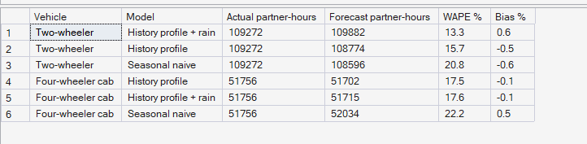
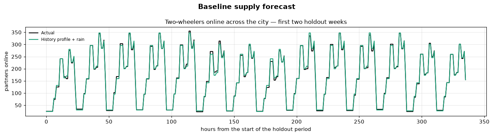

# Phase 9 — Demand & Supply Forecasting
## 03. Baseline Supply Forecast

**Code:** `src/pulse/forecasting/supply.py` · **SQL Script:** `sql/04_forecast_accuracy.sql` (Result Set B)

---

## 1. Business Question

How many partners of each vehicle type will be online in each home zone and
hour next week?

---

## 2. Objective

Forecast **baseline supply** — partners online by home zone, hour and vehicle,
before any dispatch or repositioning — and measure accuracy on the holdout
weeks.

---

## 3. Data Sources

- `sql/02_supply_history.sql` (built on `dw.Fact_Driver_Availability`, `dw.Dim_Driver`)
- `dw.Fact_Supply_Forecast` (written by the pipeline)

---

## 4. Analytical Grain

**Home zone × hour × vehicle type** over the 4 holdout weeks, and summed to
**city × hour**.

---

## 5. Techniques Used

- Seasonal naive benchmark
- History profiles by home zone, vehicle, hour and day type, with and without rain
- WAPE and bias at two levels of aggregation

---

# 6. Result — Model Comparison (Python)

<!-- AUTO:models -->
| Model | WAPE % (home zone x hour x vehicle) | Bias % | WAPE % (city x hour) | Skill vs seasonal naive % |
|---|---|---|---|---|
| Seasonal naive | 21.3 | -0.2 | 7.4 | 0.0 |
| History profile | 16.3 | -0.3 | 6.3 | 23.3 |
| History profile + rain | 14.7 | 0.4 | 2.4 | 30.9 |

_Generated 2026-10-03 by a report script — do not edit by hand._
<!-- /AUTO:models -->

---

# 7. Result Set B — Accuracy Computed in the Warehouse

<!-- AUTO:B -->
| Vehicle | Model | Actual partner-hours | Forecast partner-hours | WAPE % | Bias % |
|---|---|---|---|---|---|
| Two-wheeler | History profile + rain | 109,272 | 109,882 | 13.3 | 0.6 |
| Two-wheeler | History profile | 109,272 | 108,774 | 15.7 | -0.5 |
| Two-wheeler | Seasonal naive | 109,272 | 108,596 | 20.8 | -0.6 |
| Four-wheeler cab | History profile | 51,756 | 51,702 | 17.5 | -0.1 |
| Four-wheeler cab | History profile + rain | 51,756 | 51,715 | 17.6 | -0.1 |
| Four-wheeler cab | Seasonal naive | 51,756 | 52,034 | 22.2 | 0.5 |

_Generated 2026-10-03 by a report script — do not edit by hand._
<!-- /AUTO:B -->

### Screenshot

---

# 8. Chart

---

# 9. Key Observations

### 9.1 Supply is more predictable than demand
Partners follow fixed shifts, so baseline supply follows a stable weekly
pattern; its error is much lower than demand's.

### 9.2 Rain matters for supply too
Two-wheeler log-ins drop on rain days (Assumption S-04); the rain-aware profile
captures this and is the most accurate.

### 9.3 City totals are almost exact
Zone-level errors largely cancel out, so the city's total supply per hour is
forecast very accurately.

---

# 10. Business Interpretation

The supply side is the easier half of the forecast. The uncertainty PULSE
must manage comes mainly from demand.

---

# 11. Business Implication

Phase 10 starts each hour from the forecast baseline supply and decides how
many partners to move from where they start to where demand will be.

---

# 12. Reproducibility

Regenerated by `python scripts/report_phase9.py`; Result Set B is recomputed in SQL.

---

## Conclusion

<!-- AUTO:headline -->
- Best model: **History profile + rain**, WAPE **14.7%** per home zone, hour and vehicle (skill **30.9%** over seasonal naive).
- Summed over the city it is accurate to **2.4%** per hour.

_Generated 2026-10-03 by a report script — do not edit by hand._
<!-- /AUTO:headline -->
