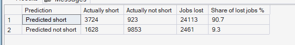
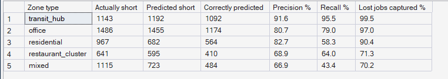

# Phase 9 — Demand & Supply Forecasting
## 04. Pressure Forecast — Seeing Shortages a Week Ahead

**Code:** `src/pulse/forecasting/pressure.py` · **SQL Script:** `sql/05_pressure_forecast.sql`

---

## 1. Business Question

Can PULSE tell, a week in advance, which zone-hours will be under-supplied —
early enough to move supply before demand arrives?

---

## 2. Objective

Predict under-supplied zone-hours for the holdout weeks from the demand
forecast and expected partner presence, and measure how many real shortages
— and how many lost jobs — the prediction catches.

---

## 3. Data Sources

- `dw.Fact_Pressure_Forecast` (predicted vs actual, with lost jobs)
- `dw.Agg_Pressure_ZoneHour` (Phase 8 actual pressure states)
- `dw.Dim_Zone`

---

## 4. Analytical Grain

**Zone × hour** over the 4 holdout weeks.

---

## 5. Techniques Used

- Forecast MPI = forecast work hours ÷ expected partners present (history profile)
- Classification at the Phase 8 threshold (MPI > 1.10)
- Confusion matrix, precision, recall and lost-jobs capture rate
- Calendar-only demand model (no weather assumed)

---

# 6. Result Set A — Predicted vs Actual Shortages

<!-- AUTO:A -->
| Prediction | Actually short | Actually not short | Jobs lost | Share of lost jobs % |
|---|---|---|---|---|
| Predicted short | 3,724 | 923 | 24,113 | 90.7 |
| Predicted not short | 1,628 | 9,853 | 2,461 | 9.3 |

_Generated 2026-10-03 by a report script — do not edit by hand._
<!-- /AUTO:A -->

### Screenshot

---

# 7. Result Set B — Prediction Quality by Zone Type

<!-- AUTO:B -->
| Zone type | Actually short | Predicted short | Correctly predicted | Precision % | Recall % | Lost jobs captured % |
|---|---|---|---|---|---|---|
| transit_hub | 1,143 | 1,192 | 1,092 | 91.6 | 95.5 | 99.5 |
| office | 1,486 | 1,455 | 1,174 | 80.7 | 79.0 | 97.0 |
| residential | 967 | 682 | 564 | 82.7 | 58.3 | 90.4 |
| restaurant_cluster | 641 | 595 | 410 | 68.9 | 64.0 | 71.3 |
| mixed | 1,115 | 723 | 484 | 66.9 | 43.4 | 70.2 |

_Generated 2026-10-03 by a report script — do not edit by hand._
<!-- /AUTO:B -->

### Screenshot

---

# 8. Key Observations

### 8.1 The forecast finds the costly shortages
A minority of zone-hours is flagged a week ahead, yet those zone-hours contain
the large majority of jobs that are later lost (Result Set A).

### 8.2 Most flags are real
Most zone-hours flagged as short really are short, so acting on the flags
rarely wastes moves.

### 8.3 Missed shortages are mostly mild
Short zone-hours the forecast misses carry few lost jobs: they sit near the
1.10 threshold, where small random swings decide the label.

### 8.4 Chronic pressure points are easiest to predict
Transit hubs and office zones, short in the same hours every week, are
predicted most reliably. Mixed zones and restaurant clusters, short only
occasionally, are the hardest (Result Set B).

---

# 9. Business Interpretation

Shortages in PULSE are **predictable**, not random. That turns the problem
from reacting to failures into planning ahead — the condition Phase 10 needs.

---

# 10. Business Implication

`dw.Fact_Pressure_Forecast` gives Phase 10 its targets: the zone-hours where
moving supply ahead of time is expected to recover lost demand.

---

# 11. Reproducibility

Regenerated by `python scripts/report_phase9.py`; both result sets are
computed in SQL from the stored forecasts.

---

## Conclusion

<!-- AUTO:headline -->
- A week ahead, the forecast flags **28.8%** of zone-hours as short; those zone-hours contain **90.7%** of all jobs later lost to no partner.
- Precision **80.1%** (flagged zone-hours that really were short) and recall **69.6%** (short zone-hours that were flagged).

_Generated 2026-10-03 by a report script — do not edit by hand._
<!-- /AUTO:headline -->
