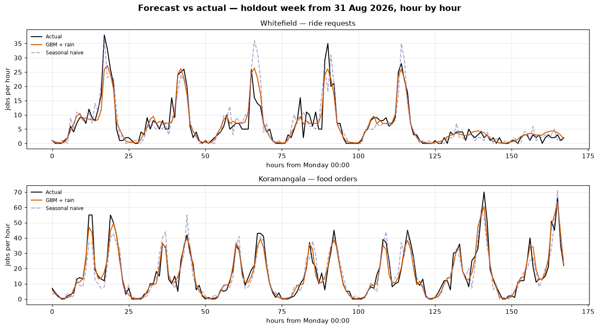

# Phase 9 — Demand & Supply Forecasting

**Question answered:** *What will demand and supply look like next week —
and where will the marketplace be short?*



## How it is built

| Layer | File | Purpose |
|-------|------|---------|
| History extracts | `sql/01_…`, `sql/02_…`, `sql/03_…` | Demand, baseline supply and pressure history from `PULSE_DW` |
| Models | `src/pulse/forecasting/` | Benchmarks, gradient boosting, supply profiles, pressure prediction |
| Forecast tables | `sql/00_create_forecast_tables.sql` | `dw.Fact_Demand_Forecast`, `dw.Fact_Supply_Forecast`, `dw.Fact_Pressure_Forecast` |
| Accuracy in SQL | `sql/04_…`, `sql/05_…` | WAPE, bias, precision and recall computed in the warehouse |
| Findings | `01_…md` to `04_…md` | Structured write-ups; tables, headlines and charts generated |

```bash
python scripts/report_phase9.py    # fit, forecast, store, and regenerate all four documents
```

## Analyses

| # | Document | Business question |
|---|----------|-------------------|
| 01 | `01_Forecasting_Approach.md` | What is forecast, from what, and how is it validated? |
| 02 | `02_Demand_Forecast_Accuracy.md` | How accurately can demand be forecast a week ahead? |
| 03 | `03_Supply_Forecast.md` | How accurately can baseline supply be forecast? |
| 04 | `04_Pressure_Forecast.md` | Can shortages be seen coming a week ahead? |
