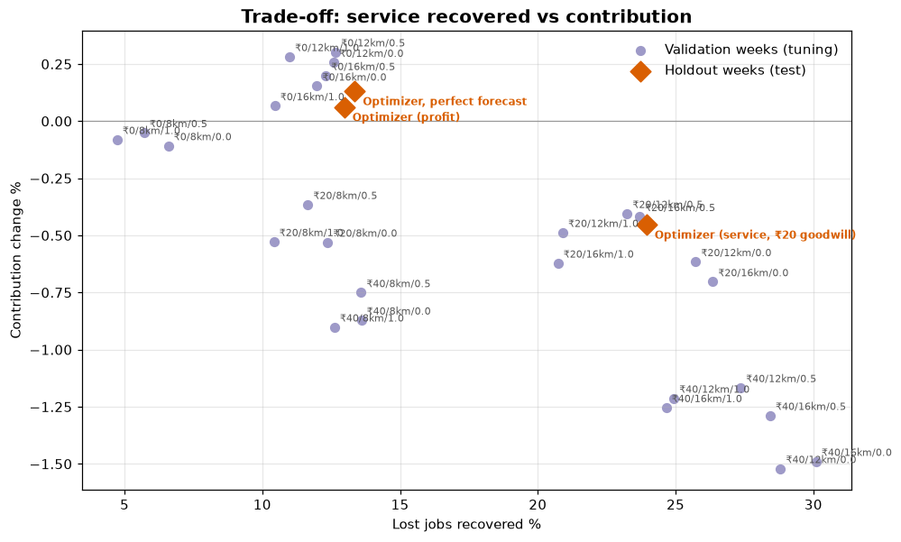

# Phase 10 — Supply Allocation & Repositioning Optimization
## 01. City Optimizer Design and Fair Testing

**Code:** `src/pulse/optimization/` · **Settings:** `config/bengaluru/policy.yaml` · **Economics SQL:** `sql/05_economics_inputs.sql`

---

## 1. Business Question

How should PULSE decide, every hour, which idle partners to move to which
zones — and how can the decision be tested fairly against today's dispatch?

---

## 2. The Decision, Every Hour

At the start of each hour the policy:

1. counts partners by zone and vehicle type — idle partners fully, busy ones
   in proportion to the part of the hour they will be free;
2. reads expected demand for the next ~90 minutes from the **Phase 9
   week-ahead forecast** (half this hour, half the next);
3. solves the **allocation LP** validated in Stages 1–4;
4. turns the LP's cross-zone flows into whole moves of idle partners.

Moved partners are unavailable while they drive and are paid for the empty
kilometres (Assumption O-09).

---

## 3. The LP — and the Change That Made It Realistic

The Stages 1–4 model decides how many partners of each type to move between
zones and which service they cover, maximising contribution minus
repositioning cost minus a penalty for unserved demand.

On Bengaluru, that model **lost money**: it assumed demand in a zone could be
served only by partners in that zone or partners moved there, so it paid to
move partners into zones that dispatch was already covering from next door.

The fix (Assumption O-08) adds **serve-from-neighbour** arcs: a partner can
cover a nearby zone *without moving* — rides within the 20-minute reach at the
hour's speed, food within the 8 km pickup limit — at reduced productivity
because of the pickup drive. Paid moves are then chosen only when a whole
neighbourhood is short: exactly the "reposition ahead" shortage of Phase 8.
Without the new instance keys, the model is unchanged, and all Stage 1–4
tests still pass.

---

## 4. Economics from the Warehouse (resolves X-02)

The toy model used ₹60 per ride and ₹40 per order. Phase 10 uses the
platform revenue per completed job actually earned in the **history weeks**:

<!-- AUTO:economics -->
| Service | Completed jobs (history) | Platform revenue (INR) | Contribution per job (INR) |
|---|---|---|---|
| Mobility | 257,782 | ₹6,996,671 | ₹27.14 |
| Food Delivery | 438,031 | ₹21,399,522 | ₹48.85 |

_Generated 2026-10-04 by a report script — do not edit by hand._
<!-- /AUTO:economics -->

---

## 5. Policy Settings

<!-- AUTO:settings -->
| Setting | Value |
|---|---|
| Jobs per partner-hour (rides / food) | 2 / 3 |
| Repositioning cost per km (two-wheeler / cab) | ₹6 / ₹12 |
| Remote-service efficiency (rides / food) | 0.6 / 0.8 |
| Look-ahead weight on next hour | 0.5 |
| Maximum move | 12 km |
| Scenarios (penalty per lost job) | optimizer_profit: ₹0; optimizer_service: ₹20; optimizer_perfect_forecast: ₹0 |

_Generated 2026-10-04 by a report script — do not edit by hand._
<!-- /AUTO:settings -->

The **unserved penalty** is a business judgement (Assumption E-05): ₹0 means
"maximise today's contribution only"; ₹20 values a served customer's future
business. Both are reported.

---

## 6. Fair Testing (resolves X-01)

| Rule | How it is enforced |
|------|--------------------|
| **Same simulator** for every policy | All scenarios run through `simulation.py`, which reuses the Stage 5b dispatch rules |
| **Same customers and orders** | Every request's random attributes (arrival minute, destination, restaurant, prep time, cancellation draw, order value) are drawn once and shared — *common random numbers* |
| **No tuning on the test** | Settings were chosen on validation weeks 9–12 with forecasts built from weeks 1–8; the holdout weeks 13–16 were simulated once |
| **Status quo reproduced** | Replaying the holdout with no policy reproduces the historical completion rates |
| **Uncertainty reported** | Contribution uplift is given per day with a 95% range (X-03) |

---

## 7. Validation Results (weeks 9–12, never the holdout)

<!-- AUTO:tuning -->
| Penalty (INR) | Max move km | Look-ahead | Contribution change % | Lost jobs change % | Moves per day |
|---|---|---|---|---|---|
| 0 | 8 | 0.0 | -0.11 | -6.6 | 58 |
| 0 | 8 | 0.5 | -0.05 | -5.7 | 47 |
| 0 | 8 | 1.0 | -0.08 | -4.7 | 44 |
| 0 | 12 | 0.0 | +0.26 | -12.6 | 89 |
| 0 | 12 | 0.5 | +0.30 | -12.7 | 80 |
| 0 | 12 | 1.0 | +0.28 | -11.0 | 72 |
| 0 | 16 | 0.0 | +0.15 | -12.0 | 88 |
| 0 | 16 | 0.5 | +0.20 | -12.3 | 79 |
| 0 | 16 | 1.0 | +0.07 | -10.5 | 72 |
| 20 | 8 | 0.0 | -0.53 | -12.4 | 131 |
| 20 | 8 | 0.5 | -0.36 | -11.7 | 113 |
| 20 | 8 | 1.0 | -0.53 | -10.4 | 125 |
| 20 | 12 | 0.0 | -0.62 | -25.7 | 205 |
| 20 | 12 | 0.5 | -0.40 | -23.2 | 178 |
| 20 | 12 | 1.0 | -0.49 | -20.9 | 178 |
| 20 | 16 | 0.0 | -0.70 | -26.3 | 204 |
| 20 | 16 | 0.5 | -0.42 | -23.7 | 175 |
| 20 | 16 | 1.0 | -0.62 | -20.7 | 175 |
| 40 | 8 | 0.0 | -0.87 | -13.6 | 178 |
| 40 | 8 | 0.5 | -0.75 | -13.6 | 164 |
| 40 | 8 | 1.0 | -0.90 | -12.6 | 187 |
| 40 | 12 | 0.0 | -1.52 | -28.8 | 266 |
| 40 | 12 | 0.5 | -1.17 | -27.4 | 244 |
| 40 | 12 | 1.0 | -1.21 | -24.9 | 253 |
| 40 | 16 | 0.0 | -1.49 | -30.1 | 261 |
| 40 | 16 | 0.5 | -1.29 | -28.4 | 242 |
| 40 | 16 | 1.0 | -1.25 | -24.7 | 247 |

_Generated 2026-10-04 by a report script — do not edit by hand._
<!-- /AUTO:tuning -->

Higher penalties move more partners and recover more demand at a higher cost;
the 12 km move limit beats 8 km (which cannot reach isolated zones) and 16 km
(which adds cost without benefit); the look-ahead weight matters little.

---

## 8. Scope Control

Phase 10 decides **where existing partners should be**. It does not bring
extra partners online (Phase 11) and does not change prices. In the
simulation, jobs inside a zone are still dispatched to the nearest partner, so
the policy acts through positioning only.
