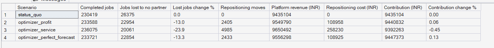
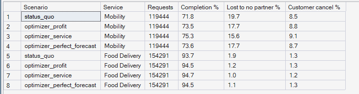

# Phase 10 — Supply Allocation & Repositioning Optimization
## 02. Policy Comparison — Status Quo vs Optimized Repositioning

**SQL Script:** `sql/01_policy_comparison.sql` · **Pipeline:** `scripts/report_phase10.py`

---

## 1. Business Question

Does optimized repositioning beat today's dispatch — in demand served and in
money — and by how much?

---

## 2. Objective

Replay the four holdout weeks under four scenarios with identical customers
and orders, and compare demand served, repositioning cost and contribution.

| Scenario | What it does |
|----------|--------------|
| Status quo | Nearest-partner dispatch, no repositioning (today) |
| Optimizer (profit) | Moves partners only when it pays in today's contribution |
| Optimizer (service) | Also values each served customer at ₹20 of future business |
| Optimizer, perfect forecast | The profit policy given the true demand — an upper bound on forecasting's value |

---

## 3. Data Sources

- `dw.Agg_Policy_ZoneHour`, `dw.Fact_Repositioning` (written by the pipeline)
- Phase 9 forecasts (`dw.Fact_Demand_Forecast`), Phase 5 economics

---

## 4. Analytical Grain

Scenario over the 28 holdout days; daily paired differences for the ranges.

---

## 5. Techniques Used

- Linear programming (OR-Tools GLOP) inside an hourly rolling policy
- Discrete-event replay with common random numbers
- Paired daily differences with a 95% t-interval

---

# 6. Result — Scenario Comparison (Python)

<!-- AUTO:python -->
| Scenario | Contribution (INR) | Change vs status quo % | Jobs lost to no partner | Lost jobs change % | Ride completion % | Food delivered % | Moves per day | Repositioning cost (INR) |
|---|---|---|---|---|---|---|---|---|
| Status quo | ₹9,435,104 | +0.00 | 26,375 | +0.00 | 71.8 | 93.7 | 0 | ₹0 |
| Optimizer (profit) | ₹9,440,831 | +0.06 | 22,954 | -12.97 | 73.5 | 94.5 | 86 | ₹108,958 |
| Optimizer (service, ₹20 goodwill) | ₹9,392,262 | -0.45 | 20,061 | -23.94 | 75.3 | 94.7 | 178 | ₹258,230 |
| Optimizer, perfect forecast | ₹9,447,373 | +0.13 | 22,854 | -13.35 | 73.6 | 94.5 | 87 | ₹108,925 |

_Generated 2026-10-04 by a report script — do not edit by hand._
<!-- /AUTO:python -->

# 7. Result — Daily Contribution Uplift with 95% Ranges

<!-- AUTO:ranges -->
| Scenario | Contribution uplift per day (INR) | 95% range low (INR) | 95% range high (INR) | Days better than status quo | Extra completed jobs per day |
|---|---|---|---|---|---|
| Optimizer (profit) | ₹205 | −₹366 | ₹775 | 18 of 28 | 113 |
| Optimizer (service, ₹20 goodwill) | −₹1,530 | −₹2,240 | −₹820 | 5 of 28 | 202 |
| Optimizer, perfect forecast | ₹438 | −₹140 | ₹1,016 | 20 of 28 | 118 |

_Generated 2026-10-04 by a report script — do not edit by hand._
<!-- /AUTO:ranges -->

---

# 8. Result Set A — Outcome by Scenario (SQL)

<!-- AUTO:A -->
| Scenario | Completed jobs | Jobs lost to no partner | Lost jobs change % | Repositioning moves | Platform revenue (INR) | Repositioning cost (INR) | Contribution (INR) | Contribution change % |
|---|---|---|---|---|---|---|---|---|
| status_quo | 230,419 | 26,375 | +0.00 | 0 | ₹9,435,104 | ₹0 | ₹9,435,104 | +0.00 |
| optimizer_profit | 233,588 | 22,954 | -13.00 | 2,405 | ₹9,549,790 | ₹108,958 | ₹9,440,832 | +0.06 |
| optimizer_service | 236,075 | 20,061 | -23.90 | 4,985 | ₹9,650,492 | ₹258,230 | ₹9,392,263 | -0.45 |
| optimizer_perfect_forecast | 233,721 | 22,854 | -13.30 | 2,433 | ₹9,556,298 | ₹108,925 | ₹9,447,373 | +0.13 |

_Generated 2026-10-04 by a report script — do not edit by hand._
<!-- /AUTO:A -->

### Screenshot

---

# 9. Result Set B — Completion by Scenario and Service (SQL)

<!-- AUTO:B -->
| Scenario | Service | Requests | Completion % | Lost to no partner % | Customer cancel % |
|---|---|---|---|---|---|
| status_quo | Mobility | 119,444 | 71.8 | 19.7 | 8.5 |
| optimizer_profit | Mobility | 119,444 | 73.5 | 17.7 | 8.8 |
| optimizer_service | Mobility | 119,444 | 75.3 | 15.6 | 9.1 |
| optimizer_perfect_forecast | Mobility | 119,444 | 73.6 | 17.7 | 8.7 |
| status_quo | Food Delivery | 154,291 | 93.7 | 1.9 | 1.3 |
| optimizer_profit | Food Delivery | 154,291 | 94.5 | 1.2 | 1.3 |
| optimizer_service | Food Delivery | 154,291 | 94.7 | 1.0 | 1.2 |
| optimizer_perfect_forecast | Food Delivery | 154,291 | 94.5 | 1.1 | 1.3 |

_Generated 2026-10-04 by a report script — do not edit by hand._
<!-- /AUTO:B -->

### Screenshot

---

# 10. Key Observations

### 10.1 Repositioning recovers a meaningful share of lost demand
The profit policy cuts jobs lost to no partner by double digits; the service
policy by more, lifting ride completion several points.

### 10.2 It is roughly contribution-neutral
At Bengaluru economics — about ₹27 per ride and ₹6 per kilometre to move a
partner — the extra revenue from recovered jobs roughly pays for the moves.
The profit policy's daily uplift is statistically indistinguishable from zero.

### 10.3 The toy model's +9% did not survive realistic conditions
Stage 3's toy assumed ₹60 per ride and no cross-zone dispatch. With real
economics and dispatch reach, moving partners barely pays for itself. This is
why the plan required a city-scale test before any claim.

### 10.4 Better forecasts would not change the answer
With a perfect forecast the profit policy recovers almost the same demand: the
Phase 9 forecast is not the limiting factor.

---

# 11. Business Interpretation

Repositioning is a **service lever, not a profit lever**, at these economics:
PULSE can serve noticeably more customers at roughly no net cost, and can buy
more service at a price that is explicit (see the Conclusion).

---

# 12. Business Implication

- Adopt the profit policy: more customers served, no loss of contribution.
- Adopt the service policy if a failed job costs the business more than the
  break-even value in the Conclusion (lost repeat business, brand).
- The demand still lost — the airport and citywide shortages — needs more
  partners online, not better positioning: **Phase 11**.

---

# 13. Reproducibility

`python scripts/report_phase10.py` replays all scenarios with fixed seeds,
rewrites the tables and regenerates this document; Result Sets A and B are
recomputed in SQL from the stored results.

---

## Conclusion

<!-- AUTO:headline -->
- The **profit policy** cuts jobs lost to no partner by **13.0%** (113 more completed jobs per day) and changes contribution by **+0.06%** — ₹205 per day, 95% range −₹366 to ₹775.
- The **service policy** cuts lost jobs by **23.9%** at a contribution change of **-0.45%**.
- Choosing service over profit buys about **89** more completed jobs per day for about **₹1,735** per day: worth it if a failed job costs more than about **₹20** in future business.
- With a **perfect** forecast the profit policy would cut lost jobs by 13.3% (vs 13.0%): forecast accuracy is not the limiting factor.

_Generated 2026-10-04 by a report script — do not edit by hand._
<!-- /AUTO:headline -->
