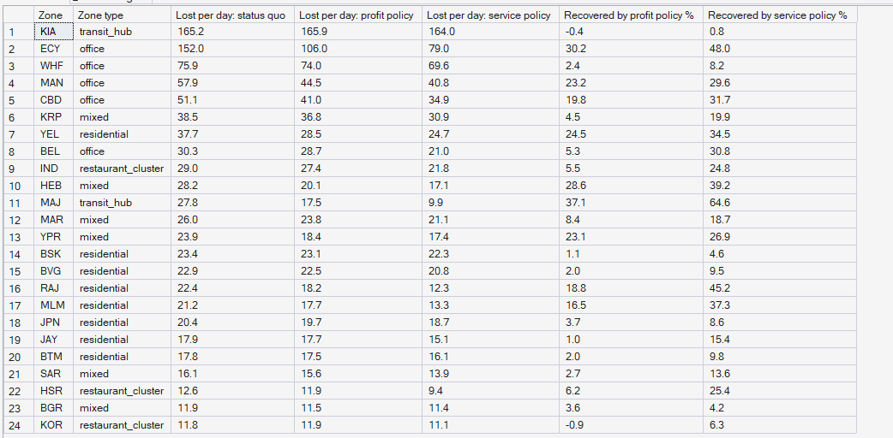
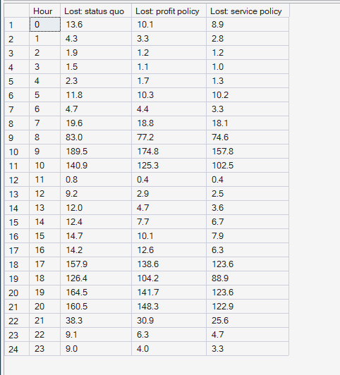

# Phase 10 — Supply Allocation & Repositioning Optimization
## 03. Where the Gains Come From

**SQL Script:** `sql/02_where_gains_come_from.sql`

---

## 1. Business Question

Which zones and hours does repositioning rescue — and which can it not reach?

---

## 2. Objective

Compare lost jobs per day under the status quo and both policies, by zone and
by weekday hour.

---

## 3. Data Sources

- `dw.Agg_Policy_ZoneHour`, `dw.Dim_Zone`, `dw.Dim_Time`

---

## 4. Analytical Grain

**Zone** over the 28 holdout days (Result Set A) and **weekday hour** (Result Set B).

---

## 5. Techniques Used

- Conditional aggregation across scenarios
- Recovery rate = (status-quo losses − policy losses) ÷ status-quo losses

---

# 6. Result Set A — Lost Jobs per Day by Zone

<!-- AUTO:A -->
| Zone | Zone type | Lost per day: status quo | Lost per day: profit policy | Lost per day: service policy | Recovered by profit policy % | Recovered by service policy % |
|---|---|---|---|---|---|---|
| KIA | transit_hub | 165.2 | 165.9 | 164.0 | -0.4 | 0.8 |
| ECY | office | 152.0 | 106.0 | 79.0 | 30.2 | 48.0 |
| WHF | office | 75.9 | 74.0 | 69.6 | 2.4 | 8.2 |
| MAN | office | 57.9 | 44.5 | 40.8 | 23.2 | 29.6 |
| CBD | office | 51.1 | 41.0 | 34.9 | 19.8 | 31.7 |
| KRP | mixed | 38.5 | 36.8 | 30.9 | 4.5 | 19.9 |
| YEL | residential | 37.7 | 28.5 | 24.7 | 24.5 | 34.5 |
| BEL | office | 30.3 | 28.7 | 21.0 | 5.3 | 30.8 |
| IND | restaurant_cluster | 29.0 | 27.4 | 21.8 | 5.5 | 24.8 |
| HEB | mixed | 28.2 | 20.1 | 17.1 | 28.6 | 39.2 |
| MAJ | transit_hub | 27.8 | 17.5 | 9.9 | 37.1 | 64.6 |
| MAR | mixed | 26.0 | 23.8 | 21.1 | 8.4 | 18.7 |
| YPR | mixed | 23.9 | 18.4 | 17.4 | 23.1 | 26.9 |
| BSK | residential | 23.4 | 23.1 | 22.3 | 1.1 | 4.6 |
| BVG | residential | 22.9 | 22.5 | 20.8 | 2.0 | 9.5 |
| RAJ | residential | 22.4 | 18.2 | 12.3 | 18.8 | 45.2 |
| MLM | residential | 21.2 | 17.7 | 13.3 | 16.5 | 37.3 |
| JPN | residential | 20.4 | 19.7 | 18.7 | 3.7 | 8.6 |
| JAY | residential | 17.9 | 17.7 | 15.1 | 1.0 | 15.4 |
| BTM | residential | 17.8 | 17.5 | 16.1 | 2.0 | 9.8 |
| SAR | mixed | 16.1 | 15.6 | 13.9 | 2.7 | 13.6 |
| HSR | restaurant_cluster | 12.6 | 11.9 | 9.4 | 6.2 | 25.4 |
| BGR | mixed | 11.9 | 11.5 | 11.4 | 3.6 | 4.2 |
| KOR | restaurant_cluster | 11.8 | 11.9 | 11.1 | -0.9 | 6.3 |

_Generated 2026-10-04 by a report script — do not edit by hand._
<!-- /AUTO:A -->

### Screenshot

---

# 7. Result Set B — Lost Jobs per Weekday by Hour

<!-- AUTO:B -->
| Hour | Lost: status quo | Lost: profit policy | Lost: service policy |
|---|---|---|---|
| 0 | 13.60 | 10.10 | 8.90 |
| 1 | 4.30 | 3.30 | 2.80 |
| 2 | 1.90 | 1.20 | 1.20 |
| 3 | 1.50 | 1.10 | 1.00 |
| 4 | 2.30 | 1.70 | 1.30 |
| 5 | 11.80 | 10.30 | 10.20 |
| 6 | 4.70 | 4.40 | 3.30 |
| 7 | 19.60 | 18.80 | 18.10 |
| 8 | 83.00 | 77.20 | 74.60 |
| 9 | 189.50 | 174.80 | 157.80 |
| 10 | 140.90 | 125.30 | 102.50 |
| 11 | 0.80 | 0.40 | 0.40 |
| 12 | 9.20 | 2.90 | 2.50 |
| 13 | 12.00 | 4.70 | 3.60 |
| 14 | 12.40 | 7.70 | 6.70 |
| 15 | 14.70 | 10.10 | 7.90 |
| 16 | 14.20 | 12.60 | 6.30 |
| 17 | 157.90 | 138.60 | 123.60 |
| 18 | 126.40 | 104.20 | 88.90 |
| 19 | 164.50 | 141.70 | 123.60 |
| 20 | 160.50 | 148.30 | 122.90 |
| 21 | 38.30 | 30.90 | 25.60 |
| 22 | 9.10 | 6.30 | 4.70 |
| 23 | 9.00 | 4.00 | 3.30 |

_Generated 2026-10-04 by a report script — do not edit by hand._
<!-- /AUTO:B -->

### Screenshot

---

# 8. Key Observations

### 8.1 Electronic City is the big win
The zone Phase 6 found "cut off at the evening peak" recovers a large share of
its losses: partners are moved in from Sarjapur Road and Bannerghatta Road before
the peak.

### 8.2 The airport cannot be helped by repositioning
Kempegowda Airport is beyond the 12 km move limit from every zone, so its
losses are unchanged. Only extra partners stationed there can help (Phase 11).

### 8.3 Whitefield barely improves
Whitefield's shortage is a neighbourhood-wide one with little spare supply
nearby; repositioning recovers only a small share.

### 8.4 Gains concentrate in the commute peaks
Most recovered jobs fall in the morning (08:00–10:00) and evening
(17:00–20:00) peaks, where Phase 8 located the "reposition ahead" shortages.

---

# 9. Business Interpretation

Repositioning works where spare partners exist within reach: Electronic City,
Majestic, Manyata, the CBD. It cannot help zones that are isolated (the airport)
or short across their whole neighbourhood (Whitefield).

---

# 10. Business Implication

The remaining losses are concentrated and named: the airport and Whitefield are
the first targets for Phase 11 incentives.

---

# 11. Reproducibility

Regenerated by `python scripts/report_phase10.py`.

---

## Conclusion

<!-- AUTO:headline -->
- The zone losing the most jobs, **KIA**, goes from **165.2** to **165.9** lost per day under the profit policy (**-0.4%** recovered).
- Among zones losing at least 5 jobs a day, **MAJ** gains most (**37.1%** recovered).

_Generated 2026-10-04 by a report script — do not edit by hand._
<!-- /AUTO:headline -->
