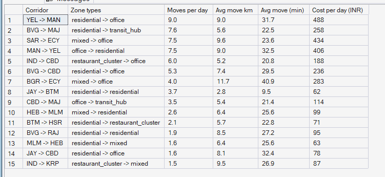
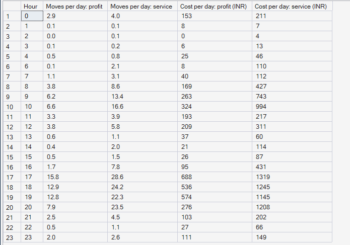
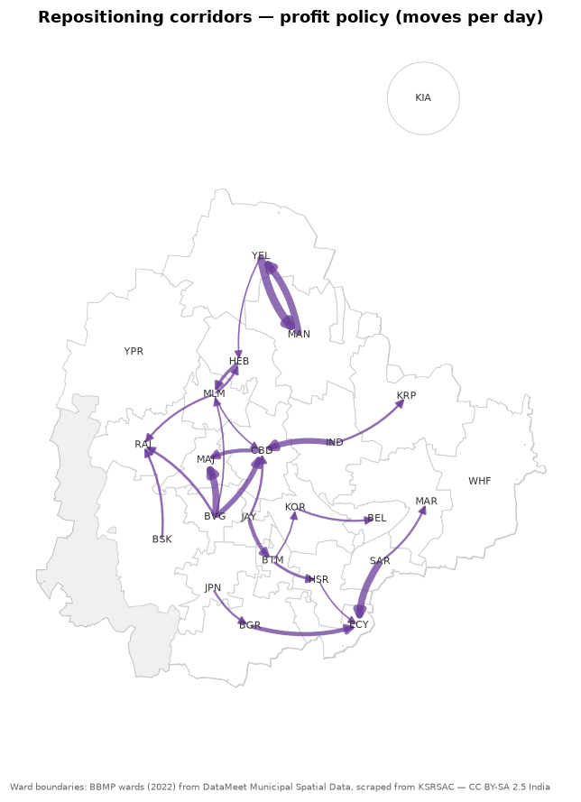

# Phase 10 — Supply Allocation & Repositioning Optimization
## 04. Repositioning Activity

**SQL Script:** `sql/03_repositioning_activity.sql`

---

## 1. Business Question

Which partners does the optimizer move, from where to where, when — and at
what cost?

---

## 2. Objective

Describe the moves of both policies: busiest corridors, distances, timing and
daily cost.

---

## 3. Data Sources

- `dw.Fact_Repositioning` (every simulated move), `dw.Dim_Zone`, `dw.Dim_Time`

---

## 4. Analytical Grain

**Corridor** (origin → destination zone, Result Set A) and **hour of day** (Result Set B).

---

## 5. Techniques Used

- Corridor aggregation with string concatenation
- Daily averages over the 28 holdout days
- Flow map of the busiest corridors

---

# 6. Result Set A — The 15 Busiest Corridors (Profit Policy)

<!-- AUTO:A -->
| Corridor | Zone types | Moves per day | Avg move km | Avg move (min) | Cost per day (INR) |
|---|---|---|---|---|---|
| YEL -> MAN | residential -> office | 9.0 | 9.0 | 31.7 | ₹488 |
| BVG -> MAJ | residential -> transit_hub | 7.6 | 5.6 | 22.5 | ₹258 |
| SAR -> ECY | mixed -> office | 7.5 | 9.6 | 23.6 | ₹434 |
| MAN -> YEL | office -> residential | 7.5 | 9.0 | 32.5 | ₹406 |
| IND -> CBD | restaurant_cluster -> office | 6.0 | 5.2 | 20.8 | ₹188 |
| BVG -> CBD | residential -> office | 5.3 | 7.4 | 29.5 | ₹236 |
| BGR -> ECY | mixed -> office | 4.0 | 11.7 | 40.9 | ₹283 |
| JAY -> BTM | residential -> residential | 3.7 | 2.8 | 9.5 | ₹62 |
| CBD -> MAJ | office -> transit_hub | 3.5 | 5.4 | 21.4 | ₹114 |
| HEB -> MLM | mixed -> residential | 2.6 | 6.4 | 25.6 | ₹99 |
| BTM -> HSR | residential -> restaurant_cluster | 2.1 | 5.7 | 22.8 | ₹71 |
| BVG -> RAJ | residential -> residential | 1.9 | 8.5 | 27.2 | ₹95 |
| MLM -> HEB | residential -> mixed | 1.6 | 6.4 | 25.6 | ₹63 |
| JAY -> CBD | residential -> office | 1.6 | 8.1 | 32.4 | ₹78 |
| IND -> KRP | restaurant_cluster -> mixed | 1.5 | 9.5 | 26.9 | ₹87 |

_Generated 2026-10-04 by a report script — do not edit by hand._
<!-- /AUTO:A -->

### Screenshot

---

# 7. Result Set B — Moves by Hour

<!-- AUTO:B -->
| Hour | Moves per day: profit | Moves per day: service | Cost per day: profit (INR) | Cost per day: service (INR) |
|---|---|---|---|---|
| 0 | 2.9 | 4.0 | ₹153 | ₹211 |
| 1 | 0.1 | 0.1 | ₹8 | ₹7 |
| 2 | 0.0 | 0.1 | ₹0 | ₹4 |
| 3 | 0.1 | 0.2 | ₹6 | ₹13 |
| 4 | 0.5 | 0.8 | ₹25 | ₹46 |
| 6 | 0.1 | 2.1 | ₹8 | ₹110 |
| 7 | 1.1 | 3.1 | ₹40 | ₹112 |
| 8 | 3.8 | 8.6 | ₹169 | ₹427 |
| 9 | 6.2 | 13.4 | ₹263 | ₹743 |
| 10 | 6.6 | 16.6 | ₹324 | ₹994 |
| 11 | 3.3 | 3.9 | ₹193 | ₹217 |
| 12 | 3.8 | 5.8 | ₹209 | ₹311 |
| 13 | 0.6 | 1.1 | ₹37 | ₹60 |
| 14 | 0.4 | 2.0 | ₹21 | ₹114 |
| 15 | 0.5 | 1.5 | ₹26 | ₹87 |
| 16 | 1.7 | 7.8 | ₹95 | ₹431 |
| 17 | 15.8 | 28.6 | ₹688 | ₹1,319 |
| 18 | 12.9 | 24.2 | ₹536 | ₹1,245 |
| 19 | 12.8 | 22.3 | ₹574 | ₹1,145 |
| 20 | 7.9 | 23.5 | ₹276 | ₹1,208 |
| 21 | 2.5 | 4.5 | ₹103 | ₹202 |
| 22 | 0.5 | 1.1 | ₹27 | ₹66 |
| 23 | 2.0 | 2.6 | ₹111 | ₹149 |

_Generated 2026-10-04 by a report script — do not edit by hand._
<!-- /AUTO:B -->

### Screenshot

---

# 8. Flow Map

---

# 9. Key Observations

### 9.1 Moves are few and short
Under the profit policy a small fraction of online partners is moved each day,
typically 7–8 km and under half an hour of driving.

### 9.2 Moves run against the commute drift
In the morning, partners are sent back into residential zones and to transit
hubs, where commuters start their journeys. From midday into the evening they
are sent towards office zones, ahead of the evening exodus — counteracting the
drift found in Phase 7, which carries partners the other way.

### 9.3 Electronic City is fed from the south-east
Sarjapur Road and Bannerghatta Road send partners to Electronic City, the
zone with the largest recovery.

---

# 10. Business Interpretation

The optimizer behaves like an experienced operations manager: a few targeted
moves before each peak, not a constant reshuffle of the fleet.

---

# 11. Business Implication

The moves are concrete and small enough to run as **partner nudges** ("head to
Electronic City now, ₹40 bonus"). Each is stored in `dw.Fact_Repositioning` for
the Power BI operations page (Phase 12).

---

# 12. Reproducibility

Regenerated by `python scripts/report_phase10.py`.

---

## Conclusion

<!-- AUTO:headline -->
- The busiest corridor is **YEL -> MAN** (residential -> office): **9.0** moves per day, **9.0 km** on average.
- Moves peak at **17:00** with **15.8** per day under the profit policy.

_Generated 2026-10-04 by a report script — do not edit by hand._
<!-- /AUTO:headline -->
