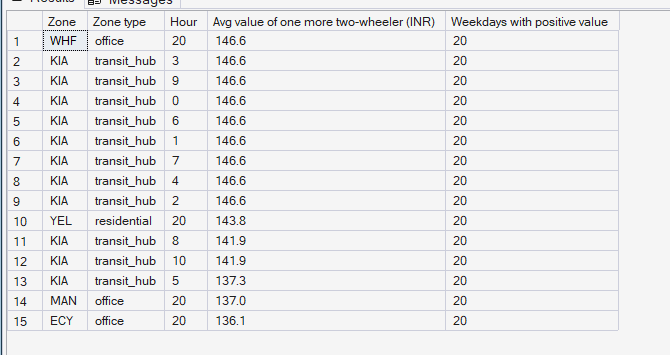
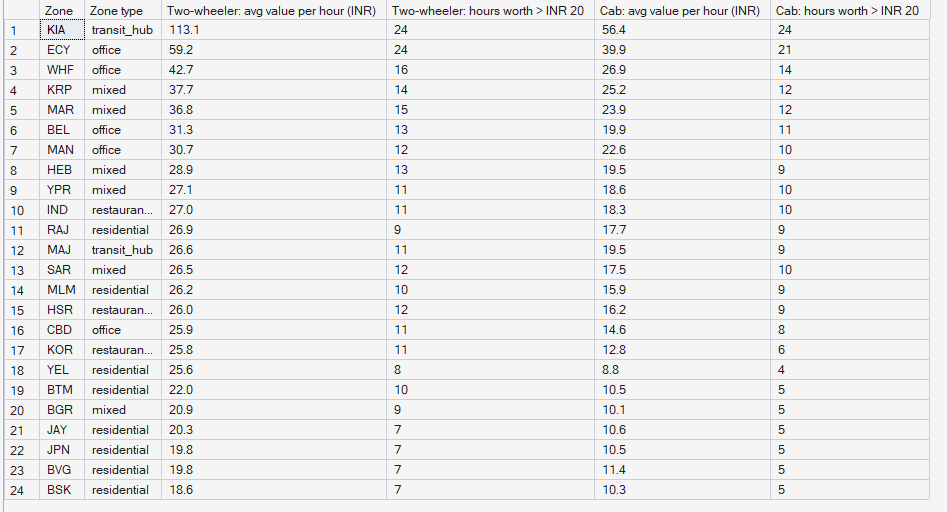

# Phase 10 — Supply Allocation & Repositioning Optimization
## 05. Marginal Value of Supply — Where Is One More Partner Worth Most?

**SQL Script:** `sql/04_marginal_value_of_supply.sql`

---

## 1. Business Question

After the best possible repositioning, where and when would **one more
partner** add the most value? That is where incentives should go (Phase 11).

---

## 2. Objective

Summarise the LP's supply shadow prices — the contribution one extra partner
of each type would add in each zone and hour — for the weekday holdout hours.

---

## 3. Data Sources

- `dw.Agg_Supply_Value` (shadow prices recorded by the profit policy every hour)
- `dw.Dim_Zone`, `dw.Dim_Time`

---

## 4. Analytical Grain

**Zone × weekday hour** for two-wheelers (Result Set A) and **zone** (Result Set B).

---

## 5. Techniques Used

- LP duality: the shadow price of each supply constraint (Stage 4 method,
  verified there against re-solving with ±1 partner)
- Averaging over weekdays, including hours where the value is zero

---

# 6. Result Set A — The 15 Most Valuable Weekday Zone-Hours for a Two-Wheeler

<!-- AUTO:A -->
| Zone | Zone type | Hour | Avg value of one more two-wheeler (INR) | Weekdays with positive value |
|---|---|---|---|---|
| WHF | office | 20 | ₹147 | 20 |
| KIA | transit_hub | 3 | ₹147 | 20 |
| KIA | transit_hub | 9 | ₹147 | 20 |
| KIA | transit_hub | 0 | ₹147 | 20 |
| KIA | transit_hub | 6 | ₹147 | 20 |
| KIA | transit_hub | 1 | ₹147 | 20 |
| KIA | transit_hub | 7 | ₹147 | 20 |
| KIA | transit_hub | 4 | ₹147 | 20 |
| KIA | transit_hub | 2 | ₹147 | 20 |
| YEL | residential | 20 | ₹144 | 20 |
| KIA | transit_hub | 8 | ₹142 | 20 |
| KIA | transit_hub | 10 | ₹142 | 20 |
| KIA | transit_hub | 5 | ₹137 | 20 |
| MAN | office | 20 | ₹137 | 20 |
| ECY | office | 20 | ₹136 | 20 |

_Generated 2026-10-04 by a report script — do not edit by hand._
<!-- /AUTO:A -->

### Screenshot

---

# 7. Result Set B — Value of Supply by Zone

<!-- AUTO:B -->
| Zone | Zone type | Two-wheeler: avg value per hour (INR) | Two-wheeler: hours worth > INR 20 | Cab: avg value per hour (INR) | Cab: hours worth > INR 20 |
|---|---|---|---|---|---|
| KIA | transit_hub | ₹113.10 | 24 | ₹56.40 | 24 |
| ECY | office | ₹59.20 | 24 | ₹39.90 | 21 |
| WHF | office | ₹42.70 | 16 | ₹26.90 | 14 |
| KRP | mixed | ₹37.70 | 14 | ₹25.20 | 12 |
| MAR | mixed | ₹36.80 | 15 | ₹23.90 | 12 |
| BEL | office | ₹31.30 | 13 | ₹19.90 | 11 |
| MAN | office | ₹30.70 | 12 | ₹22.60 | 10 |
| HEB | mixed | ₹28.90 | 13 | ₹19.50 | 9 |
| YPR | mixed | ₹27.10 | 11 | ₹18.60 | 10 |
| IND | restaurant_cluster | ₹27 | 11 | ₹18.30 | 10 |
| RAJ | residential | ₹26.90 | 9 | ₹17.70 | 9 |
| MAJ | transit_hub | ₹26.60 | 11 | ₹19.50 | 9 |
| SAR | mixed | ₹26.50 | 12 | ₹17.50 | 10 |
| MLM | residential | ₹26.20 | 10 | ₹15.90 | 9 |
| HSR | restaurant_cluster | ₹26 | 12 | ₹16.20 | 9 |
| CBD | office | ₹25.90 | 11 | ₹14.60 | 8 |
| KOR | restaurant_cluster | ₹25.80 | 11 | ₹12.80 | 6 |
| YEL | residential | ₹25.60 | 8 | ₹8.80 | 4 |
| BTM | residential | ₹22 | 10 | ₹10.50 | 5 |
| BGR | mixed | ₹20.90 | 9 | ₹10.10 | 5 |
| JAY | residential | ₹20.30 | 7 | ₹10.60 | 5 |
| JPN | residential | ₹19.80 | 7 | ₹10.50 | 5 |
| BVG | residential | ₹19.80 | 7 | ₹11.40 | 5 |
| BSK | residential | ₹18.60 | 7 | ₹10.30 | 5 |

_Generated 2026-10-04 by a report script — do not edit by hand._
<!-- /AUTO:B -->

### Screenshot

---

# 8. Key Observations

### 8.1 Value is concentrated
A few places — the airport, Electronic City, Whitefield and the other eastern
office belt zones at the commute peaks — carry most of the value of extra
supply; most zone-hours are worth
little, because the fleet already covers them.

### 8.2 Two-wheelers are worth more than cabs
A two-wheeler can serve rides or food, so it is valuable in more hours than a
rides-only cab.

### 8.3 These are upper bounds per partner
A shadow price is the value of the *first* extra partner; each further partner
in the same zone-hour is worth the same or less (Stage 4 showed degenerate
cases where adding is worth less than removing costs).

---

# 9. Business Interpretation

The shadow prices are a price list for supply: they say how much PULSE could
afford to pay to bring one more partner online, where and when.

---

# 10. Business Implication

Phase 11 uses this price list to test incentives: an incentive pays off only
where it costs less than the value of the extra partner-hours it creates.

---

# 11. Reproducibility

Regenerated by `python scripts/report_phase10.py`.

---

## Conclusion

<!-- AUTO:headline -->
- One more two-wheeler is worth most in **WHF at 20:00** on weekdays: **₹146.6** for that hour on average.
- **KIA** has the highest average value per two-wheeler-hour (**₹113.1**) — a first candidate for Phase 11 incentives.

_Generated 2026-10-04 by a report script — do not edit by hand._
<!-- /AUTO:headline -->
