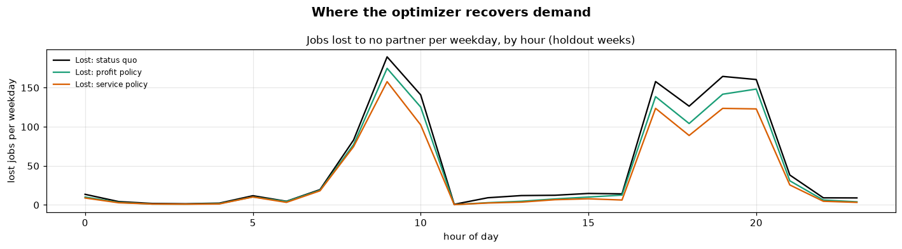

# Phase 10 — Supply Allocation & Repositioning Optimization

**Question answered:** *If PULSE moves idle partners ahead of demand, how much
lost demand does it recover — and does it pay?*



## Two layers of evidence

| Layer | Document | What it proves |
|-------|----------|----------------|
| Toy model (Stages 1–4) | `Validation_Results.md` | The LP is correct: hand calculation, stress tests, shadow prices |
| **Bengaluru (this phase)** | `01_…` to `05_…` | What the optimizer achieves in a realistic city, tested fairly |

## How it is built

| Layer | File |
|-------|------|
| LP model (with dispatch reach) | `src/pulse/optimization/model.py` |
| Hourly repositioning policy | `src/pulse/optimization/policy.py` |
| Fair replay simulator (common random numbers) | `src/pulse/optimization/simulation.py` |
| Scenarios and result tables | `src/pulse/optimization/city.py`, `config/bengaluru/policy.yaml` |
| Warehouse tables and analyses | `sql/00_…` to `sql/06_…` |

```bash
python scripts/tune_policy.py      # once: choose settings on validation weeks (~10 min)
python scripts/report_phase10.py   # holdout scenarios, tables, documents, charts (a few minutes)
```

## Documents

| # | Document | Business question |
|---|----------|-------------------|
| 01 | `01_City_Optimizer_Design.md` | How does the optimizer work on Bengaluru, and how was it tested fairly? |
| 02 | `02_Policy_Comparison.md` | Does optimized repositioning beat the status quo — in service and in money? |
| 03 | `03_Where_Gains_Come_From.md` | Which zones and hours recover demand, and which do not? |
| 04 | `04_Repositioning_Activity.md` | Which partners move, where, and at what cost? |
| 05 | `05_Marginal_Value_of_Supply.md` | Where is one more partner worth most? (input to Phase 11) |
