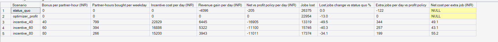
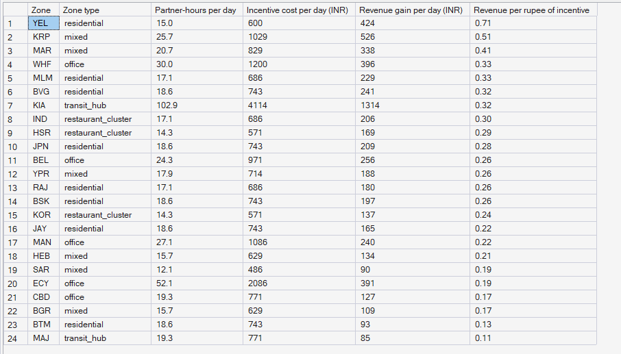

# Phase 11 — Incentive Economics + Scenario Simulation
## 02. Incentive Results — Do Incentives Pay?

**SQL Script:** `sql/01_incentive_programmes.sql`

---

## 1. Business Question

On top of the best repositioning policy, do incentive programmes earn back
their cost — and if not, what does each extra job they serve cost?

---

## 2. Objective

Compare the profit repositioning policy with and without each incentive
programme over the four holdout weeks, and place every lever on one
cost-per-extra-job ladder.

---

## 3. Data Sources

- `dw.Agg_Scenario_Summary`, `dw.Fact_Incentives`, `dw.Agg_Policy_ZoneHour`
- Phase 10 results for the repositioning rungs of the ladder

---

## 4. Analytical Grain

Programme over 28 holdout days (Result Set A); zone for the ₹40 programme (Result Set B).

---

## 5. Techniques Used

- Replay simulation with common random numbers
- Incremental analysis against the profit policy
- Return per rupee of incentive by zone

---

# 6. Result Set A — Programmes vs the Profit Policy

<!-- AUTO:A -->
| Scenario | Bonus per partner-hour (INR) | Partner-hours bought per weekday | Incentive cost per day (INR) | Revenue gain per day (INR) | Net vs profit policy per day (INR) | Jobs lost | Lost jobs change vs status quo % | Extra jobs per day vs profit policy | Net cost per extra job (INR) |
|---|---|---|---|---|---|---|---|---|---|
| status_quo | ₹0 | 0 | ₹0 | −₹4,096 | −₹205 | 26,375 | 0.0 | -122 |  |
| optimizer_profit | ₹0 | 0 | ₹0 | ₹0 | ₹0 | 22,954 | -13.0 | 0 |  |
| incentive_40 | ₹40 | 799 | ₹22,829 | ₹6,445 | −₹16,905 | 13,319 | -49.5 | 344 | ₹49.10 |
| incentive_60 | ₹60 | 394 | ₹16,886 | ₹5,322 | −₹11,100 | 15,746 | -40.3 | 257 | ₹43.10 |
| incentive_80 | ₹80 | 266 | ₹15,200 | ₹3,943 | −₹11,011 | 17,374 | -34.1 | 199 | ₹55.20 |

_Generated 2026-10-04 by a report script — do not edit by hand._
<!-- /AUTO:A -->

### Screenshot

---

# 7. Result Set B — Return per Rupee by Zone (₹40 Programme)

<!-- AUTO:B -->
| Zone | Zone type | Partner-hours per day | Incentive cost per day (INR) | Revenue gain per day (INR) | Revenue per rupee of incentive |
|---|---|---|---|---|---|
| YEL | residential | 15.0 | ₹600 | ₹424 | 0.71 |
| KRP | mixed | 25.7 | ₹1,029 | ₹526 | 0.51 |
| MAR | mixed | 20.7 | ₹829 | ₹338 | 0.41 |
| WHF | office | 30.0 | ₹1,200 | ₹396 | 0.33 |
| MLM | residential | 17.1 | ₹686 | ₹229 | 0.33 |
| BVG | residential | 18.6 | ₹743 | ₹241 | 0.32 |
| KIA | transit_hub | 102.9 | ₹4,114 | ₹1,314 | 0.32 |
| IND | restaurant_cluster | 17.1 | ₹686 | ₹206 | 0.30 |
| HSR | restaurant_cluster | 14.3 | ₹571 | ₹169 | 0.29 |
| JPN | residential | 18.6 | ₹743 | ₹209 | 0.28 |
| BEL | office | 24.3 | ₹971 | ₹256 | 0.26 |
| YPR | mixed | 17.9 | ₹714 | ₹188 | 0.26 |
| RAJ | residential | 17.1 | ₹686 | ₹180 | 0.26 |
| BSK | residential | 18.6 | ₹743 | ₹197 | 0.26 |
| KOR | restaurant_cluster | 14.3 | ₹571 | ₹137 | 0.24 |
| JAY | residential | 18.6 | ₹743 | ₹165 | 0.22 |
| MAN | office | 27.1 | ₹1,086 | ₹240 | 0.22 |
| HEB | mixed | 15.7 | ₹629 | ₹134 | 0.21 |
| SAR | mixed | 12.1 | ₹486 | ₹90 | 0.19 |
| ECY | office | 52.1 | ₹2,086 | ₹391 | 0.19 |
| CBD | office | 19.3 | ₹771 | ₹127 | 0.17 |
| BGR | mixed | 15.7 | ₹629 | ₹109 | 0.17 |
| BTM | residential | 18.6 | ₹743 | ₹93 | 0.13 |
| MAJ | transit_hub | 19.3 | ₹771 | ₹85 | 0.11 |

_Generated 2026-10-04 by a report script — do not edit by hand._
<!-- /AUTO:B -->

### Screenshot

---

# 8. The Lever Ladder — Cost per Extra Job Served

<!-- AUTO:ladder -->
| Lever | Compared with | Extra jobs served per day | Net cost per day (INR) | Net cost per extra job (INR) |
|---|---|---|---|---|
| Profit repositioning (Phase 10) | status quo | 122 | −₹205 | −₹2 |
| Service repositioning, ₹20 goodwill (Phase 10) | profit repositioning | 104 | ₹1,735 | ₹17 |
| Incentives at ₹40 per partner-hour | profit repositioning | 344 | ₹16,905 | ₹49 |
| Incentives at ₹60 per partner-hour | profit repositioning | 257 | ₹11,100 | ₹43 |
| Incentives at ₹80 per partner-hour | profit repositioning | 199 | ₹11,011 | ₹55 |

_Generated 2026-10-04 by a report script — do not edit by hand._
<!-- /AUTO:ladder -->

---

# 9. Key Observations

### 9.1 Incentives serve many more customers
Every programme cuts lost jobs well beyond what repositioning achieves.

### 9.2 But none pays for itself
Each guaranteed partner-hour earns back only a fraction of its bonus. The LP's
shadow prices promised far more, because most of an extra partner's jobs would
otherwise have gone to an existing, half-idle partner: only truly unserved
jobs are gained.

### 9.3 No zone pays on its own
Even the best targets return well under one rupee per rupee spent. The airport
is no exception: its rides earn less than the city average.

### 9.4 Diminishing returns
The largest programme earns the least per partner-hour: each extra partner in
the same zone-hour adds less than the one before (Assumption E-07).

---

# 10. Business Interpretation

At Bengaluru economics, incentives are a **service lever with a clear price**,
not an investment: they buy served customers at a cost per job higher than
repositioning.

---

# 11. Business Implication

Spend on levers in ladder order. Pay for incentives only where a lost customer
is worth more than the incentive's cost per extra job — and see
`03_Stress_Scenarios.md` for the days when that cost falls.

---

# 12. Reproducibility

`python scripts/report_phase11.py`; targets come only from validation weeks.

---

## Conclusion

<!-- AUTO:headline -->
- Every incentive programme **loses money**: each guaranteed partner-hour brings back only ₹8–₹15 of revenue, against a bonus of ₹40–₹80.
- They do serve many more customers: the cheapest rung, **incentives at ₹60 per partner-hour**, serves **257** more jobs per day at about **₹43** per job.
- Cost-per-job ladder: profit repositioning (free) → service repositioning → incentives. Use incentives only if a lost customer is worth more than the incentive's cost per job.

_Generated 2026-10-04 by a report script — do not edit by hand._
<!-- /AUTO:headline -->
