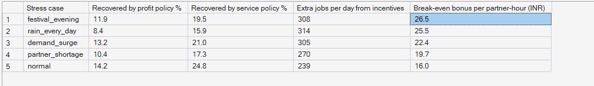
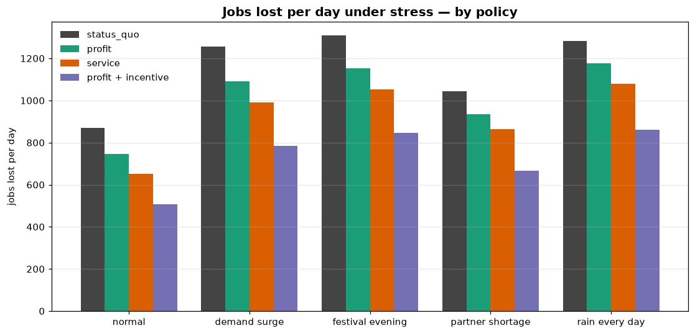
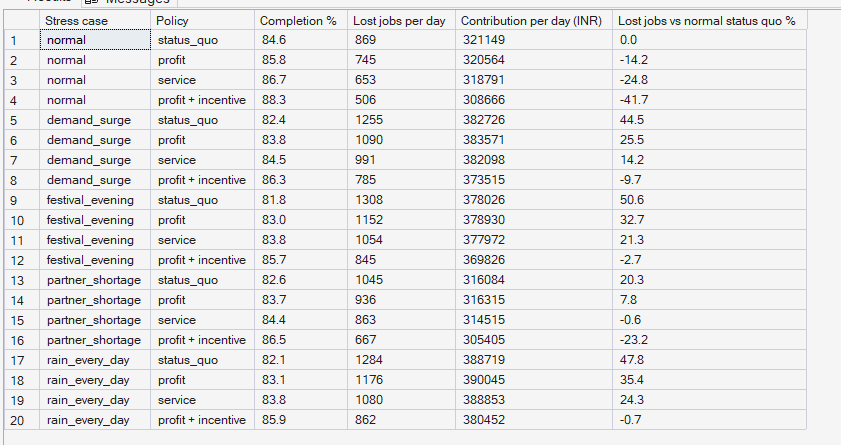

# Phase 11 — Incentive Economics + Scenario Simulation
## 03. Stress Scenarios

**SQL Script:** `sql/02_stress_scenarios.sql`

---

## 1. Business Question

How badly do rain, festival evenings, partner shortages and demand surges hurt
the marketplace — and which levers still help when they happen?

---

## 2. Objective

Replay 14 holdout days under each stress scenario and each policy, and measure
lost demand, contribution, and what repositioning and incentives recover.

---

## 3. Data Sources

- `dw.Agg_Scenario_Summary` (study = stress)

---

## 4. Analytical Grain

Stress case × policy over 14 holdout days (every second day).

---

## 5. Techniques Used

- Scenario transforms on demand and partner log-ins (binomial / Poisson scaling, fixed seed)
- Replay with common random numbers inside each scenario
- Break-even bonus = extra revenue per incentive partner-hour

---

# 6. Result Set A — Every Stress Case under Every Policy

<!-- AUTO:A -->
| Stress case | Policy | Completion % | Lost jobs per day | Contribution per day (INR) | Lost jobs vs normal status quo % |
|---|---|---|---|---|---|
| normal | status_quo | 84.6 | 869 | ₹321,149 | 0.0 |
| normal | profit | 85.8 | 745 | ₹320,564 | -14.2 |
| normal | service | 86.7 | 653 | ₹318,791 | -24.8 |
| normal | profit + incentive | 88.3 | 506 | ₹308,666 | -41.7 |
| demand_surge | status_quo | 82.4 | 1,255 | ₹382,726 | 44.5 |
| demand_surge | profit | 83.8 | 1,090 | ₹383,571 | 25.5 |
| demand_surge | service | 84.5 | 991 | ₹382,098 | 14.2 |
| demand_surge | profit + incentive | 86.3 | 785 | ₹373,515 | -9.7 |
| festival_evening | status_quo | 81.8 | 1,308 | ₹378,026 | 50.6 |
| festival_evening | profit | 83.0 | 1,152 | ₹378,930 | 32.7 |
| festival_evening | service | 83.8 | 1,054 | ₹377,972 | 21.3 |
| festival_evening | profit + incentive | 85.7 | 845 | ₹369,826 | -2.7 |
| partner_shortage | status_quo | 82.6 | 1,045 | ₹316,084 | 20.3 |
| partner_shortage | profit | 83.7 | 936 | ₹316,315 | 7.8 |
| partner_shortage | service | 84.4 | 863 | ₹314,515 | -0.6 |
| partner_shortage | profit + incentive | 86.5 | 667 | ₹305,405 | -23.2 |
| rain_every_day | status_quo | 82.1 | 1,284 | ₹388,719 | 47.8 |
| rain_every_day | profit | 83.1 | 1,176 | ₹390,045 | 35.4 |
| rain_every_day | service | 83.8 | 1,080 | ₹388,853 | 24.3 |
| rain_every_day | profit + incentive | 85.9 | 862 | ₹380,452 | -0.7 |

_Generated 2026-10-04 by a report script — do not edit by hand._
<!-- /AUTO:A -->

### Screenshot

---

# 7. Result Set B — What Each Lever Recovers under Stress

<!-- AUTO:B -->
| Stress case | Recovered by profit policy % | Recovered by service policy % | Extra jobs per day from incentives | Break-even bonus per partner-hour (INR) |
|---|---|---|---|---|
| festival_evening | 11.9 | 19.5 | 308 | ₹26.50 |
| rain_every_day | 8.4 | 15.9 | 314 | ₹25.50 |
| demand_surge | 13.2 | 21.0 | 305 | ₹22.40 |
| partner_shortage | 10.4 | 17.3 | 270 | ₹19.70 |
| normal | 14.2 | 24.8 | 239 | ₹16 |

_Generated 2026-10-04 by a report script — do not edit by hand._
<!-- /AUTO:B -->

### Screenshot

---

# 8. Key Observations

### 8.1 Every stress case raises lost demand sharply
Rain, festival evenings and demand surges each push lost jobs well above a
normal day; a partner shortage less so.

### 8.2 More demand can still mean more money
Rain, festivals and surges raise contribution — there is more business — even
while more customers are turned away. A partner shortage is the only case that
cuts contribution.

### 8.3 Repositioning helps less under stress
With less idle supply to move, repositioning recovers a smaller share of losses
than on a normal day.

### 8.4 Incentives are worth most under stress
Each incentive partner-hour earns about 60% more on rain and festival days than
on a normal day, because fewer of its jobs would have been served anyway.

---

# 9. Business Interpretation

The two levers complement each other: repositioning works best on normal days
when spare partners exist; incentives work best on stress days when they do not.

---

# 10. Business Implication

Make incentives **event-triggered**: switch them on for forecast rain and
festival days, priced below the break-even bonus in Result Set B, and keep
repositioning running every day.

---

# 11. Reproducibility

`python scripts/report_phase11.py`; scenario settings in `config/bengaluru/policy.yaml`.

---

## Conclusion

<!-- AUTO:headline -->
- The hardest stress case is **festival evening**: lost jobs rise **51%** above a normal day under the status quo.
- Repositioning recovers **14.2%** of losses on a normal day but only **8.4–13.2%** under stress: less idle supply to move.
- Incentives are worth most under stress: break-even rises from **₹16** per partner-hour on a normal day to **₹26** on **festival evening** days.

_Generated 2026-10-04 by a report script — do not edit by hand._
<!-- /AUTO:headline -->
