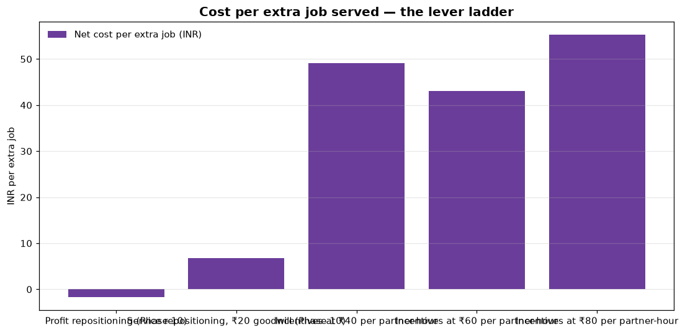

# Phase 11 — Incentive Economics + Scenario Simulation

**Question answered:** *When repositioning is not enough, is it worth paying to
bring more partners online — and how does the marketplace hold up under stress?*



## How it is built

| Layer | File |
|-------|------|
| Incentive mechanism, targeting, stress transforms | `src/pulse/optimization/incentives.py` |
| Studies (validation targets, incentives, stress) | `src/pulse/optimization/phase11.py` |
| Settings: bonus levels, stress scenarios | `config/bengaluru/policy.yaml` |
| Tables and analyses | `sql/00_…` to `sql/02_…` |

```bash
python scripts/report_phase11.py    # about 10 minutes
```

Every run uses the Phase 10 replay simulator, so all scenarios face exactly
the same customers and orders.

## Documents

| # | Document | Business question |
|---|----------|-------------------|
| 01 | `01_Incentive_Design.md` | How are incentives modelled, targeted and costed? |
| 02 | `02_Incentive_Results.md` | Do incentives pay — and what does each extra job served cost? |
| 03 | `03_Stress_Scenarios.md` | How do rain, festivals, shortages and surges hit the marketplace, and which levers help? |

## What PULSE recommends

1. **Always run profit repositioning** — it serves more customers at no net cost (Phase 10).
2. **Add service repositioning** if a lost customer is worth more than about ₹17–20
   (the extra cost per extra job served, Phases 10 and 11).
3. **Use incentives only as event-triggered measures** on rain and festival days,
   and only if partners can be secured for less than the break-even bonus in
   `03_Stress_Scenarios.md` — standing incentive programmes do not pay.
